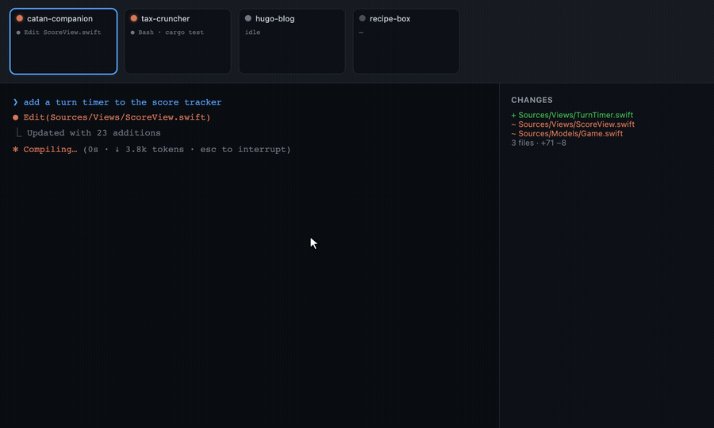
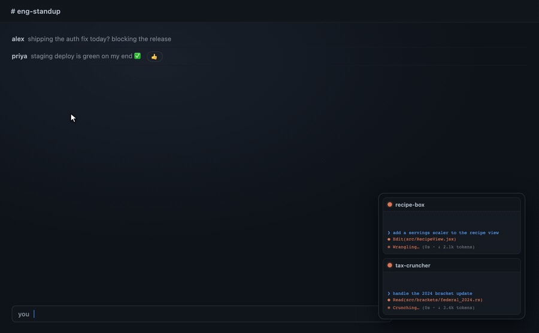

# Claudesk

### Many Claude Code projects. One window. Zero hunting.

A lean, dark, macOS-native shell for the power Claude Code user juggling many
projects at once: every project is one click to a live CC session, every session
shows its status at a glance, and your attention lands where it's needed instead of
getting lost in a pile of terminal windows.

---

**The problem:** When you've got several Claude Code sessions running across
different projects, finding the one that's stalled waiting on *you* means clicking
through windows and hopping Spaces — a constant attention tax on top of the
setup tax.

**The filmstrip:** Every open project is a live tile across the top with an
**idle / running / awaiting-input / working-in-background** status dot. One glance
shows which one needs you; one click jumps there.

<p align="center">
  
</p>

**The problem:** Real work means leaving the IDE — you're heads-down in another
app, reading docs, in a meeting — but a CC session you left running can finish or
hit a prompt at any moment, and you won't know unless you keep switching back.

**The picture-in-picture:** A small always-on-top panel keeps your sessions
watchable from the corner of the screen while you work in any other app — and it
pings you the moment one needs input.

<p align="center">
  
</p>

---

A macOS-only, single-user "lite IDE" that puts the daily Claude Code + Sublime Text
workflow in **one window with multiple virtual workspaces inside it**. Pick a project
→ a PTY-backed Claude Code session fires up in that project's directory, in seconds,
inside a workspace — no more "open terminal → `cd` → `claude`" every time, across 20+
rotating projects.

> **Status: daily-driver ready.** Click a project → a working CC session in the project
> dir inside a workspace; a built-in lite editor + git-diff viewer in the right half;
> Sublime Text / Sublime Merge / Reveal-in-Finder one click away; N projects open
> concurrently as workspaces switched via a live filmstrip with per-workspace status; an
> always-on-top picture-in-picture panel that keeps sessions watchable from any other app;
> a menu-bar status item that lights up when any project needs input; time analytics; a
> workflow-docs viewer; smart auto-resume; skill buttons; and in-app auto-update.
> Installable via a [Homebrew tap](#install).
>
> Since then: a `⌘,` settings panel with a full keyboard-shortcut reference, Developer-ID
> signing + Apple notarization (so there's no Gatekeeper workaround), and a workflow
> supervisor that enforces drive-mode chaining mechanically.
>
> For what shipped when, see [`CHANGELOG.md`](CHANGELOG.md) and the
> [releases](https://github.com/StaymanHou/Claudesk/releases).

## Install

> **Requires:** macOS on **Apple Silicon** (M1 or later — the build is `aarch64`;
> Intel Macs are not supported and `brew` will refuse the cask), and
> [**Homebrew**](https://brew.sh). You'll also need the
> [**Claude Code CLI**](https://docs.claude.com/claude-code) installed + authenticated
> and **Sublime Text / Merge** to actually use it — see [Prerequisites](#prerequisites).

Claudesk is distributed through a personal **Homebrew tap**:

```bash
brew tap StaymanHou/claudesk
brew trust --cask StaymanHou/claudesk/claudesk
brew install --cask claudesk
```

Why each step:

- **`brew trust`** — recent Homebrew refuses casks from third-party taps until you
  explicitly trust them (*"Refusing to load cask … from untrusted tap"*). One-time
  per tap.
- **`brew install --cask claudesk`** — downloads the `.dmg`, checks its SHA-256, and
  installs `Claudesk.app` to `/Applications`.

That's the whole install — **no Gatekeeper workaround needed.** Claudesk is
Developer-ID signed and notarized by Apple, so it opens normally on first launch.
(Releases before **v0.5.2** were unsigned and needed a manual
`xattr -dr com.apple.quarantine` step; that is no longer required.)

**Updating:**

```bash
brew update
brew upgrade --cask claudesk
```

Or just use the built-in updater — Claudesk checks for updates on launch and can
download, verify, install and relaunch itself in one click.

Your state — remembered projects, Claude Code hook registration, etc. under
`~/Library/Application Support/com.claudesk.app/` — carries across updates automatically.

**Before first launch**, make sure you have the [**Claude Code CLI**](https://docs.claude.com/claude-code)
(`claude`) installed and authenticated, plus **Sublime Text** / **Sublime Merge** for the
in-app launcher buttons. See [Prerequisites](#prerequisites) for the full list.

> Prefer to build it yourself? See [Build from source](#build-from-source) below.

## What it is

Claudesk is a **macOS-only, single-user "lite IDE"** that puts the daily
**Claude Code + Sublime** workflow into **one window with multiple virtual
workspaces inside it**. Each workspace = one project = one live Claude Code (CC)
session: a true terminal on the left, a lite code-editor + git-diff viewer on the
right. A **Mission-Control-style layout** runs the show — one workspace is the
full-size *center stage*, and a *filmstrip* of live thumbnails/status-tiles across
the top shows every other open project at a glance, each with an
**idle / running / awaiting-input / working-in-background** status dot. Click a tile (or press a hotkey)
to promote that project to center stage. It replaces the old routine of juggling
terminal tabs, Sublime Text, and Sublime Merge across many windows and macOS Spaces.

**Tech feel:** Tauri 2 (a tiny ~3 MB native app, not Electron), **dark-mode only —
always**, fast (<500 ms startup), lean. The aesthetic is *quiet, dark,
keyboard-driven, dense-but-calm* — a tool for a power user running 20+ rotating
projects, 3–4 in flight on any given day.

### What it does, and why it matters

- **One window, many project workspaces (Mission-Control layout).** A single window
  holds N concurrent project workspaces — one full-size *center stage* + a
  *filmstrip* of the rest across the top. No window-juggling, no Spaces-hopping;
  every in-flight project is one glance and one click away, so you instantly see
  which project needs you and switch without breaking flow.
- **Per-workspace status at a glance (idle / running / awaiting-input /
  working-in-background).** Every filmstrip tile carries a live status dot driven by
  Claude Code's real lifecycle (not guesswork). The "which of my 4 running agents is
  waiting on me?" question is answered in under a second, zero clicks — no more hunting
  through windows for the one stalled on a prompt. A session that hands control back
  while a backgrounded job keeps running reads *working in background* rather than
  falsely idle, so "done" and "still churning" are never the same dot.
- **Instant project launch.** Pick a project → its full environment (CC session
  `cd`'d in, editor, diff) fires up in seconds as a new workspace, eliminating the
  minutes of repetitive setup (open terminal → `cd` → `claude`, open Sublime, load
  project, open Merge, …) per project, per day. Starting work on any of 20+ projects
  is one click, not a ritual.
- **Split workspace: terminal + editor side by side.** Left half = a true
  PTY-backed Claude Code terminal (the real interactive TUI); right half = a lite
  code editor + git-diff viewer. Drive the AI and read the code without leaving the
  window — the whole edit-review-converse loop in one calm surface.
- **Lean, fast, dark, native.** Tauri 2 native app — ~3 MB, ~30–40 MB RAM idle,
  <500 ms launch, always dark. A daily driver that disappears into the work instead
  of competing with it.

## Philosophy & design choices

Claudesk is **deliberately opinionated software.** It is not meant to fit every
developer's needs in every circumstance, and it never will. Read these as the *why*
behind the product — if your situation contradicts them, Claudesk is probably the
wrong tool, and that's by design.

- **Opinionated by intent, narrow by intent.** This is a personal tool built against
  one workflow (heavy Claude Code use, the custom
  [`stayman-claude-code-customization`](https://github.com/StaymanHou/stayman-claude-code-customization)
  workflow system installed at `~/.claude/skills/`, Sublime, macOS, 20+ rotating
  projects). A tool that fits one workflow exactly beats a tool that fits every
  workflow approximately, and no feature is built for a secondary user at the primary
  user's expense — the roadmap is not distorted for them.

- **Two tiers, one app.** That narrowness is *not* a wall, because the product splits
  cleanly in two. The **lite-IDE core** — project picker, tabbed workspaces, PTY
  terminals, editor/diff, and the status surfaces (filmstrip / PiP / menu-bar, all built
  on Claude Code's *native* hook channel) — is workflow-independent and works for **any**
  Claude Code user out of the box, zero config. The **workflow-orchestration layer**
  (docs viewer, smart auto-resume, drive-mode selector, skill buttons) assumes the
  companion workflow system and is **opt-in, default off** behind a single setting. With
  it off the app is byte-identical to one that never had those features — no dead
  affordances, no controls pointing at files you don't have.

- **Tuned for Claude Code specifically — not OpenAI, not Gemini.** Portability across
  models was attempted and abandoned: not all models are created the same, and the
  workflow system + Claudesk are specifically tuned against Claude's behavior. The
  hook channel, the skill/orchestrator conventions, the drive modes, the
  resume/recycle rituals — all assume Claude Code. Running this against another
  model's CLI is out of scope.

- **Parallelism across projects, not across agents within a project.** The whole layout
  optimizes for *deliverable output per engineer-hour* by keeping many projects in
  flight at once — but with **one agent / one CC session per project** (subagents
  within that session are still fair game). This is a conscious rejection of the
  multi-agent-on-a-single-project approach: per *The Mythical Man-Month*, throwing more
  concurrent actors at one problem introduces coordination overhead that eats the gains.
  Claudesk parallelizes the *projects*, where the work is genuinely independent and the
  overhead is near zero, rather than the *agents*, where it isn't.

- **Built for flexible timelines, not for rushing.** The model assumes you're rotating
  among projects with relatively elastic deadlines — picking up whichever one is ready
  for you, letting the others run or sit. If you need to *rush a single project* to a
  hard deadline, the right move is multi-agent concurrency on that one project, and
  Claudesk is **not the fit**. It optimizes throughput across a portfolio, not latency
  on any single item.

- **Human-in-the-loop, surfaced not hidden.** Every CC session keeps a real, visible
  status (idle / running / awaiting-input / working-in-background) precisely because the bottleneck in this
  model is *operator attention* — the scarce resource is the one human steering N
  sessions. The filmstrip, PiP, and menu-bar surfaces all exist to answer "which
  project needs me right now?" in under a second. Claudesk doesn't try to remove the
  human from the loop; it tries to make the human's attention land where it's needed
  with minimal cost. (Hence also: yolo mode by default, but recycle/resume on operator
  judgment, never automatically.)

- **Lite over featureful.** If it isn't a *daily* friction, it doesn't get built.
  Claudesk consciously refuses to grow into a general-purpose IDE — the wins come from
  eliminating the repeated setup tax and the cross-project attention tax, not from
  feature breadth. Reuse the real tools (Sublime Text, Sublime Merge) for the long tail
  instead of reimplementing them.

- **Wrap the official tools, don't fork them.** Claudesk drives the real `claude` CLI
  and pops the real Sublime apps. It's an *orchestration layer*, not a replacement — so
  it inherits every upstream improvement for free and never has a fork to maintain.

- **Designed for a single screen — the laptop scenario.** Claudesk assumes you may be
  working on one display: a laptop on the move, not a multi-monitor desk. That's *why*
  the whole product collapses into **one window** (no window-juggling), and why the
  filmstrip, the collapsible-to-status-tiles layout, and the always-on-top
  picture-in-picture all exist — they put N projects' worth of attention onto a single
  screen without forcing you to spread windows across monitors or Spaces you don't have.
  Multi-monitor setups still work fine; they're just never *required*.

- **Local dev environment, not cloud.** Claudesk runs your Claude Code sessions in real
  PTYs against your real local filesystem and toolchain — no remote VM, no cloud
  workspace, no syncing your code up to someone else's machine. It's a native ~3 MB
  macOS app, not a browser tab pointed at a server. The work stays on your hardware:
  zero latency, your own environment and secrets, full offline capability, and nothing
  to pay for or trust beyond the tools you already run.

See [`workflow-system/product/vision.md`](workflow-system/product/vision.md) for the full vision, principles,
and anti-goals.

## Prerequisites

**To run Claudesk** (whether installed via Homebrew or built from source):

- **macOS on Apple Silicon** (this project is macOS-only; the release is `aarch64`)
- **Claude Code CLI** (`claude`) installed, on your `PATH`, and authenticated before launching Claudesk

**Optional** (Claudesk runs fine without them — they back the one-click launcher buttons):

- **Sublime Text** with `subl` on `PATH` (or the app installed for the `open -a` fallback)
- **Sublime Merge** — for the in-app "open in Merge" launcher button

**Additionally, to build from source:**

- **Rust** stable ≥ 1.77 via `rustup`
- **Node** 20 LTS+ and **pnpm** (`corepack enable` or `npm i -g pnpm`)
- **Xcode Command Line Tools** — `xcode-select --install`

See [`CLAUDE.md`](CLAUDE.md) → "Getting Started" for the full setup notes and ecosystem
gotchas (pnpm v11 `pnpm-workspace.yaml`, ESLint v9 pin, etc.).

## Setup

Claudesk ships in two tiers. **Tier 1 is the whole app for most people** — it needs
nothing but the Claude Code CLI, and it is what you get the moment you install.
**Tier 2** is an optional layer for people who also run the companion workflow
system; it is **off by default**, and if you never turn it on, Claudesk behaves
exactly as if it had never been built.

### Tier 1 — the lite IDE (no extra setup)

This is the default experience. It works for **any** Claude Code user, out of the box,
with zero configuration.

**What you need:**

- **macOS on Apple Silicon** + [Claude Code CLI](https://docs.claude.com/claude-code)
  (`claude`) installed, on your `PATH`, and authenticated.
- That's the requirement. *(Sublime Text / Sublime Merge are **optional** — they power
  the one-click launcher buttons. Claudesk runs fine without them; those buttons just
  won't have anything to open.)*

**Getting going:**

1. Install via the [Homebrew tap](#install) and launch Claudesk.
2. Click **`+`** in the project picker and choose a project directory.
3. Click the project. A workspace opens with a live Claude Code session already
   `cd`'d into that directory.
4. Repeat for as many projects as you want — each becomes its own workspace, and the
   filmstrip across the top shows them all with live status.

**What you get:**

| | |
|---|---|
| **Project picker** | Every project one click from a live session. Per-project `--model` override on the row. |
| **Workspaces + filmstrip** | N projects open at once; click a tile to promote it to center stage. Collapsible to status-only tiles. |
| **PTY terminal** | The real interactive Claude Code TUI, not a re-implementation. Yolo mode by default. |
| **Editor · Diff · Terminal** | The right half of each workspace — a CodeMirror editor, an inline git-diff viewer, and a second terminal. File tree and fuzzy finder (`⌘P`) included. |
| **Status surfaces** | idle / running / awaiting-input / working-in-background, driven by Claude Code's own hook channel — on the filmstrip, in a menu-bar item, and in an always-on-top picture-in-picture panel. |
| **Time analytics** | A local-only dashboard (`⌘⇧A`) of where the hours actually went. |
| **Sublime launchers** | One-click pop to Sublime Text / Sublime Merge / Finder when you want the heavier tool. |
| **In-app updates** | Claudesk checks, downloads, verifies and installs its own updates. |
| **Settings** | `⌘,` — permission mode, analytics, updates, and a full keyboard-shortcut reference. |

That is the complete tier-1 product. Nothing above is degraded or partial, and none of
it asks you to install anything beyond the Claude Code CLI.

### Tier 2 — the opt-in workflow layer (default OFF)

Claudesk can also drive a companion **workflow system** — a set of Claude Code skills and
orchestrator agents that run projects through explicit state machines (product → feature →
task → incident). If you run that system, Claudesk surfaces it as buttons and status
instead of typed slash commands. If you don't, **none of it exists for you.**

**The gate is a first-class concept, not a hidden preference.**

- **It is OFF by default.** Nothing here is on until you turn it on.
- **With it OFF, Claudesk is byte-identical to a build that never had these features.**
  Not greyed out, not disabled-with-a-tooltip — *absent*. No empty tabs, no dead menu
  items, no live chords. This is enforced mechanically by a standing test
  (`src/state/__tests__/offInvariantGuard.test.ts`), not by convention.
- **Enabling the UI is strictly separate from installing the substrate.** The toggle
  writes one field in Claudesk's own settings and touches nothing in `~/.claude/`.
  Installing the workflow system is a different, explicitly-consented action. Neither
  implies the other: you can enable the toggle without the system installed, and
  installing the system does not flip the toggle.

**To turn it on:** `⌘,` → **Workflow features** → *Enable workflow features*.

If you don't have the workflow system yet, Claudesk offers an install wizard that clones
the companion repo and runs its own `install.sh`, after showing you every side effect it
will have — including the ones that surprise people, like the block it injects into your
`~/.claude/settings.json`. You choose where it goes, and you can decline.

**What switching it on adds:**

| | |
|---|---|
| **Docs panel** (`⌘⇧K`) | A fourth right-panel tab rendering this project's workflow docs — and it becomes the tab a workspace *opens* on, because "where is this project?" is the question you open a workspace with. |
| **Skill buttons** | Five one-click commands in the workspace header: `/session-start`, `/session-restore`, `/session-capture`, `/util-prune-claude-md`, `/util-backlog-paydown`. |
| **Recycle Session** | Restart a session in place when its context is spent. |
| **Drive mode** | A per-project selector (`stepping` / `orchestrated` / `autopilot` / `fsd`) on the picker row, plus a readout in the workspace header. |
| **Workflow supervisor** | Enforces drive-mode chaining mechanically, with a per-workspace toggle. |
| **Smart auto-resume** | On open, a workspace that has a handoff pointer offers to inject `/session-restore`. |

⚠️ **One deliberate exception, worth knowing.** Auto-resume is gated *per arm*, not
wholesale. Resuming an **uncleanly-exited** session (Claudesk spawns `claude --continue`)
reads only Claudesk's own state, so it works for **everyone** — gate or no gate. Only the
`/session-restore` arm, which reads the workflow system's files, is gated. A crash-recovery
feature that serves every Claude Code user is not withheld behind a workflow toggle.

The companion system lives at
[`stayman-claude-code-customization`](https://github.com/StaymanHou/stayman-claude-code-customization).
It is a personal workflow, shared as-is — Claudesk does not require it, and tier 1 does
not degrade without it.

## Develop / contribute

Make sure you have the [build prerequisites](#prerequisites) (Rust, Node + pnpm,
Xcode CLT), then:

```bash
git clone git@github.com:StaymanHou/Claudesk.git
cd Claudesk
pnpm install
```

**Run the debug build (hot-reload):**

```bash
pnpm tauri:dev      # native debug build with Vite hot-reload
```

`pnpm tauri:dev` builds the **unoptimized debug target** and runs it under a separate
identity (`com.claudesk.app.dev`, window titled *"Claudesk (dev)"*, magenta "DEV" badge
on the Dock icon). It's fully isolated from an installed production build — separate
project list, hook socket, and Claude Code hook registration — so you can run the
installed app **and** `pnpm tauri:dev` at the same time without interference (i.e.
develop Claudesk *with* Claudesk). Use `pnpm tauri:dev`, **not** a bare `pnpm tauri dev`,
or the dev build will collide with a production install.

Front-end-only work (no Rust rebuild) can iterate even faster against the Vite dev
server alone — but note it has no Tauri IPC, so anything calling the backend won't work:

```bash
pnpm dev            # Vite only, http://localhost:1420 — UI iteration, no backend
```

**Checks** — run this one command before opening a PR:

```bash
pnpm verify:auto
```

It chains the whole gate and stops at the first failure:
`lint` → `format:check` → `tsc --noEmit` → `vitest` → `cargo fmt --check` →
`cargo clippy --all-targets -D warnings` → `cargo test`.

There is **no CI and no git hook** on this repo, so `pnpm verify:auto` *is* the gate —
run it rather than a remembered subset. Two of its steps are easy to drop by hand and are
deliberately included: `tsc --noEmit` (type errors are invisible to lint and tests alike)
and `--all-targets` on clippy (plain `cargo clippy` skips the test target). Use
`pnpm format` to auto-fix formatting.

See [`CLAUDE.md`](CLAUDE.md) → "Development Conventions" for code style, the workflow
system, and ecosystem gotchas (pnpm v11 `pnpm-workspace.yaml`, the ESLint v9 pin,
dark-mode-only UI, the `CcSession` seam, etc.).

## Build from source

For development, or to install your own build instead of the Homebrew cask. Building
produces both a `.app` and a `.dmg`.

⚠️ **A local build is unsigned** unless you have a Developer ID certificate — released
builds are signed and notarized, but `pnpm tauri build` on your machine is not. So the
Gatekeeper step below still applies to *your own* builds, even though it no longer
applies to an installed release.

```bash
pnpm tauri build
cp -R src-tauri/target/release/bundle/macos/Claudesk.app /Applications/
xattr -dr com.apple.quarantine /Applications/Claudesk.app   # clear Gatekeeper (unsigned)
```

The `.dmg` lands at `src-tauri/target/release/bundle/dmg/Claudesk_<version>_aarch64.dmg`
— this is the same artifact published to the Homebrew tap.

**Updating** a from-source install = rebuild and replace (quit the running app first):

```bash
git pull && pnpm install        # if there are upstream changes / dep updates
pnpm tauri build
cp -R src-tauri/target/release/bundle/macos/Claudesk.app /Applications/
xattr -dr com.apple.quarantine /Applications/Claudesk.app
```

The production bundle id (`com.claudesk.app`) is stable across updates, so your state
(`projects.json`, the Claude Code hook registration, etc. under
`~/Library/Application Support/com.claudesk.app/`) carries over automatically. The
Gatekeeper `xattr` step reappears on each replaced **unsigned local** build.

⚠️ Note `cp -R` **strips a notarization ticket** (extended attributes do not survive a
plain copy) — irrelevant for an unsigned local build, but if you ever copy a *released*
`.app` by hand, use `ditto` instead or it will be rejected as unnotarized.

> **Cutting a release** (maintainer): the build → tag → GitHub release → tap-cask bump
> flow is driven by the project-local `/release` skill — see
> [`.claude/skills/release/SKILL.md`](.claude/skills/release/SKILL.md). In-app
> auto-update has shipped: an installed build checks for new versions and updates
> itself. Developer-ID signing + Apple notarization shipped in **v0.5.2**, which is what
> removed the `xattr` step for installed releases.

## More

- [`CLAUDE.md`](CLAUDE.md) — project overview, conventions, and current phase
- [`workflow-system/product/vision.md`](workflow-system/product/vision.md) — full product vision
- [`workflow-system/product/arch.md`](workflow-system/product/arch.md) — architecture and key decisions
- [`CHANGELOG.md`](CHANGELOG.md) — what has shipped

## License

[MIT](LICENSE) © Stayman Hou
