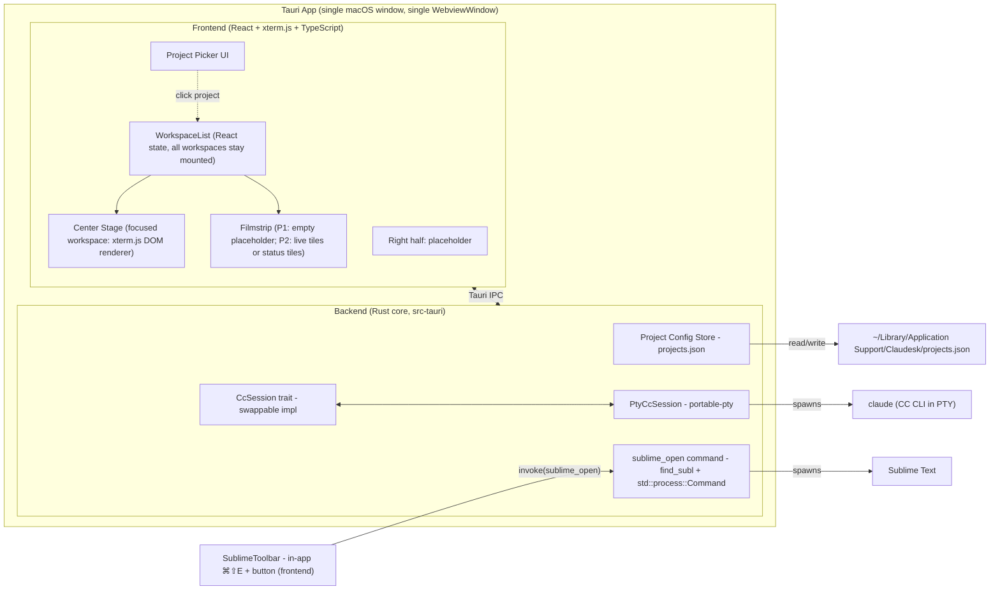
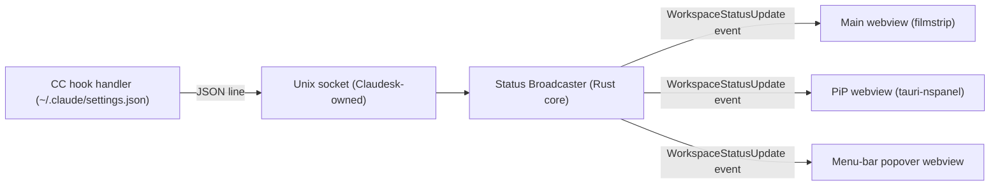
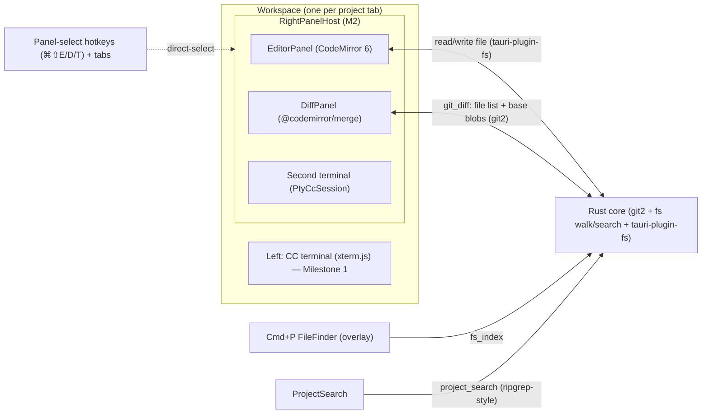

> Revision 2026-05-19: Added cross-window CC status indicator (Phase 2) — see "Phase 2 / Phase 3 forward-look" section. No Phase 1 components affected; the indicator is a Phase 2 forward-look only.
> Revision 2026-05-22: Added two Phase 2 forward-look sub-sections — Smart auto-resume on project open (three-branch decision tree replacing the original "two-branch heuristic") and Drive-mode selector + indicator (header chrome + WIP-frontmatter persistence). Both are Phase 2 only; Phase 1 components unaffected.
> Revision 2026-06-15: Major revision following the vision pivot (multi-window → single-window with tabbed workspaces) and the research findings that resolved four open design questions. **Phase 1 now ships the tab-shell substrate** (single-workspace use is N=1 of the tab model) and a new **thumbnail-rendering probe** that gates Phase 2's filmstrip-rendering strategy. **xterm.js: DOM renderer only** — WebGL addon dropped after the WebGL-context cap finding. The prior "Phase 2 cross-window CC status indicator" sub-section is **replaced** by three status surfaces (filmstrip / menu-bar / PiP) coordinated by a single Rust-side status broadcaster fed by a Unix-socket hook channel. The earlier "WP9b probe" (shared file vs Unix socket) is resolved: socket wins. Phase 1 component diagram and data-flow tables updated below; Phase 2 forward-look sub-sections rewritten.
> Revision 2026-06-19 (WP7 shipped, commit `50ca322`): The `CcSession` trait + `PtyCcSession` impl now exist as built. Three as-built deltas from the design above: (1) **raw `portable-pty` behind our own 4 Tauri commands** (`cc_spawn`/`cc_input`/`cc_resize`/`cc_kill`), NOT the `tauri-plugin-pty` JS bridge — keeps `CcSession` the sole "drive CC" seam (the plugin's JS `spawn()` would compete with it). (2) **Output/exit are event streams, not trait methods**: `on_output(callback)` is realized as the `cc-output-<sid>` Tauri event and `wait_for_exit()` as the `cc-exit-<sid>` event (emitted on PTY EOF); the trait's concrete methods are `send_input`/`resize`/`kill`. (3) **PTY bytes cross IPC as base64 strings** (both directions) — `Vec<u8>` serializes as a heavy JSON number array, base64 is ~4× cheaper. Also as-built: spawn sets `TERM=xterm-256color`+`COLORTERM=truecolor` explicitly (the WP2-flagged no-inherited-TERM-under-Tauri case — confirmed needed), `kill()` is `/exit\r`-then-SIGKILL, and window-close reaping is `WindowEvent::CloseRequested` → `SessionRegistry::kill_all`. xterm wiring needed rAF-deferred fit/resize + explicit `term.focus()` (mount + post-spawn + click) for correct sizing/input under WKWebView (verify-human round-1 finding).
> Revision 2026-06-19 (Milestone 2 architecture — Lite Editor + Diff Viewer): Folded the `research.md` M2 findings into a new **"Milestone 2 architecture"** section below (promoting the old Phase-3-forward-look editor stub to a designed milestone). Decisions: **CodeMirror 6** (not Monaco) as the right-half editor (`@uiw/react-codemirror` binding, dark-only theme); the diff viewer splits **`git2` (Rust: changed-file list + base blobs) + `@codemirror/merge` (JS: rendering)**; the **Cmd+P fuzzy file finder and project-wide find/replace are app-layer Rust+React subsystems**, NOT editor config (the load-bearing scoping correction — neither editor manages a project tree); the right-half placeholder grows into a per-workspace **panel host** (editor / diff / second terminal) with a **panel-switch hotkey** that must coexist with CM6's keymap; and the in-app Sublime Text pop (`⌘⇧E`) is **removed** at M2 once editor parity is proven (vision Core Principle 3, 2026-06-19). Component table "Right pane placeholder" row updated + new M2 components added; a Key Decision added. Milestone 1 (Phase 1) components unchanged. NOTE: this file predates the roadmap's Phase→Milestone rename; "Phase N" headings below remain valid read-aliases for "Milestone N" and are not swept here.
> Revision 2026-06-20 (WP5 spec — RightPanelHost design deltas): Two corrections to the M2 section below. (1) **Panel switching is per-panel DIRECT-SELECT (⌘⇧E Editor / ⌘⇧D Diff / ⌘⇧T Terminal) + clickable tabs, NOT a cycle** — updated the RightPanelHost component row + the data-flow mermaid label. (2) **Sublime *Merge* is kept permanently; only Sublime *Text* is removed at parity (WP8).** A permanent `smerge_open` command + "Open in Sublime Merge" toolbar button (added in WP5) cover staging/blame/history/blob-at-rev that the inline DiffPanel does not — updated the "Sublime pop removed" design constraint. The Sublime-Text pop chord moves ⌘⇧E → ⌘⇧O (transitional, deleted at WP8). NOTE: the DiffPanel row still names `@codemirror/merge` — superseded as-built (styled git2-hunk lines), tracked separately by SURFACE-2026-06-20-WP4-COMMIT-LOG-SCOPE-EXPANSION for the next finalize resync.
>
> Revision 2026-06-20 (WP8 REDEFINED + shipped — Sublime Text pop is NOT removed): The operator reversed WP8's scope. **Both Sublime launchers (Text + Merge) are now kept permanently** — the in-app editor becomes the *primary* routine-editing surface but does **not** remove the Sublime Text escape hatch. WP8 became a frontend-only UI consolidation: both launchers moved out of the standalone `SublimeToolbar` into the `RightPanelHost` `right-panel-toggle` tab row as inlined-SVG **icon buttons** (right-aligned past a divider), and the now-redundant Sublime-Text `⌘⇧O` `keydown` hotkey was **deleted** (`chord.ts` + `SublimeToolbar.tsx` removed; the two `invoke` handlers moved to `sublime/sublimeLaunch.ts`). The backend `sublime` module is **UNTOUCHED** — `sublime_open` + `smerge_open` + the shared resolver + consts all stay. `⌘⇧O` is freed/unbound. **The parity gate is dropped** — WP8 is no longer gated on WP9 (no removal → no parity proof needed). This **supersedes** every "Sublime Text pop removed at M2/WP8, gated on parity, last build step" statement below (notably the component-table `sublime_open` row, the "Sublime hotkey is in-app … removed at Milestone 2" Key Decision, the RightPanelHost "transitional Sublime Text pop" row, and the "Sublime *Text* pop removed at M2 — gated, last" M2 design constraint). Those inline mentions are reconciled in the two highest-traffic spots inline; the rest are left for the next finalize sweep, covered globally by this note.
> Revision 2026-06-19 (WP9 shipped, commit `91fae7f` — **Phase 1 COMPLETE**): Two polish additions within the existing surfaces, no architecture change. (1) **Friendly "claude not on PATH" error:** a pure `classify_spawn_error` maps the not-found spawn failure to a dedicated `CcError::CcNotFound` variant carrying actionable guidance (names Claude Code + install-docs link); the existing `cc-error-overlay` renders the IPC string verbatim (pinned by a cross-layer test). (2) **Deleted-project pruning:** `config_store::prune_missing` + a `prune_missing_projects` command drop projects whose folder no longer exists; the picker calls it on mount and shows a dismissible toast. This closes Phase 1 (Bare Shell + Tab Substrate PoC) — all WP1–WP9 shipped; the WBS for the Phase 1 cycle is archived under `docs/product/archive/phase-1-bare-shell-poc/`. Phases 2–4 remain headline-only, to be decomposed when Phase 2 opens.

# Architecture

**Phase:** Phase 1 (Bare Shell + Tab Substrate). YAGNI applied — only the components needed to satisfy Phase 1 exit criteria are designed in detail. Phase 1 introduces the **tab-shell substrate** even though only one workspace is ever open in Phase 1, because Phase 2's filmstrip / PiP / menu-bar surfaces all assume the substrate exists. Phase 2 (stateful CC controller, file-watcher, status broadcaster, skill registry, Recycle Session, three status surfaces) and Phase 3 (lite editor, diff viewer, right-half panel swap) are explicitly identified as **extension points**, not built.

### Tech Stack

- **Language (backend):** Rust (stable, ≥1.77) — required by Tauri 2; owns the CC process, PTY, filesystem, global shortcuts, project config persistence, **status broadcaster (Phase 2)**, **Unix-socket hook listener (Phase 2)**. Rust is also a deliberate fit for Phase 2's stateful-controller work (process lifecycle, file watching, async I/O).
- **Language (frontend):** TypeScript + React 19 — community consensus for Tauri 2 in 2026 (matches the Terax reference project); the lite-editor work in Phase 3 (Monaco or CodeMirror 6) needs this stack regardless, so we pay the cost once.
- **Build / bundler:** Vite — fast HMR for dev; Tauri's `beforeDevCommand` / `beforeBuildCommand` hooks plug into Vite's CLI cleanly.
- **Framework:** Tauri 2 (2.9.x line) — native WebView (WKWebView on macOS); ~3MB bundle; Rust backend with IPC to a web frontend. **Single `WebviewWindow`**, all workspaces are React components in one webview (research decision: no multi-webview).
- **Embedded terminal:**
  - Backend: `tauri-plugin-pty` (wraps `portable-pty`) — registered in the Tauri builder; spawns `claude` in a real pty inside the Rust core. **Course-correction from roadmap.md text** (which said "node-pty via Tauri sidecar pattern"): node-pty would require shipping a Node runtime in the bundle, defeating the bundle-size advantage. portable-pty runs natively in Rust.
  - Frontend: `@xterm/xterm` + `@xterm/addon-fit` — render the terminal, fit to container. **DOM renderer only — `@xterm/addon-webgl` is NOT used** (2026-06-15 decision; see Key Decisions below). The 2026 DOM renderer is fast enough for the foreground workspace.
  - Bridge: `tauri-pty` (JS bindings shipped with `tauri-plugin-pty`) — `spawn()` returns a handle whose `onData` / `write` / `resize` mirror node-pty's API closely enough that xterm.js wiring is straight-line.
- **Sublime-pop hotkey:** an **in-app** keybinding — a webview `keydown` handler (`⌘⇧E`) owned by the focused workspace. NOT an OS-global shortcut, so **no `tauri-plugin-global-shortcut` and no macOS Accessibility permission** are required. (As-built 2026-06-19, WP8: the OS-global approach was built then rejected at verify-human in favor of in-app — see WP8 in `docs/product/archive/phase-1-bare-shell-poc/wbs.md`.)
- **External tools invoked via shell:** `subl` (Sublime Text), `smerge` (Sublime Merge — Phase 2). Claudesk launches `subl` from the backend `sublime_open` command via **`std::process::Command`** (consistent with `cc_session` spawning `claude`; the original `tauri-plugin-shell` plan was dropped as-built — the launch is backend code, not a frontend-callable shell). No embedding.
- **Persistence:** flat JSON file at `~/Library/Application Support/Claudesk/projects.json` via `tauri-plugin-fs` + `path::app_data_dir()`. No DB; project list is a list of `{path, last_opened_at, display_name?, default_drive_mode?}` records. Matches the "no per-project config burden" vision principle (no `.claudesk.json` per repo).
- **Database:** none — Phase 1 has no relational data, and the only durable state is the project list (handled above).
- **Infrastructure:** none — this is a single-user desktop app; no servers, no cloud, no telemetry.

**Phase 2 additions (forward-look, not built in Phase 1):**
- `tauri-nspanel` v2.1 — `NSPanel` wrapper for the PiP window (display-only floating panel, all-Spaces, fullscreen-aux, non-activating).
- `tauri-plugin-positioner` (with `tray-icon` feature) — positions the menu-bar popover under the tray icon.
- `tauri-plugin-fs-watch` / `notify` — debounced file-watcher for `workflow/.session.md`.

**Milestone 2 additions (Lite Editor + Diff Viewer — designed below, not yet built):** *(versions verified against npm registry 2026-06-19; see `research.md`)*
- **CodeMirror 6** — the right-half editor engine (decided over Monaco in `research.md`: ~1.26 MB gzipped vs ~5 MB, no web-worker config, composes as an embedded panel, native-webview-friendly). Granular `@codemirror/{state,view,commands,language,search}` (state 6.6.0 / view 6.43.1 / search 6.7.1) or the `codemirror` 6.0.2 meta-package.
- **`@uiw/react-codemirror`** 4.25.10 — the modern CM6 React binding (NOT legacy `react-codemirror2`).
- **`@codemirror/merge`** 6.12.2 — diff/merge **rendering** (side-by-side `MergeView` or inline `unifiedMergeView`; computes its own diff). Fed `(base_text, current_text)` per file.
- **`@replit/codemirror-minimap`** (community) — minimap; treated as an **optional/deferrable** M2 feature (lowest-confidence dep, see Risks in `research.md`).
- **`git2`** (libgit2 Rust binding) — backend git data: the changed-file list (unstaged/staged) + base-content blobs (HEAD / index). Does NOT render the diff (CM6 does); supplies the inputs. Behind Tauri commands in the established `command → pure-fn → typed-error → String` shape.
- File read/write reuses the existing `tauri-plugin-fs` (no new IO plumbing). Dark-only CM6 theme extension (no light variant).

### Dev Environment

**Host-based (opt-out — justification required).**

This is a desktop application targeting macOS. Tauri development requires direct access to the host's WKWebView, macOS code-signing chain (for later phases), and native windowing — all of which a Docker container on macOS cannot provide. The standard Tauri 2 toolchain runs natively on macOS via `rustup` + `node`. Industry practice for Tauri development is host-based; Dockerizing it would add friction without benefit.

**Toolchain:**
- Rust (stable, ≥1.77) via `rustup`
- Node 20 LTS or newer via `nvm` / `fnm` / system install
- Xcode Command Line Tools (`xcode-select --install`) — provides the C compiler, `codesign`, and macOS SDK headers
- `pnpm` (preferred) or `npm` for frontend deps
- Sublime Text installed locally (Sublime Merge too, for Phase 2). `subl`/`smerge` on `PATH` is **optional** — Claudesk discovers the binary via PATH → `.app` bundle (`/Applications/Sublime Text.app/.../bin/subl`) → `open -a` fallback (WP3 probe), so the maintainer's no-symlink setup works out of the box. Claudesk invokes Sublime but does NOT install it.
- Claude Code CLI installed and authenticated independently (`claude` on `PATH`)

**First-run bootstrap:**
```bash
# clone, then in repo root:
pnpm install            # frontend deps
cd src-tauri && cargo fetch   # backend deps
cd ..
pnpm tauri dev          # development run (Vite + Tauri together)
```

**Build commands during dev:**
- `pnpm tauri dev` — full app, live reload
- `pnpm tauri build` — production .app bundle
- `cargo test` (inside `src-tauri/`) — Rust unit tests
- `pnpm test` — frontend tests (Vitest)
- Lint: `pnpm lint` (eslint), `cargo clippy` (Rust)

### System Design



**Component responsibilities:**

| Component | Layer | Responsibility |
|-----------|-------|---------------|
| Project Picker UI | Frontend | List recents from config; "Open Folder" via Tauri dialog; emit `open_workspace(path)` (Phase 1: opens the single workspace; Phase 2: opens a new workspace into the list) |
| **WorkspaceList** | Frontend | Authoritative array of `Workspace { id, project_path, cc_session_id, status, xterm_ref }`. All workspaces stay mounted; switching center stage is `display: none` / `display: block`, never unmount. Phase 1: length always 1. Phase 2: length N. |
| **Center Stage** | Frontend | Renders the focused workspace at full size. Hosts the xterm.js terminal pane (left) and the right-half placeholder. |
| **Filmstrip** | Frontend | Phase 1: empty placeholder container (so Phase 2 doesn't have to introduce a new layout slot). Phase 2: one tile per non-focused workspace (live ~1 fps mirror OR static status tile, per probe outcome). |
| Right pane placeholder | Frontend | **Milestone 1:** static "Coming soon" panel; reserved real-estate inside each workspace. **Milestone 2:** grows into the per-workspace **RightPanelHost** (editor / diff / second-terminal swap) — see Milestone 2 architecture below. |
| Project Config Store | Backend | Read/write `projects.json`; debounced writes on update. |
| `CcSession` trait | Backend | **Forward-compat seam.** Abstract interface: `send_input(bytes)`, `on_output(callback)`, `resize(cols, rows)`, `wait_for_exit()`, `kill()`. Phase 1 has one impl (`PtyCcSession`); Phase 2 will add `recycle()`, `state_events()`, and per-session status fan-out. Future could add an `SdkCcSession` if we ever migrate to the Agent SDK. |
| `PtyCcSession` | Backend | Concrete impl using `portable-pty` to spawn `claude --dangerously-skip-permissions` with the project dir as cwd; bridges to frontend xterm.js via Tauri events. |
| `sublime` module / `sublime_open` + `smerge_open` commands | Backend | Resolves `subl`/`smerge` (PATH → `.app` bundle → `open -a`, per WP3) and spawns `subl <path>` / `smerge <path>` via `std::process::Command` (steal focus; never `--project`/`--new-window`). Frontend-invoked from the `RightPanelHost` tab-row icon buttons (`sublime/sublimeLaunch.ts`). **PERMANENT (revised 2026-06-20, WP8): both commands stay** — WP8 was redefined to KEEP both launchers (no removal). The Sublime-Text `⌘⇧O` hotkey was deleted (button-only now); the backend module is otherwise unchanged. |
| In-app Sublime hotkey + button | Frontend | `SublimeToolbar` in each workspace's right panel: an "Open in Sublime" button (labeled `⌘⇧E`) and a `keydown` handler bound only on the focused workspace. Both `invoke("sublime_open", {projectPath})`. No OS-global shortcut, no Accessibility permission. |

**Forward-compatibility seams (NOT built in Phase 1, only reserved):**

- `CcSession` trait is the seam for Phase 2's stateful controller (extra methods for ready-state detection, recycle, file-watcher integration) and any future Agent-SDK-backed implementation.
- **WorkspaceList holds many workspaces in Phase 2; in Phase 1 it always holds exactly one.** The data shape is the same; the only Phase 1 invariant is N=1 enforced by the picker's "open project" handler.
- The Filmstrip slot exists in Phase 1 layout but is empty — Phase 2 populates it.
- A `WorkflowStateWatcher` module is *not* created in Phase 1 — Phase 2.
- A `StatusBroadcaster` module is *not* created in Phase 1 — Phase 2.
- A `SkillRegistry` module is *not* created in Phase 1 — Phase 2.
- The right pane inside each workspace is a placeholder component; Phase 3 will replace it with a tabbed/swappable panel host. No premature panel-swap abstraction in Phase 1.

### Phase 1 thumbnail-rendering probe (gating for Phase 2)

A new Phase 1 work package: a synthetic harness measuring whether ~1 fps live terminal mirrors are cheap enough at N=8 workspaces. **Pass → Phase 2 ships live mirrors. Fail → Phase 2 ships status tiles in v1**, leave live mirrors as a Future Possibility.

**Harness shape:**
- 8 xterm.js instances, DOM renderer only, full-size rendering.
- Each xterm fed a representative CC output stream (canned recording of a typical Claude Code session, looped).
- Filmstrip thumbnails are `scale(0.15)` CSS-transformed tiles mirroring each background terminal, throttled to ~1 fps.
- One workspace simultaneously active (rendering normally at full speed) to simulate the center-stage workload.

> **CORRECTION (2026-06-17, from WP4 outcome).** The original text above said "live mirrors of those **off-screen** full-size xterms." That mechanism is **non-viable** and was corrected during WP4 (see `wp4-thumbnail-probe-outcome.md`): (1) a DOM node has exactly one parent, so one xterm subtree cannot appear in both an off-screen container and a filmstrip tile; (2) xterm.js's `RenderService` registers an `IntersectionObserver({threshold:0})` that **pauses the renderer for off-viewport terminals** — so an off-screen (`left:-99999px`) terminal's DOM goes stale and there is nothing live to mirror. The viable mechanism, validated by the probe, is **`@xterm/addon-serialize` `serializeAsHTML()` from the buffer** (the buffer updates via `write()` even while the renderer is paused), rendered into the tile at ~1 fps. Background workspaces are deliberately kept off-viewport so the renderer pauses for free; the serialized snapshot stays current. (`cloneNode`-per-frame of the live DOM also works but is more expensive and forces backgrounds on-viewport — rejected.)

**Measurements:**
- CPU usage at idle (all 8 workspaces "idle"; no PTY output flowing): target **<10%**.
- CPU usage during one active CC session (center-stage workspace receiving real output; 7 backgrounds idle): target **<20%**.
- RAM total: target **<300 MB**.
- Frame time on the center-stage workspace: target **<16ms** (no visible jank from background-mirror work).

Thresholds above are the proposed defaults. The probe's own implementation plan (when picked up as a Phase 1 WP) finalises them.

**Output:** a one-page report. **Decided as a sibling doc:** [`wp4-thumbnail-probe-outcome.md`](./wp4-thumbnail-probe-outcome.md) (kept separate to avoid bloating this file).

> **OUTCOME (2026-06-17): PASS → Phase 2 ships live ~1 fps mirrors, using `serializeAsHTML()`.** On Apple M4 / macOS 26.5.1 against a real-CC-transcript-reconstructed fixture: idle webview CPU 4.5% (<10% ✅), active median 13.3% (<20% ✅; p95 ~30% on bursts — caveat + mitigations in the report), RAM 240 MB (<300 ✅), center frame time p95 18 ms with **0 dropped frames** (✅). The `serialize` arm beat `cloneNode`. Full measurements, arm comparison, caveats (frame-time measured in Chromium; CPU via `top`), and Phase 2 deltas → `wp4-thumbnail-probe-outcome.md`.

### Data Flow

**Phase 1 happy path — project open:**

1. User clicks a project in the picker (or selects "Open Folder").
2. Frontend invokes Tauri command `open_workspace(path)`.
3. Backend updates `projects.json` (`last_opened_at`, optionally adds new project).
4. Backend instantiates a `PtyCcSession` with cwd=`path`, command=`claude`, args=`["--dangerously-skip-permissions"]`.
5. Backend emits `cc-session-ready` event with a session handle ID.
6. Frontend receives the event, **adds a Workspace record to `WorkspaceList`** (Phase 1: list now has length 1), mounts xterm.js inside the center stage, subscribes to `cc-output-<sid>` events, wires xterm.js `onData` → Tauri command `cc-input(sid, bytes)`, and `xterm fit addon resize` → `cc-resize(sid, cols, rows)`.
7. CC's TUI renders inside xterm.js. User interacts as in a normal terminal.

**Phase 1 happy path — Sublime hotkey/button (in-app):**

1. With Claudesk focused, the user presses `⌘⇧E` (an in-app webview keybinding) OR clicks the "Open in Sublime" button in the focused workspace's right-panel toolbar.
2. The focused workspace's `SublimeToolbar` reads its own `project_path` (frontend React state) and calls `invoke("sublime_open", { projectPath })`.
3. The backend `sublime_open` command resolves `subl` (PATH → `.app` bundle → `open -a`) and spawns `subl <path>` via `std::process::Command` (`open -a "Sublime Text" <path>` on the fallback). Never `--project`/`--new-window` (WP3).
4. macOS focuses the Sublime Text window (steal-focus is intended — the user explicitly asked for Sublime).
5. `⌘⇧E` does nothing when Claudesk is not the focused app (in-app keybinding, not OS-global) — no Accessibility permission needed.

**Phase 1 shutdown / window close:**

1. Frontend signals `close_workspace` (or window close event).
2. For each workspace in `WorkspaceList`, backend calls `CcSession::kill()` — sends SIGTERM to the CC process, then SIGKILL after timeout.
3. Backend persists `projects.json` final state.
4. App quits.

### Key Decisions

- **Tauri over Electron.** Aligned with vision principle 1 ("lite over featureful"). Research established 25x smaller bundle, ~50% lower RAM, faster startup. The "less mature packaging ecosystem" tradeoff is acceptable for a single-user tool.
- **`tauri-plugin-pty` / `portable-pty` over node-pty + sidecar.** node-pty requires a Node runtime; portable-pty runs natively in Rust. Bundle-size and architectural cleanliness win.
- **PTY byte-injection over Agent SDK for v1.** The vision requires the familiar interactive CC TUI in the foreground workspace. PTY byte-injection means we treat Claudesk as a legitimate terminal-front-end — typing slash commands as a human would. We avoid the "PTY scraping" anti-pattern (parsing CC's output text to infer state) by using **file watching** (Phase 2) for state detection. The `CcSession` trait is the seam that lets us swap to an Agent SDK backend later without UI changes.
- **Single window, many workspaces (NEW 2026-06-15).** Reversed from "one project per window." Multiple projects = workspaces inside one window, switched via filmstrip thumbnails (Phase 2). Aligned with the revised vision and the way the user actually juggles 3–4 projects.
- **xterm.js DOM renderer only — no WebGL (NEW 2026-06-15).** Research established the browser-wide WebGL-context cap of ~16/page. With a tab shell hosting many xterm instances, the WebGL renderer either hits the cap or forces a swap-on-focus complexity that gives marginal benefit on top of the modern DOM renderer. Verdict: DOM-only is simpler and good enough for the foreground workspace. If a single-workspace user one day proves the DOM renderer can't keep up, we re-add the WebGL addon for the center stage only — a one-line addon load. Decision is reversible.
- **Single `WebviewWindow`, no multi-webview (NEW 2026-06-15).** Tauri 2's multi-webview API is `unstable`-flagged and offers webview isolation we don't need (all workspaces share Claudesk's trust boundary). React-managed tabs in one webview is the stable choice.
- **Tab-shell substrate ships in Phase 1 (NEW 2026-06-15).** The WorkspaceList + Center Stage + Filmstrip slot are built in Phase 1 even though Phase 1 only ever opens one workspace. This is "design for N=1 with N>1 in mind" — Phase 2 plugs into existing structure rather than reshaping the foundation.
- **Thumbnail-rendering probe gates Phase 2's filmstrip + PiP rendering (NEW 2026-06-15).** Decision recorded in the dedicated section above. Probe pass → live ~1 fps mirrors. Probe fail → status tiles in v1.
- **Menu-bar status item ships BEFORE PiP in Phase 2 (NEW 2026-06-15).** Cheaper to build, covers the "Claudesk hidden" case PiP can't, and includes a dogfooding gate that may defer PiP to Phase 4 entirely.
- **CC hook channel via Unix socket, not shared file (NEW 2026-06-15).** Resolves the previously deferred WP9b probe. With three concurrent status-surface consumers (filmstrip / menu-bar / PiP), Unix-socket multi-consumer concurrency wins decisively over shared-file locking and debounce-write juggling.
- **Flat JSON for project list.** No SQLite, no app-managed DB. The list is ≤100 entries with read-on-open and write-on-update; JSON is appropriate.
- **No per-project config file in the project itself.** Project list lives in `~/Library/Application Support/...`, not in `.claudesk.json` files inside each repo. Aligned with vision principle 5.
- **Host-based dev environment, not Docker.** Tauri targets host WKWebView and native windowing; Docker on macOS cannot provide them. Industry standard for Tauri.
- **`--dangerously-skip-permissions` (yolo mode) by default.** Vision explicit. A Phase 4 setting will let users opt out.
- **Sublime hotkey is in-app, not OS-global (revised 2026-06-19, WP8).** The original design used `tauri-plugin-global-shortcut` (which needs a macOS Accessibility grant + first-launch onboarding flow). That was built then rejected at verify-human — the operator clarified the hotkey should fire only while Claudesk is focused, not system-wide. As-built: a right-panel "Open in Sublime" affordance backed by `sublime_open`. (The `⌘⇧E`→`⌘⇧O` Sublime-Text `keydown` hotkey that originally accompanied the button was **deleted at WP8, 2026-06-20** — the button is now the only Sublime-Text affordance.) No `tauri-plugin-global-shortcut`, no Accessibility permission, no onboarding dialog. **Both Sublime launchers (Text + Merge) are now PERMANENT icon buttons** in the RightPanelHost tab row — WP8 was redefined to keep them (the earlier "removed at Milestone 2 once parity is proven" plan is superseded; see the Revision 2026-06-20 note at the top of this file).
- **CodeMirror 6 over Monaco for the in-app editor (Milestone 2, decided 2026-06-19 from `research.md`).** For an editor *embedded* as one panel among several in a ~3 MB Tauri app, CM6 wins decisively: ~1.26 MB gzipped vs Monaco's ~5 MB, no web-worker configuration (fiddly in WKWebView), composes as a component, native-webview/serializable pedigree fits Tauri IPC. Monaco's advantage (VS-Code-grade IntelliSense / language servers) doesn't apply — Claude Code is the intelligence layer, the editor is a Sublime-feature-parity *lite* editor. React binding: `@uiw/react-codemirror` (not legacy `react-codemirror2`). Reversible if a hard CM6 limitation surfaces, but the bundle/worker wins are structural.
- **The editor edits a document; the project is app-layer (Milestone 2).** Cmd+P fuzzy file finder and project-wide find/replace are Rust+React subsystems, not editor config — true for Monaco too (neither manages a project tree). The WBS budgets them as their own work, not sub-tasks of "wire up the editor." The diff viewer is `git2` (file list + base blobs) + `@codemirror/merge` (rendering), not `git2` computing the rendered diff.

### Phase 2 forward-look (informational, not built)

The Phase 2 forward-look is reorganised around four architectural deltas: (a) **status broadcaster** as the central nervous system, (b) **three status surfaces** that subscribe to it, (c) **smart auto-resume on workspace open**, (d) **drive-mode selector**. The prior 2026-05-19 "cross-window CC status indicator" sub-section is fully replaced by (a) + (b). The 2026-05-22 "smart auto-resume" and "drive-mode selector" sub-sections are preserved in spirit but updated for the workspace-not-window model.

#### A. Status broadcaster + Unix-socket hook channel



- **CC hook registration.** On first launch (or via a Phase 4 setting), Claudesk installs entries in `~/.claude/settings.json`'s `hooks` block for `UserPromptSubmit` (→ "running"), `Stop` (→ "idle"), and `Notification` (→ "awaiting-input"). The hook is a tiny POSIX shell script (no runtime deps) that writes a JSON line — `{ event, pid, cwd, timestamp }` — to Claudesk's Unix socket at a stable path (e.g., `~/Library/Application Support/Claudesk/hook.sock`).
- **Unix socket vs shared file.** Decided: socket. Claudesk's Rust core opens the socket on app launch and accepts a stream of JSON lines from any CC instance whose `cwd` matches a known workspace's project path. No file lock contention, no debounce-write juggling, no torn reads. The hook script is small enough to write the socket synchronously in <1ms; CC does not block waiting for the hook.
- **Status broadcaster.** Normalizes incoming hook events into `WorkspaceStatusUpdate { workspace_id, state: Idle|Running|AwaitingInput, last_event_at, last_output_snippet? }` and emits via Tauri's event channel (`app_handle.emit("workspace-status", ...)`). All three webviews subscribe; they re-render their local UI on each event.
- **Coexistence with `claude-time`.** `claude-time` (from the `my-claude-code-customization` project) already taps the same hook events. Hook entries in `~/.claude/settings.json` are a JSON array — both subscribers register side-by-side; no need to share a script.
- **Failure mode.** If the socket is missing or the hook script can't connect, the workspace status defaults to `Unknown`. Claudesk does not infer state from PTY output; an unknown badge is honest, a guessed badge is not.

#### B. Three status surfaces (subscribers)

**B.1 — Filmstrip + Center Stage (in-window).**
- Lives in the main React webview. Subscribes to `workspace-status` events from the broadcaster.
- Center Stage renders the focused workspace's xterm.js at full size, DOM renderer.
- Filmstrip renders one tile per non-focused workspace. Tile content per the **WP4 probe outcome (PASS, 2026-06-17 — live mirrors):**
  - Each background workspace's xterm.js is mounted **off-viewport** (`left:-99999px`) so xterm pauses its renderer (the buffer still updates via `write()`). The filmstrip tile is built from **`@xterm/addon-serialize` `serializeAsHTML()`** read off that buffer, rendered into a `scale(0.15)` tile, throttled to ~1 fps. (NOT a live mirror of off-screen DOM — that mechanism is non-viable; see the probe outcome doc and the §"Phase 1 thumbnail-rendering probe" correction.)
  - Active-CPU p95 caveat (~30% on output bursts) → mitigations available (sub-1fps background rate, coalesced serialize, mirror only visible tiles) if dogfooding shows it matters.
  - (Status-tile-only fallback was the probe-fail branch; not taken.)
- Clicking a tile swaps which workspace is the center stage (CSS `display: none` / `display: block`; no remount). Workspace state and PTY connection persist.
- **Filmstrip collapse:** A chrome button toggles between "full filmstrip" (tiles with thumbnails or status) and "collapsed strip" (one-line row of project-name + status-dot pills). Collapsed workspaces use `display: none` on their off-screen xterm to suppress the render loop; PTY output still buffers in xterm's scrollback.

**B.2 — Menu-bar status item.**
- Native Tauri tray icon via `tauri::tray::TrayIconBuilder`. `setIconAsTemplate(true)` for light/dark adaptation.
- Icon shows an aggregate status dot:
  - **Green** = all workspaces `Idle`
  - **Blue** = any workspace `Running`
  - **Amber** = any workspace `AwaitingInput`
- Left-click opens a popover (positioned via `tauri-plugin-positioner` with the `tray-icon` feature → `Position::TrayBottomCenter`). Popover is its own `WebviewWindow`, subscribes to `workspace-status`, renders a one-row-per-workspace list with status dot + project name. Clicking a row sends an IPC command to the main Claudesk window: bring forward + switch center stage to that workspace.
- Right-click opens a native menu: Show Claudesk window / Toggle PiP / Quit.
- **Ships BEFORE PiP** in Phase 2 (roadmap milestone 2.5). Dogfooding gate: at least one daily-driver week using the menu-bar item alone. If sufficient, **PiP defers to Phase 4**.

**B.3 — PiP NSPanel (conditional).**
- `tauri-nspanel` v2.1: `PanelBuilder` with `no_activate(true)` + `PanelLevel::Floating`.
- Underlying `NSWindow` collection behavior: `NSWindowCollectionBehaviorCanJoinAllSpaces | NSWindowCollectionBehaviorFullScreenAuxiliary | NSWindowCollectionBehaviorStationary`. Visible on every Space, draws over fullscreen apps, doesn't steal focus on click.
- User-toggled (right-click menu-bar item → Toggle PiP, or in-Claudesk button). **Display-only in v1** — clicking a tile does NOT bring the workspace forward. Click-to-focus is a Future Possibility.
- Content mirrors filmstrip rendering: live ~1 fps mirrors if probe passed; status tiles if probe failed.
- **Bus-factor risk:** `tauri-nspanel` is single-maintainer. Mitigation: pin v2.1; monitor `tauri-apps/tauri#13034` for first-party NSPanel support and migrate when it lands.

#### C. Smart auto-resume on workspace open (preserved from 2026-05-22, updated for workspaces)

- **Decision logic = pure function of two signals**, evaluated on workspace-open in the Rust backend:
  1. `session_md_exists = fs::exists("<project>/workflow/.session.md")`
  2. `cc_has_resumable = check via Claude Code's resume mechanism whether a prior conversation is available for cwd=<project>` — exact probe shape decided in **WP9c probe** (still pending; not affected by the 2026-06-15 revision).
- **Branch table:**
  | `session_md_exists` | `cc_has_resumable` | Action |
  |---|---|---|
  | true | * | inject `/session-resume\n` into the PTY (workflow context wins over raw history) |
  | false | true | inject `/resume\n` into the PTY |
  | false | false | inject `/session-start\n` into the PTY |
- **No persisted "next-command" state.** Claudesk never writes a sidecar file like `last-action.json`. Source-of-truth files (`workflow/.session.md` + CC's own session-list) are authoritative; rereads on every workspace-open.
- **WP9c probe still required.** Sibling to the thumbnail probe, gating the smart-auto-resume implementation. Confirms the exact CC CLI surface for "is there a resumable conversation for this cwd."
- **Injection mechanism reuses existing seam.** Slash command via `CcSession::send_input(b"/session-resume\n")`. No new IPC, no new trait method.
- **Multiple workspaces in flight at the same time** is handled trivially — auto-resume runs per-workspace on workspace-open, never globally.

#### D. Drive-mode selector + indicator (preserved from 2026-05-22, updated for workspaces)

- **UI surface = workspace header chrome** (on the center-stage workspace). A small 4-position selector (radio-group or segmented control). Filmstrip tiles do NOT show drive mode — it's a center-stage concern only.
- **Persistence layers, in order of precedence (write-down, read-up):**
  1. **Active WIP file's `drive_mode:` frontmatter** — workflow's source of truth.
  2. **`projects.json` per-project `default_drive_mode`** — fallback for the gap between sessions.
  3. **Global default = `autopilot` (Mode 3)**.
- **Read path on workspace open:** check (1), fall back to (2), fall back to (3). Render in the center-stage header.
- **Write path on user click:** update WIP frontmatter (if active) AND `projects.json` (always).
- **Cross-workspace consistency** is no longer a concern (no multi-window setup; only one workspace per project at a time in v1).
- **No new Rust module.** Thin layer in `config_store/`.

## Milestone 2 architecture — Lite Editor + Diff Viewer (designed; next to build)

> **Scope (Milestone 2, roadmap):** the right half stops being a placeholder and becomes a real per-workspace editing surface that *replaces* Sublime Text for routine work. Grounded in `research.md` (2026-06-19). YAGNI still applies — this designs M2 only; Milestones 3–9 (stateful CC controller, multi-workspace, status surfaces, polish) stay forward-look.

### Component shape

The Milestone 1 "right-half placeholder" inside each workspace becomes a **`RightPanelHost`** — a per-workspace React component that owns the right half and swaps between three panels: **Editor** (CodeMirror 6), **Diff** (`@codemirror/merge`), and **Second terminal** (a second `PtyCcSession`, reusing the WP7 seam). One host instance per workspace; each workspace keeps its own panel state (which panel is active, open file, scroll), mirroring the "all workspaces stay mounted" rule from Milestone 1.

| Component | Layer | Responsibility |
|-----------|-------|---------------|
| **RightPanelHost** | Frontend | Per-workspace owner of the right half. Holds the active-panel state (editor \| diff \| terminal); **per-panel direct-select hotkeys** (⌘⇧E Editor / ⌘⇧D Diff / ⌘⇧T Terminal — NOT a cycle) + clickable tabs select panels. Also hosts the right-panel launch toolbar (transitional Sublime Text pop + permanent "Open in Sublime Merge" button). Replaces the M1 placeholder. *(As-built WP5: direct-select chords, not the originally-sketched cycle.)* |
| **EditorPanel** | Frontend | CodeMirror 6 via `@uiw/react-codemirror`. Multi-cursor (core), `@codemirror/search` find/replace, language modes (per-file), optional minimap, dark theme. Reads/writes files via `tauri-plugin-fs`. |
| **DiffPanel** | Frontend | `@codemirror/merge` (`MergeView` side-by-side or `unifiedMergeView` inline — config flip). Renders `(base_text, current_text)` per file; CM6 computes the chunks. Shows the changed-file list (from the backend) + the selected file's diff. |
| **FileFinder** (Cmd+P) | Frontend + Backend | **App-layer, not an editor feature.** A React fuzzy-picker overlay over a backend-provided file index of the workspace's project dir; selecting opens the file into the EditorPanel. |
| **ProjectSearch** | Frontend + Backend | **App-layer.** Backend ripgrep-style search over the project dir → results list; opening a result loads the file + highlights the match in CM6 (`@codemirror/search` does the in-document highlight). |
| **`git_diff` command(s)** | Backend | `git2`-backed: list changed files (unstaged vs staged) + return base-content blobs (HEAD blob for working-tree diffs, index blob for staged). Pure-fn core + thin Tauri command wrappers (the WP6/WP7 shape). Does NOT compute the rendered diff — supplies inputs to DiffPanel. |
| **`fs_index` / `project_search` command(s)** | Backend | Walk the workspace project dir for the FileFinder index; ripgrep-style content search for ProjectSearch. Honors `.gitignore`. |
| **Second-terminal panel** | Frontend + Backend | A second `PtyCcSession`-equivalent for an ad-hoc shell in the right half (reuses the `CcSession` trait + `cc_*` command pattern; not `claude` — a plain shell). |

### Data flow (Milestone 2)



### Key M2 design constraints

- **The editor engine edits a *document*; the *project* is ours.** This is the load-bearing finding (`research.md`): Cmd+P fuzzy file finder and project-wide find/replace are **app-layer subsystems** (Rust file-index + ripgrep-style search + React overlays), not CM6 (or Monaco) configuration. The WBS must budget them as their own work, distinct from "wire up CodeMirror." Roughly 2 of the 6 Sublime-parity "editor" features are actually backend features.
- **Diff = `git2` (data) + `@codemirror/merge` (render).** `git2` supplies the changed-file list and base blobs; CM6 computes + renders the diff. No git-hunk format marshaled over IPC. Side-by-side vs unified is a config choice (side-by-side = Sublime Merge mental model; unified = better for the narrow half-width panel) — decide at build, not a dependency change. Interactive staging / rebase / blame / conflict-resolution are explicitly out of M2 scope.
- **Panel-switch hotkey must coexist with CM6's keymap.** When focus is inside a CM6 editor, CM6 can swallow app-level chords. The right-half panel-switch hotkey (and Cmd+P / the command palette) must be registered so they fire *even while editing* — as CM6 keybindings that bubble, or with app key handling scoped to let the chord through. This is the same class of issue WP8 hit with `⌘⇧E`; design it deliberately, do not rely on a naive document-level listener.
- **N mounted editors.** Per the tab model (Milestone 6+), N workspaces each may hold a CM6 EditorPanel plus a DiffPanel (`MergeView` = 2 more CM6 instances), all mounted (`display:none` when backgrounded). CM6 is far lighter than Monaco, but the WP4-style "cost at N" concern applies to editors too — the WP4 probe covered terminals only. A cheap sanity check during M2 build that N mounted editors stay within the RAM/CPU envelope is warranted (not a separate probe milestone, but a build-time guard).
- **Both Sublime launchers KEPT permanently as tab-row icon buttons (revised 2026-06-20, WP8 — supersedes the "Sublime Text pop removed at parity" plan).** WP8 was redefined: the Sublime **Text** pop is **NOT removed**. Both launchers (`sublime_open` Text + `smerge_open` Merge) are permanent **icon buttons** in the `RightPanelHost` `right-panel-toggle` tab row (right-aligned past a divider), each calling its unchanged backend command via `sublime/sublimeLaunch.ts`. The only thing deleted at WP8 was the redundant Sublime-**Text** `⌘⇧O` `keydown` hotkey (`chord.ts` + `SublimeToolbar.tsx` removed); `⌘⇧O` is now freed/unbound. **There is no parity gate** — WP8 is no longer gated on WP9 (no removal → no parity proof needed), and it is no longer the "last M2 build step." The in-app editor is the *primary* routine-editing surface, but Sublime Text remains a permanent escape hatch alongside Sublime Merge (the inline DiffPanel covers *viewing*; staging / blame / history / blob-at-rev stay in Sublime Merge). *(Earlier 2026-06-19/2026-06-20 wording said the Text pop was removed at parity — fully superseded by the WP8 redefinition; see the top-of-file Revision 2026-06-20 note.)*
- **Dark-mode only.** CM6 theme is a single dark theme extension; no light variant (project convention).

### M2 forward-compat / seam reuse

- **`CcSession` trait reused** for the second-terminal panel (a plain shell, not `claude`) — no new process-spawning abstraction.
- **`tauri-plugin-fs` reused** for file read/write — already a dependency from Milestone 1's config store.
- **Backend command shape reused** — `git_diff` / `fs_index` / `project_search` follow the `command → pure-fn (injected paths, TempDir-testable) → typed error → String` pattern from `config_store` (WP6) and `cc_session` (WP7).

### Phase 3+ forward-look (informational, not built — superseded scope note)

> The former "Phase 3" lite-editor work is now **Milestone 2** (designed above). What remains genuinely forward-look beyond M2:

- A richer git surface (interactive staging / blame / history) beyond M2's diff-viewer basics — only if the in-app diff viewer proves insufficient in dogfooding.
- Editor LSP-style features (completions/diagnostics) via a language server behind CM6 — explicitly out of vision scope (Claude Code is the intelligence layer), noted only as a known CM6-extensibility path.

### Future hedge

- `SdkCcSession` impl of `CcSession` (using `@anthropic-ai/claude-agent-sdk`) is documented in research as a potential migration path if PTY-based control ever becomes untenable.
- **PiP click-to-focus** — promote a workspace from a PiP tile click. Defer until display-only PiP has been used long enough (or PiP has been replaced by menu-bar) to confirm the limitation is real.
