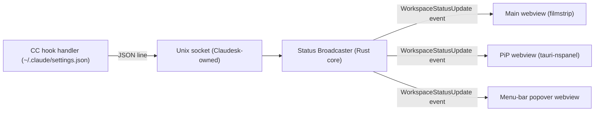
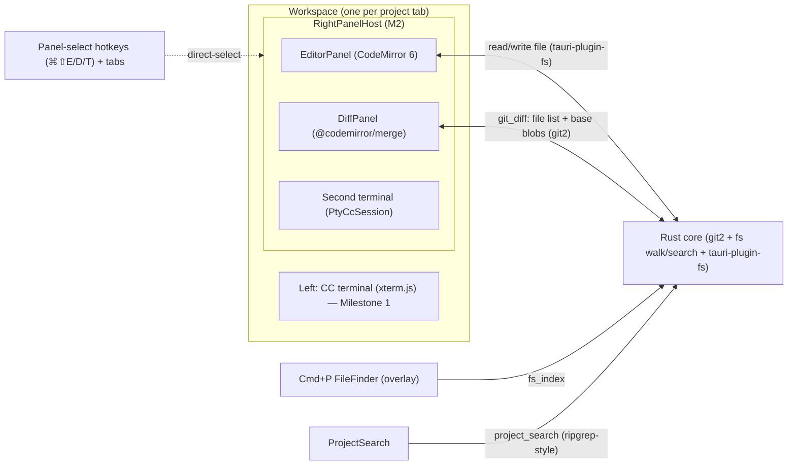
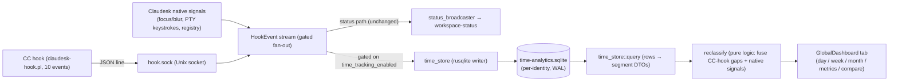
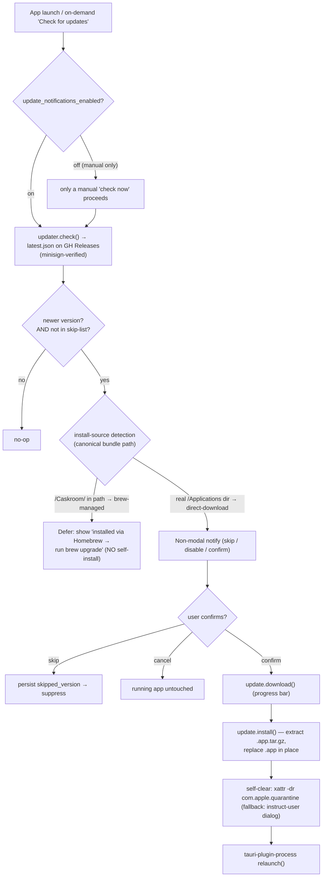

> Revision 2026-06-25 (QoL/lifecycle sweep COMPLETE — between-milestone resync): a between-milestone QoL/lifecycle sweep (its own scratch `qol-wbs.md`, **not** a roadmap milestone — now retired/deleted) shipped 9 WPs after the M4 close and before M5 (PiP) planning. **NOT a new milestone — no roadmap line moved.** Most as-built deltas were resynced into this file in-place during the WPs; the durable ones now reflected below: **WP0** — the per-workspace `notify`-debounced filesystem watcher (`src-tauri/src/fs_watch/`, feeds FileTree refresh + open-doc reload — see the dependency note in the tech-stack section); **WP1** — workspace close is a real unmount+teardown (`close_workspace`: `cc_kill` both panes + `workspace_deregister` + `workspace_watch_stop` + center-stage re-pick + dirty-guard confirm) — the explicit exception to "all workspaces stay mounted"; **WP2** — the hook event set grew to **four** (`PostToolUse`→Running answer-resume signal) + `Notification`→AwaitingInput is **gated** on `notification_type` (both already inline at the CC-hook-registration + Notification-gating + broadcaster bullets); **WP5/WP5b** — the new `editor_fs` root-confined mutation commands (`delete_file`/`trash_path`/`create_dir`, now in the M2 component table); **WP8** — diff-viewer polish (commits-collapsed-default + stacked-sticky-header CSS vars, now in the M2 DiffPanel row). WP3 (autofocus-CC-on-promote), WP4 (terminal spawn-once on re-activation — extends the M2 PTY prompt-flush invariant), WP6 (⌘⇧N new-workspace chord), WP7 (FileTree git-status bubble-up) are frontend-local refinements not warranting a structural arch entry. No durable `docs/product/wbs.md` exists (M4's was the last and is archived); this finalize archived nothing (the scratch WBS self-retired) and re-closed no milestone — it resynced durable docs + swept the backlog only.
>
> Revision 2026-06-24 (Milestone 4 SHIPPED — finalize resync): M4 (multi-workspace UX — filmstrip + center stage) closed; **the M3+M4 dogfood-replace point is reached** (Claudesk replaces the terminal + Sublime daily-driver setup). All 6 WPs shipped (WP1 N-cost probe → eager-mount; WP2 N>1 lift; WP3 filmstrip tiles + status + live mirror + click/⌘⇧+digit + drag-reorder; WP4 collapse toggle; WP4b left/right intra-workspace focus indicator; WP5 verify-at-N). Three **inserted-but-shipped** items this cycle (not WBS WPs) are now as-built and supersede inline mentions below:
> 1. **Dev/prod isolation.** The running **bundle identifier** is the single source of truth for all per-install state: prod = `com.claudesk.app`, dev = `com.claudesk.app.dev` (via a `src-tauri/tauri.dev.json` config-overlay; `pnpm tauri:dev` launches with `--config tauri.dev.json`). The identifier derives the app-data dir, `projects.json`, `hook.sock`, the deployed hook-script basename (`claudesk-hook.pl` vs `claudesk-hook-dev.pl`), and the `~/.claude/settings.json` matcher-group (matched on the **exact** script basename — closes the `claudesk-hook.pl` ⊂ `claudesk-hook-dev.pl` substring trap), so the installed prod app and `pnpm tauri:dev` run **concurrently with zero interference**. Dev `projects.json` seeds once from prod on first launch.
> 2. **GUI-PATH fix (`src-tauri/src/env_path`).** A Finder/Dock-launched macOS app inherits the minimal launchd PATH (`/usr/bin:/bin:/usr/sbin:/sbin`), not the user's shell PATH — so user-installed CLIs (`claude` in `~/.local/bin`, etc.) were invisible and `cc_spawn` failed ("No viable candidates found in PATH"). On launch (FIRST line of `.setup()`, before any spawn) the app captures the login-shell PATH (`$SHELL -l -i -c 'printf %s "$PATH"'`) and sets it process-wide — fixing `claude` + `subl`/`smerge` + `finder` + any future CLI. Bug surfaced only in installs (never `tauri:dev`); see `CLAUDE.md` → Setup & Ecosystem Gotchas + the installed-build-smoke-test convention.
> 3. **Right-panel launcher is now a TRIO.** Sublime Text (`sublime_open`) + Sublime Merge (`smerge_open`) + **Reveal-in-Finder (`finder_open`, `open <dir>`)** — a new `src-tauri/src/finder` module mirroring `sublime` (no tool discovery; `open` is always present). Third icon button in the `RightPanelHost` tab row.
>
> Stale path mentions below (`~/Library/Application Support/Claudesk/…`) are corrected to the bundle-identifier path inline at the two highest-traffic spots; the rest are covered globally by this note. M4 WBS + the WP1/WP4 probe-outcome docs archived to `archive/milestone-4-multi-workspace-ux/`.

> Revision 2026-06-22 (Milestone 3 SHIPPED — finalize resync): M3 (CC lifecycle & state plumbing) closed. The Phase-2 forward-look §A is now as-built for the hook channel + broadcaster: hook script is **Perl** (not POSIX sh), socket path is `com.claudesk.app/hook.sock` (bundle identifier, not `Claudesk/`), the broadcaster + snake_case DTO landed at WP4, and a frontend close-the-loop note (WP6) records the honest indicator + the orange/blue palette. The planned `.session.md` file-watcher (§"Phase 2 additions") was **DROPPED** — wrong file (manual pause bookmark, not a live signal); a future milestone may watch the live workflow doc hierarchy instead. M3 WBS archived to `archive/milestone-3-cc-lifecycle-state-plumbing/`.

> Revision 2026-05-19: Added cross-window CC status indicator (Phase 2) — see "Phase 2 / Phase 3 forward-look" section. No Phase 1 components affected; the indicator is a Phase 2 forward-look only.
> Revision 2026-05-22: Added two Phase 2 forward-look sub-sections — Smart auto-resume on project open (three-branch decision tree replacing the original "two-branch heuristic") and Drive-mode selector + indicator (header chrome + WIP-frontmatter persistence). Both are Phase 2 only; Phase 1 components unaffected.
> Revision 2026-06-15: Major revision following the vision pivot (multi-window → single-window with tabbed workspaces) and the research findings that resolved four open design questions. **Phase 1 now ships the tab-shell substrate** (single-workspace use is N=1 of the tab model) and a new **thumbnail-rendering probe** that gates Phase 2's filmstrip-rendering strategy. **xterm.js: DOM renderer only** — WebGL addon dropped after the WebGL-context cap finding. The prior "Phase 2 cross-window CC status indicator" sub-section is **replaced** by three status surfaces (filmstrip / menu-bar / PiP) coordinated by a single Rust-side status broadcaster fed by a Unix-socket hook channel. The earlier "WP9b probe" (shared file vs Unix socket) is resolved: socket wins. Phase 1 component diagram and data-flow tables updated below; Phase 2 forward-look sub-sections rewritten.
> Revision 2026-06-19 (WP7 shipped, commit `50ca322`): The `CcSession` trait + `PtyCcSession` impl now exist as built. Three as-built deltas from the design above: (1) **raw `portable-pty` behind our own 4 Tauri commands** (`cc_spawn`/`cc_input`/`cc_resize`/`cc_kill`), NOT the `tauri-plugin-pty` JS bridge — keeps `CcSession` the sole "drive CC" seam (the plugin's JS `spawn()` would compete with it). (2) **Output/exit are event streams, not trait methods**: `on_output(callback)` is realized as the `cc-output-<sid>` Tauri event and `wait_for_exit()` as the `cc-exit-<sid>` event (emitted on PTY EOF); the trait's concrete methods are `send_input`/`resize`/`kill`. (3) **PTY bytes cross IPC as base64 strings** (both directions) — `Vec<u8>` serializes as a heavy JSON number array, base64 is ~4× cheaper. Also as-built: spawn sets `TERM=xterm-256color`+`COLORTERM=truecolor` explicitly (the WP2-flagged no-inherited-TERM-under-Tauri case — confirmed needed), `kill()` is `/exit\r`-then-SIGKILL, and window-close reaping is `WindowEvent::CloseRequested` → `SessionRegistry::kill_all`. xterm wiring needed rAF-deferred fit/resize + explicit `term.focus()` (mount + post-spawn + click) for correct sizing/input under WKWebView (verify-human round-1 finding).
> Revision 2026-06-19 (Milestone 2 architecture — Lite Editor + Diff Viewer): Folded the `research.md` M2 findings into a new **"Milestone 2 architecture"** section below (promoting the old Phase-3-forward-look editor stub to a designed milestone). Decisions: **CodeMirror 6** (not Monaco) as the right-half editor (`@uiw/react-codemirror` binding, dark-only theme); the diff viewer splits **`git2` (Rust: changed-file list + base blobs) + `@codemirror/merge` (JS: rendering)**; the **Cmd+P fuzzy file finder and project-wide find/replace are app-layer Rust+React subsystems**, NOT editor config (the load-bearing scoping correction — neither editor manages a project tree); the right-half placeholder grows into a per-workspace **panel host** (editor / diff / second terminal) with a **panel-switch hotkey** that must coexist with CM6's keymap; and the in-app Sublime Text pop (`⌘⇧E`) is **removed** at M2 once editor parity is proven (vision Core Principle 3, 2026-06-19). Component table "Right pane placeholder" row updated + new M2 components added; a Key Decision added. Milestone 1 (Phase 1) components unchanged. NOTE: this file predates the roadmap's Phase→Milestone rename; "Phase N" headings below remain valid read-aliases for "Milestone N" and are not swept here.
> Revision 2026-06-20 (WP5 spec — RightPanelHost design deltas): Two corrections to the M2 section below. (1) **Panel switching is per-panel DIRECT-SELECT (⌘⇧E Editor / ⌘⇧D Diff / ⌘⇧T Terminal) + clickable tabs, NOT a cycle** — updated the RightPanelHost component row + the data-flow mermaid label. (2) **Sublime *Merge* is kept permanently; only Sublime *Text* is removed at parity (WP8).** A permanent `smerge_open` command + "Open in Sublime Merge" toolbar button (added in WP5) cover staging/blame/history/blob-at-rev that the inline DiffPanel does not — updated the "Sublime pop removed" design constraint. The Sublime-Text pop chord moves ⌘⇧E → ⌘⇧O (transitional, deleted at WP8). NOTE: the DiffPanel row still names `@codemirror/merge` — superseded as-built (styled git2-hunk lines), tracked separately by SURFACE-2026-06-20-WP4-COMMIT-LOG-SCOPE-EXPANSION for the next finalize resync.
>
> Revision 2026-06-20 (WP8 REDEFINED + shipped — Sublime Text pop is NOT removed): The operator reversed WP8's scope. **Both Sublime launchers (Text + Merge) are now kept permanently** — the in-app editor becomes the *primary* routine-editing surface but does **not** remove the Sublime Text escape hatch. WP8 became a frontend-only UI consolidation: both launchers moved out of the standalone `SublimeToolbar` into the `RightPanelHost` `right-panel-toggle` tab row as inlined-SVG **icon buttons** (right-aligned past a divider), and the now-redundant Sublime-Text `⌘⇧O` `keydown` hotkey was **deleted** (`chord.ts` + `SublimeToolbar.tsx` removed; the two `invoke` handlers moved to `sublime/sublimeLaunch.ts`). The backend `sublime` module is **UNTOUCHED** — `sublime_open` + `smerge_open` + the shared resolver + consts all stay. `⌘⇧O` is freed/unbound. **The parity gate is dropped** — WP8 is no longer gated on WP9 (no removal → no parity proof needed). This **supersedes** every "Sublime Text pop removed at M2/WP8, gated on parity, last build step" statement below (notably the component-table `sublime_open` row, the "Sublime hotkey is in-app … removed at Milestone 2" Key Decision, the RightPanelHost "transitional Sublime Text pop" row, and the "Sublime *Text* pop removed at M2 — gated, last" M2 design constraint). Those inline mentions are reconciled in the two highest-traffic spots inline; the rest are left for the next finalize sweep, covered globally by this note.
> Revision 2026-06-19 (WP9 shipped, commit `91fae7f` — **Phase 1 COMPLETE**): Two polish additions within the existing surfaces, no architecture change. (1) **Friendly "claude not on PATH" error:** a pure `classify_spawn_error` maps the not-found spawn failure to a dedicated `CcError::CcNotFound` variant carrying actionable guidance (names Claude Code + install-docs link); the existing `cc-error-overlay` renders the IPC string verbatim (pinned by a cross-layer test). (2) **Deleted-project pruning:** `config_store::prune_missing` + a `prune_missing_projects` command drop projects whose folder no longer exists; the picker calls it on mount and shows a dismissible toast. This closes Phase 1 (Bare Shell + Tab Substrate PoC) — all WP1–WP9 shipped; the WBS for the Phase 1 cycle is archived under `docs/product/archive/phase-1-bare-shell-poc/`. Phases 2–4 remain headline-only, to be decomposed when Phase 2 opens.

> Revision 2026-06-22 (Milestone 2 SHIPPED — finalize resync): M2 closed; the "Milestone 2 architecture" section is now as-built (status header flipped from "designed; next to build" to SHIPPED). Reconciled the two long-flagged "next finalize sweep" deferrals: the **DiffPanel renders styled `git2`-hunk lines, not `@codemirror/merge`** (component-shape paragraph, table, and the "Diff =" design constraint all corrected), and the **RightPanelHost tab row carries both permanent Sublime launcher icon buttons** (the "transitional Sublime Text pop" wording removed). Added the `CcSession` as-built note (`spawn_argv`/`term_spawn`) and a new load-bearing **PTY prompt-flush invariant** (incident-terminal-blank-cursor: backend buffer-and-flush is necessary but not sufficient — the `cc-output` listener must outlive the React phase transition; contract in `src/cc/spawnTrigger.ts`). M2 WBS + research archived to `archive/milestone-2-lite-editor-diff-viewer/`.

# Architecture

> Revision 2026-06-29 (Milestone 7 architecture — Menu-bar status item, **SHRUNK to alarm + actuator at spec debate**): Promoted the Phase-2 forward-look §B.2 (menu-bar) from a sketch to a **designed-for-build** section (§B.2 below, rewritten in place). **At the M7 spec debate the operator established that a full status surface (dot + popover list + navigate-on-click) would be a strict *subset* of the already-shipped M5 PiP and therefore redundant** (see design-prior [[new-surface-must-earn-its-place-against-existing-ones]]). M7 was **shrunk to its one non-overlapping virtue — *location*** (the menu bar is a strip the user already passively watches, present even at zero workspaces, no summon/allocation): a **single 2-state ambient alarm** (lit when *any* workspace is AwaitingInput; neutral otherwise) + a **right-click actuator menu** (Show Claudesk / Toggle PiP / Quit — acts on the app, which display-only PiP cannot). The **popover `WebviewWindow`, the per-workspace list, navigate-on-click, and the `tauri-plugin-positioner` dependency are CUT** — that half re-implemented PiP. It still subscribes to the **same M3 `status_broadcaster` `workspace-status` event** (no broadcaster change). **Net-new vs. as-built:** one new Rust module `src-tauri/src/tray/` (mirrors `pip/` shape: pure `aggregate_alarm` fold + DTO in `mod.rs`, tray-icon ops + commands in `commands.rs`), the `tray-icon` + `image-png` tauri features, and **2** pre-rendered template icon variants in `src-tauri/icons/tray/` (lit/neutral), embedded via `include_bytes!` (NOT a `trayIcon` config block — that would create a second static tray redundant with the dynamic `TrayIconBuilder`-in-setup the runtime swap needs). **No new dependency, no new Vite entry, no new webview.** **Reuses (no new seam):** the M3 `workspace-status` broadcast (the tray-icon subscribes), the M5 run-on-main-thread rule (tray-icon ops are AppKit ops), and the 2026-06-24 `app_menu` managed-handle + `on_menu_event`/emit bridge (the right-click menu mirrors existing actions — Show/Toggle-PiP/Quit). No M1–M6 component changed. YAGNI held — M8–M12 stay headline-only. *(The cut popover/positioner/navigate design is preserved below as a struck-through "rejected richer version" for the record.)*

**Phase:** Phase 1 (Bare Shell + Tab Substrate). YAGNI applied — only the components needed to satisfy Phase 1 exit criteria are designed in detail. Phase 1 introduces the **tab-shell substrate** even though only one workspace is ever open in Phase 1, because Phase 2's filmstrip / PiP / menu-bar surfaces all assume the substrate exists. Phase 2 (stateful CC controller, file-watcher, status broadcaster, skill registry, Recycle Session, three status surfaces) and Phase 3 (lite editor, diff viewer, right-half panel swap) are explicitly identified as **extension points**, not built.

### Tech Stack

- **Language (backend):** Rust (stable, ≥1.77) — required by Tauri 2; owns the CC process, PTY, filesystem, global shortcuts, project config persistence, **status broadcaster (Phase 2)**, **Unix-socket hook listener (Phase 2)**. Rust is also a deliberate fit for Phase 2's stateful-controller work (process lifecycle, file watching, async I/O).
- **Language (frontend):** TypeScript + React 19 — community consensus for Tauri 2 in 2026 (matches the Terax reference project); the lite-editor work in Phase 3 (Monaco or CodeMirror 6) needs this stack regardless, so we pay the cost once.
- **Build / bundler:** Vite — fast HMR for dev; Tauri's `beforeDevCommand` / `beforeBuildCommand` hooks plug into Vite's CLI cleanly.
- **Framework:** Tauri 2 (2.9.x line) — native WebView (WKWebView on macOS); ~3MB bundle; Rust backend with IPC to a web frontend. **Single `WebviewWindow`**, all workspaces are React components in one webview (research decision: no multi-webview).
- **Embedded terminal:**
  - Backend: `tauri-plugin-pty` (wraps `portable-pty`) — registered in the Tauri builder; spawns `claude` in a real pty inside the Rust core. **Course-correction from roadmap.md text** (which said "node-pty via Tauri sidecar pattern"): node-pty would require shipping a Node runtime in the bundle, defeating the bundle-size advantage. portable-pty runs natively in Rust.
  - Frontend: `@xterm/xterm` + `@xterm/addon-fit` — render the terminal, fit to container. **DOM renderer only — `@xterm/addon-webgl` is NOT used** (2026-06-15 decision; see Key Decisions below). The 2026 DOM renderer is fast enough for the foreground workspace.
  - Bridge: `tauri-pty` (JS bindings shipped with `tauri-plugin-pty`) — `spawn()` returns a handle whose `onData` / `write` / `resize` mirror node-pty's API closely enough that xterm.js wiring is straight-line.
- **Sublime-pop hotkey:** an **in-app** keybinding — a webview `keydown` handler (`⌘⇧E`) owned by the focused workspace. NOT an OS-global shortcut, so **no `tauri-plugin-global-shortcut` and no macOS Accessibility permission** are required. (As-built 2026-06-19, WP8: the OS-global approach was built then rejected at verify-human in favor of in-app — see WP8 in `docs/product/archive/phase-1-bare-shell-poc/wbs.md`.)
- **External tools invoked via shell:** `subl` (Sublime Text), `smerge` (Sublime Merge — Phase 2). Claudesk launches `subl` from the backend `sublime_open` command via **`std::process::Command`** (consistent with `cc_session` spawning `claude`; the original `tauri-plugin-shell` plan was dropped as-built — the launch is backend code, not a frontend-callable shell). No embedding.
- **Persistence:** flat JSON file at `~/Library/Application Support/<bundle-id>/projects.json` via `tauri-plugin-fs` + `path::app_data_dir()` — `<bundle-id>` is `com.claudesk.app` (prod) or `com.claudesk.app.dev` (dev), per the dev/prod-isolation note at the top of this file (NOT `Claudesk/`). No DB; project list is a list of `{path, last_opened_at, display_name?, default_drive_mode?}` records. Matches the "no per-project config burden" vision principle (no `.claudesk.json` per repo).
- **Database:** none — Phase 1 has no relational data, and the only durable state is the project list (handled above).
- **Infrastructure:** none — this is a single-user desktop app; no servers, no cloud, no telemetry.

**Phase 2 additions (forward-look, not built in Phase 1):**
- `tauri-nspanel` v2.1 — `NSPanel` wrapper for the PiP window (display-only floating panel, all-Spaces, fullscreen-aux, non-activating).
- `tauri-plugin-positioner` (with `tray-icon` feature) — positions the menu-bar popover under the tray icon.
- `notify` (via **`notify-debouncer-full` 0.7**, which re-exports `notify ^8.2`) — debounced filesystem watcher. **BUILT 2026-06-24 (QoL-WP0, commit `d893254`)** — but NOT for `.session.md` (that use was ~~DROPPED at M3~~: `.session.md` is a manual pause bookmark, not a live signal; a future milestone may watch the live workflow doc hierarchy `roadmap → wbs → wip(s) → backlog` instead — `SURFACE-2026-06-22-WP5-DROPPED-WATCH-WORKFLOW-DOC-HIERARCHY`). The watcher Claudesk actually ships is a **per-workspace** watcher in `src-tauri/src/fs_watch/`: on workspace-open (mirroring `workspace_register` in `useWorkspaceStatus.ts`) it starts a recursive debouncer over the project root and emits a debounced, heavy-dir-filtered `fs-change` Tauri event; on close it stops (drop-stops-the-debouncer). Exclusion shares `fs_index`'s rule — **as-built M6 WP6 re-base (commit `61db3d4`): heavy-dir, NOT gitignore** (`.git/` hard-excluded + heavy/generated dirs suppressed by a pure NAME-based predicate on the hot path; gitignored-but-edited files like `.env` get live external-change refresh). One contract with the tree walk. Two consumers subscribe: the **FileTree rail** auto-refreshes (re-walks `fs_tree`, preserving expand/scroll, via an `fsTreeRefreshKey` bump) and **open editor docs** live-reload (re-stat + the existing `diskConflict.diskDecision` → reload-when-clean / conflict-when-dirty, no tab activation needed). Module shape mirrors `status_broadcaster` (pure transform + DTO in `mod.rs`; managed debouncer registry + `workspace_watch_start`/`_stop` commands + `app.emit` in `commands.rs`). `FsChange` DTO is snake_case end-to-end (the IPC-casing convention, contract-tested both sides).

**Milestone 2 additions (Lite Editor + Diff Viewer — designed below, not yet built):** *(versions verified against npm registry 2026-06-19; see `research.md`)*
- **CodeMirror 6** — the right-half editor engine (decided over Monaco in `research.md`: ~1.26 MB gzipped vs ~5 MB, no web-worker config, composes as an embedded panel, native-webview-friendly). Granular `@codemirror/{state,view,commands,language,search}` (state 6.6.0 / view 6.43.1 / search 6.7.1) or the `codemirror` 6.0.2 meta-package.
- **`@uiw/react-codemirror`** 4.25.10 — the modern CM6 React binding (NOT legacy `react-codemirror2`).
- **`@codemirror/merge`** 6.12.2 — diff/merge **rendering** (side-by-side `MergeView` or inline `unifiedMergeView`; computes its own diff). Fed `(base_text, current_text)` per file.
- **`@replit/codemirror-minimap`** (community) — minimap; treated as an **optional/deferrable** M2 feature (lowest-confidence dep, see Risks in `research.md`).
- **`git2`** (libgit2 Rust binding) — backend git data: the changed-file list (unstaged/staged) + base-content blobs (HEAD / index). Does NOT render the diff (CM6 does); supplies the inputs. Behind Tauri commands in the established `command → pure-fn → typed-error → String` shape.
- File read/write reuses the existing `tauri-plugin-fs` (no new IO plumbing). Dark-only CM6 theme extension (no light variant).

### Dev Environment

**Host-based (opt-out — justification required).**

This is a desktop application targeting macOS. Tauri development requires direct access to the host's WKWebView, macOS code-signing chain (for later phases), and native windowing — all of which a Docker container on macOS cannot provide. The standard Tauri 2 toolchain runs natively on macOS via `rustup` + `node`. Industry practice for Tauri development is host-based; Dockerizing it would add friction without benefit.

**Toolchain:**
- Rust (stable, ≥1.77) via `rustup`
- Node 20 LTS or newer via `nvm` / `fnm` / system install
- Xcode Command Line Tools (`xcode-select --install`) — provides the C compiler, `codesign`, and macOS SDK headers
- `pnpm` (preferred) or `npm` for frontend deps
- Sublime Text installed locally (Sublime Merge too, for Phase 2). `subl`/`smerge` on `PATH` is **optional** — Claudesk discovers the binary via PATH → `.app` bundle (`/Applications/Sublime Text.app/.../bin/subl`) → `open -a` fallback (WP3 probe), so the maintainer's no-symlink setup works out of the box. Claudesk invokes Sublime but does NOT install it.
- Claude Code CLI installed and authenticated independently (`claude` on `PATH`)

**First-run bootstrap:**
```bash
# clone, then in repo root:
pnpm install            # frontend deps
cd src-tauri && cargo fetch   # backend deps
cd ..
pnpm tauri dev          # development run (Vite + Tauri together)
```

**Build commands during dev:**
- `pnpm tauri dev` — full app, live reload
- `pnpm tauri build` — production .app bundle
- `cargo test` (inside `src-tauri/`) — Rust unit tests
- `pnpm test` — frontend tests (Vitest)
- Lint: `pnpm lint` (eslint), `cargo clippy` (Rust)

### System Design


**Component responsibilities:**

| Component | Layer | Responsibility |
|-----------|-------|---------------|
| Project Picker UI | Frontend | List recents from config; "Open Folder" via Tauri dialog; emit `open_workspace(path)` (Phase 1: opens the single workspace; Phase 2: opens a new workspace into the list) |
| **WorkspaceList** | Frontend | Authoritative array of `Workspace { id, project_path, cc_session_id, status, xterm_ref }`. All workspaces stay mounted; switching center stage is `display: none` / `display: block`, never unmount. Phase 1: length always 1. Phase 2: length N. |
| **Center Stage** | Frontend | Renders the focused workspace at full size. Hosts the xterm.js terminal pane (left) and the right-half placeholder. |
| **Filmstrip** | Frontend | Phase 1: empty placeholder container (so Phase 2 doesn't have to introduce a new layout slot). Phase 2: one tile per non-focused workspace (live ~1 fps mirror OR static status tile, per probe outcome). |
| Right pane placeholder | Frontend | **Milestone 1:** static "Coming soon" panel; reserved real-estate inside each workspace. **Milestone 2:** grows into the per-workspace **RightPanelHost** (editor / diff / second-terminal swap) — see Milestone 2 architecture below. |
| Project Config Store | Backend | Read/write `projects.json`; debounced writes on update. |
| `CcSession` trait | Backend | **Forward-compat seam.** Abstract interface: `send_input(bytes)`, `on_output(callback)`, `resize(cols, rows)`, `wait_for_exit()`, `kill()`. Phase 1 has one impl (`PtyCcSession`); Phase 2 will add `recycle()`, `state_events()`, and per-session status fan-out. Future could add an `SdkCcSession` if we ever migrate to the Agent SDK. |
| `PtyCcSession` | Backend | Concrete impl using `portable-pty` to spawn `claude --dangerously-skip-permissions` with the project dir as cwd; bridges to frontend xterm.js via Tauri events. |
| `sublime` module / `sublime_open` + `smerge_open` commands | Backend | Resolves `subl`/`smerge` (PATH → `.app` bundle → `open -a`, per WP3) and spawns `subl <path>` / `smerge <path>` via `std::process::Command` (steal focus; never `--project`/`--new-window`). Frontend-invoked from the `RightPanelHost` tab-row icon buttons (`sublime/sublimeLaunch.ts`). **PERMANENT (revised 2026-06-20, WP8): both commands stay** — WP8 was redefined to KEEP both launchers (no removal). The Sublime-Text `⌘⇧O` hotkey was deleted (button-only now); the backend module is otherwise unchanged. |
| In-app Sublime hotkey + button | Frontend | `SublimeToolbar` in each workspace's right panel: an "Open in Sublime" button (labeled `⌘⇧E`) and a `keydown` handler bound only on the focused workspace. Both `invoke("sublime_open", {projectPath})`. No OS-global shortcut, no Accessibility permission. |

**Forward-compatibility seams (NOT built in Phase 1, only reserved):**

- `CcSession` trait is the seam for Phase 2's stateful controller (extra methods for ready-state detection, recycle, file-watcher integration) and any future Agent-SDK-backed implementation.
- **WorkspaceList holds many workspaces in Phase 2; in Phase 1 it always holds exactly one.** The data shape is the same; the only Phase 1 invariant is N=1 enforced by the picker's "open project" handler.
- The Filmstrip slot exists in Phase 1 layout but is empty — Phase 2 populates it.
- A `WorkflowStateWatcher` module is *not* created in Phase 1 — Phase 2.
- A `StatusBroadcaster` module is *not* created in Phase 1 — Phase 2.
- A `SkillRegistry` module is *not* created in Phase 1 — Phase 2.
- The right pane inside each workspace is a placeholder component; Phase 3 will replace it with a tabbed/swappable panel host. No premature panel-swap abstraction in Phase 1.

### Phase 1 thumbnail-rendering probe (gating for Phase 2)

A new Phase 1 work package: a synthetic harness measuring whether ~1 fps live terminal mirrors are cheap enough at N=8 workspaces. **Pass → Phase 2 ships live mirrors. Fail → Phase 2 ships status tiles in v1**, leave live mirrors as a Future Possibility.

**Harness shape:**
- 8 xterm.js instances, DOM renderer only, full-size rendering.
- Each xterm fed a representative CC output stream (canned recording of a typical Claude Code session, looped).
- Filmstrip thumbnails are `scale(0.15)` CSS-transformed tiles mirroring each background terminal, throttled to ~1 fps.
- One workspace simultaneously active (rendering normally at full speed) to simulate the center-stage workload.

> **CORRECTION (2026-06-17, from WP4 outcome).** The original text above said "live mirrors of those **off-screen** full-size xterms." That mechanism is **non-viable** and was corrected during WP4 (see `wp4-thumbnail-probe-outcome.md`): (1) a DOM node has exactly one parent, so one xterm subtree cannot appear in both an off-screen container and a filmstrip tile; (2) xterm.js's `RenderService` registers an `IntersectionObserver({threshold:0})` that **pauses the renderer for off-viewport terminals** — so an off-screen (`left:-99999px`) terminal's DOM goes stale and there is nothing live to mirror. The viable mechanism, validated by the probe, is **`@xterm/addon-serialize` `serializeAsHTML()` from the buffer** (the buffer updates via `write()` even while the renderer is paused), rendered into the tile at ~1 fps. Background workspaces are deliberately kept off-viewport so the renderer pauses for free; the serialized snapshot stays current. (`cloneNode`-per-frame of the live DOM also works but is more expensive and forces backgrounds on-viewport — rejected.)

**Measurements:**
- CPU usage at idle (all 8 workspaces "idle"; no PTY output flowing): target **<10%**.
- CPU usage during one active CC session (center-stage workspace receiving real output; 7 backgrounds idle): target **<20%**.
- RAM total: target **<300 MB**.
- Frame time on the center-stage workspace: target **<16ms** (no visible jank from background-mirror work).

Thresholds above are the proposed defaults. The probe's own implementation plan (when picked up as a Phase 1 WP) finalises them.

**Output:** a one-page report. **Decided as a sibling doc:** [`wp4-thumbnail-probe-outcome.md`](./wp4-thumbnail-probe-outcome.md) (kept separate to avoid bloating this file).

> **OUTCOME (2026-06-17): PASS → Phase 2 ships live ~1 fps mirrors, using `serializeAsHTML()`.** On Apple M4 / macOS 26.5.1 against a real-CC-transcript-reconstructed fixture: idle webview CPU 4.5% (<10% ✅), active median 13.3% (<20% ✅; p95 ~30% on bursts — caveat + mitigations in the report), RAM 240 MB (<300 ✅), center frame time p95 18 ms with **0 dropped frames** (✅). The `serialize` arm beat `cloneNode`. Full measurements, arm comparison, caveats (frame-time measured in Chromium; CPU via `top`), and Phase 2 deltas → `wp4-thumbnail-probe-outcome.md`.

### Data Flow

**Phase 1 happy path — project open:**

1. User clicks a project in the picker (or selects "Open Folder").
2. Frontend invokes Tauri command `open_workspace(path)`.
3. Backend updates `projects.json` (`last_opened_at`, optionally adds new project).
4. Backend instantiates a `PtyCcSession` with cwd=`path`, command=`claude`, args=`["--dangerously-skip-permissions"]`.
5. Backend emits `cc-session-ready` event with a session handle ID.
6. Frontend receives the event, **adds a Workspace record to `WorkspaceList`** (Phase 1: list now has length 1), mounts xterm.js inside the center stage, subscribes to `cc-output-<sid>` events, wires xterm.js `onData` → Tauri command `cc-input(sid, bytes)`, and `xterm fit addon resize` → `cc-resize(sid, cols, rows)`.
7. CC's TUI renders inside xterm.js. User interacts as in a normal terminal.

**Phase 1 happy path — Sublime hotkey/button (in-app):**

1. With Claudesk focused, the user presses `⌘⇧E` (an in-app webview keybinding) OR clicks the "Open in Sublime" button in the focused workspace's right-panel toolbar.
2. The focused workspace's `SublimeToolbar` reads its own `project_path` (frontend React state) and calls `invoke("sublime_open", { projectPath })`.
3. The backend `sublime_open` command resolves `subl` (PATH → `.app` bundle → `open -a`) and spawns `subl <path>` via `std::process::Command` (`open -a "Sublime Text" <path>` on the fallback). Never `--project`/`--new-window` (WP3).
4. macOS focuses the Sublime Text window (steal-focus is intended — the user explicitly asked for Sublime).
5. `⌘⇧E` does nothing when Claudesk is not the focused app (in-app keybinding, not OS-global) — no Accessibility permission needed.

**Phase 1 shutdown / window close:**

1. Frontend signals `close_workspace` (or window close event).
2. For each workspace in `WorkspaceList`, backend calls `CcSession::kill()` — sends SIGTERM to the CC process, then SIGKILL after timeout.
3. Backend persists `projects.json` final state.
4. App quits.

### Key Decisions

- **Tauri over Electron.** Aligned with vision principle 1 ("lite over featureful"). Research established 25x smaller bundle, ~50% lower RAM, faster startup. The "less mature packaging ecosystem" tradeoff is acceptable for a single-user tool.
- **`tauri-plugin-pty` / `portable-pty` over node-pty + sidecar.** node-pty requires a Node runtime; portable-pty runs natively in Rust. Bundle-size and architectural cleanliness win.
- **PTY byte-injection over Agent SDK for v1.** The vision requires the familiar interactive CC TUI in the foreground workspace. PTY byte-injection means we treat Claudesk as a legitimate terminal-front-end — typing slash commands as a human would. We avoid the "PTY scraping" anti-pattern (parsing CC's output text to infer state) by using **file watching** (Phase 2) for state detection. The `CcSession` trait is the seam that lets us swap to an Agent SDK backend later without UI changes.
- **Single window, many workspaces (NEW 2026-06-15).** Reversed from "one project per window." Multiple projects = workspaces inside one window, switched via filmstrip thumbnails (Phase 2). Aligned with the revised vision and the way the user actually juggles 3–4 projects.
- **xterm.js DOM renderer only — no WebGL (NEW 2026-06-15).** Research established the browser-wide WebGL-context cap of ~16/page. With a tab shell hosting many xterm instances, the WebGL renderer either hits the cap or forces a swap-on-focus complexity that gives marginal benefit on top of the modern DOM renderer. Verdict: DOM-only is simpler and good enough for the foreground workspace. If a single-workspace user one day proves the DOM renderer can't keep up, we re-add the WebGL addon for the center stage only — a one-line addon load. Decision is reversible.
- **Single `WebviewWindow`, no multi-webview (NEW 2026-06-15).** Tauri 2's multi-webview API is `unstable`-flagged and offers webview isolation we don't need (all workspaces share Claudesk's trust boundary). React-managed tabs in one webview is the stable choice.
- **Tab-shell substrate ships in Phase 1 (NEW 2026-06-15).** The WorkspaceList + Center Stage + Filmstrip slot are built in Phase 1 even though Phase 1 only ever opens one workspace. This is "design for N=1 with N>1 in mind" — Phase 2 plugs into existing structure rather than reshaping the foundation.
- **Thumbnail-rendering probe gates Phase 2's filmstrip + PiP rendering (NEW 2026-06-15).** Decision recorded in the dedicated section above. Probe pass → live ~1 fps mirrors. Probe fail → status tiles in v1.
- **Menu-bar status item ships BEFORE PiP in Phase 2 (NEW 2026-06-15) — SUPERSEDED 2026-06-22.** Reversed by the dogfood-first resequence: PiP (M5) ships **before** the menu-bar (M6) and is **unconditional** (no dogfood gate). See §B.3 as-built + roadmap "Revision 2026-06-22".
- **Menu-bar item is an ambient ALARM + ACTUATOR, not a status surface (NEW 2026-06-29, M7 — shrunk at spec debate).** The M7 menu-bar item was deliberately scoped DOWN from a third status surface to its one non-redundant edge over the shipped M5 PiP: **location** (the menu bar is a strip the user already watches all day, present even at zero workspaces, no summon/allocated region). It is **(a) a 2-state ambient alarm** — a template tray icon that is **lit when ANY workspace is `AwaitingInput`** ("a project is blocked on me") and **neutral otherwise** (Running + Idle both collapse to "nothing for me to do"; running-vs-idle detail is PiP's / the window's job) — reduced by a pure unit-tested fold `aggregate_alarm(states) -> {Attention|Neutral}`, swapped via the atomic `set_icon_with_as_template` setter (the as-built tauri 2.11.2 method — the specced `set_icon_and_icon_as_template_atomic` name doesn't exist; avoids the `tauri#6527` blink, and marshals to the main thread internally), `icon_as_template(true)` for light/dark; **and (b) a native menu** (left- or right-click → `TrayIconBuilder::menu(...)`) of **actuators** — Show Claudesk / Toggle PiP / Quit — reusing the 2026-06-24 `app_menu` bridge; actuators are the non-redundant complement because display-only PiP can't *act on* the app. **CUT (the rejected "status surface" half that re-implemented PiP):** the popover `WebviewWindow`, per-workspace list, navigate-on-click, the `tauri-plugin-positioner` dependency, the third Vite entry `popover.html`/`src/popover/`, and the `tauri#13633` blur-probe risk — all gone. **Why:** capability-by-capability a popover-list-dashboard was a strict subset of PiP (`On`+`minimal` already gives near-zero-pixel, all-Spaces, always-on aggregate status); two overlapping dashboards split the glance + double maintenance — the opposite of the "lite / attention is scarce" thesis. An alarm + an actuator do NOT overlap a display dashboard. Activation policy stays `Regular` (additive tray — dock icon + main window kept). See §B.2 + design-prior [[new-surface-must-earn-its-place-against-existing-ones]].
- **CC hook channel via Unix socket, not shared file (NEW 2026-06-15).** Resolves the previously deferred WP9b probe. With three concurrent status-surface consumers (filmstrip / menu-bar / PiP), Unix-socket multi-consumer concurrency wins decisively over shared-file locking and debounce-write juggling.
- **Flat JSON for the project list. SQLite is the scoped exception for time-analytics (M9).** The **project list** (`projects.json`) stays flat JSON — no DB — because it is ≤100 entries with read-on-open / write-on-update semantics where JSON is appropriate. This rule governs the *project list specifically*, NOT the whole app. **M9 introduced one deliberate, scoped exception: a feature-local SQLite DB** (`<app-data>/time-analytics.sqlite`, per-identity — see "M9 time-analytics subsystem" below) for the time-tracking event store. SQLite is the right tool *there* and not a contradiction of the flat-JSON rule: the analytics store is high-volume append-mostly event data (thousands of hook events/day) with time-range/session/project **query** needs and concurrent multi-writer access (multiple CC sessions' hooks) — exactly what a flat JSON file is wrong for and what `claude-time` already proved SQLite fits. The exception is *contained*: it is one feature's private store, opened lazily and gated OFF by default (`time_tracking_enabled`), and it does not migrate the project list or any other app state to a DB.
- **No per-project config file in the project itself.** Project list lives in `~/Library/Application Support/...`, not in `.claudesk.json` files inside each repo. Aligned with vision principle 5.
- **Host-based dev environment, not Docker.** Tauri targets host WKWebView and native windowing; Docker on macOS cannot provide them. Industry standard for Tauri.
- **`--dangerously-skip-permissions` (yolo mode) by default.** Vision explicit. A Phase 4 setting will let users opt out.
- **Sublime hotkey is in-app, not OS-global (revised 2026-06-19, WP8).** The original design used `tauri-plugin-global-shortcut` (which needs a macOS Accessibility grant + first-launch onboarding flow). That was built then rejected at verify-human — the operator clarified the hotkey should fire only while Claudesk is focused, not system-wide. As-built: a right-panel "Open in Sublime" affordance backed by `sublime_open`. (The `⌘⇧E`→`⌘⇧O` Sublime-Text `keydown` hotkey that originally accompanied the button was **deleted at WP8, 2026-06-20** — the button is now the only Sublime-Text affordance.) No `tauri-plugin-global-shortcut`, no Accessibility permission, no onboarding dialog. **Both Sublime launchers (Text + Merge) are now PERMANENT icon buttons** in the RightPanelHost tab row — WP8 was redefined to keep them (the earlier "removed at Milestone 2 once parity is proven" plan is superseded; see the Revision 2026-06-20 note at the top of this file).
- **CodeMirror 6 over Monaco for the in-app editor (Milestone 2, decided 2026-06-19 from `research.md`).** For an editor *embedded* as one panel among several in a ~3 MB Tauri app, CM6 wins decisively: ~1.26 MB gzipped vs Monaco's ~5 MB, no web-worker configuration (fiddly in WKWebView), composes as a component, native-webview/serializable pedigree fits Tauri IPC. Monaco's advantage (VS-Code-grade IntelliSense / language servers) doesn't apply — Claude Code is the intelligence layer, the editor is a Sublime-feature-parity *lite* editor. React binding: `@uiw/react-codemirror` (not legacy `react-codemirror2`). Reversible if a hard CM6 limitation surfaces, but the bundle/worker wins are structural.
- **The editor edits a document; the project is app-layer (Milestone 2).** Cmd+P fuzzy file finder and project-wide find/replace are Rust+React subsystems, not editor config — true for Monaco too (neither manages a project tree). The WBS budgets them as their own work, not sub-tasks of "wire up the editor." The diff viewer is `git2` (file list + base blobs) + `@codemirror/merge` (rendering), not `git2` computing the rendered diff.

### Phase 2 forward-look (informational, not built)

The Phase 2 forward-look is reorganised around four architectural deltas: (a) **status broadcaster** as the central nervous system, (b) **three status surfaces** that subscribe to it, (c) **smart auto-resume on workspace open**, (d) **drive-mode selector**. The prior 2026-05-19 "cross-window CC status indicator" sub-section is fully replaced by (a) + (b). The 2026-05-22 "smart auto-resume" and "drive-mode selector" sub-sections are preserved in spirit but updated for the workspace-not-window model.

#### A. Status broadcaster + Unix-socket hook channel



- **CC hook registration.** *(As-built M3 WP2/WP3, 2026-06-22; event set + Notification gating extended QoL-WP2, 2026-06-25; event set extended 4→10 by M9 WP2, 2026-07-07.)* On launch, Claudesk installs entries in `~/.claude/settings.json`'s `hooks` block for **ten** events (`hook_install::CLAUDESK_EVENTS: [&str; 10]` is the single source of truth), split into two roles:
  - **Four *status* events** (mapped to a state by `status_broadcaster::event_to_state`): `UserPromptSubmit` (→ "running"), `Stop` (→ "idle"), `PostToolUse` (→ "running"), `Notification` (→ "awaiting-input", **gated** — see below). `PostToolUse` is the **answer-resume signal**: when a user answers an `AskUserQuestion`/permission prompt mid-turn CC fires `PostToolUse` (live-captured) but NO `UserPromptSubmit`, so without it the indicator stayed stuck at AwaitingInput until the next `Stop`.
  - **Six *time-analytics-only* events** (status-neutral — dropped by `event_to_state`, consumed only by the M9 `time_store` writer): `PreToolUse`, `PostToolUseFailure`, `SubagentStart`, `SubagentStop`, `SessionStart`, `SessionEnd`. These give the reclassifier tool-execution intervals (`PreToolUse`/`PostToolUse[Failure]` paired by `tool_use_id`), subagent intervals (`SubagentStart`/`SubagentStop` by `agent_type`), and session boundaries. `PreToolUse` — deliberately UNregistered pre-M9 (the status machine never needed it; `UserPromptSubmit`→Running covered a turn's pre-tool state) — is now registered but status-neutral because the time writer needs the tool-start timestamp. The full 4→10 delta (incl. the live-capture that confirmed `PostToolUseFailure` is a distinct CC-emitted event) is documented in `docs/product/wp1-time-analytics-probe-outcome.md` §(d).

  The hook is a tiny **Perl** script (`resources/claudesk-hook.pl`, `/usr/bin/perl` — measured ~15 ms/call, exits 0 unconditionally so it never blocks CC; the WP1 probe chose Perl over POSIX sh) that reads the event JSON on stdin and writes one JSON line — `{ hook_event_name, session_id, cwd, timestamp, source, prompt_length_chars?, message?, notification_type?, tool_name?, tool_use_id?, agent_type?, reason? }` — to Claudesk's Unix socket at the stable path `<app-data>/hook.sock` (on macOS `~/Library/Application Support/com.claudesk.app/hook.sock` — the bundle identifier, **not** `Claudesk/`; `hook_socket::commands::hook_socket_path` is the single source of truth for this path). Each extra is present only on the event(s) that carry it: `prompt_length_chars` on `UserPromptSubmit` (a **length**, never the prompt text — the privacy substitute), `notification_type` on `Notification` (QoL-WP2), the `tool_*`/`agent_type`/`reason` extras (M9 WP2) on the tool/subagent/session events, and `source` on `SessionStart` (CC's startup/resume tag — distinct from the `time_store` DB `source` *column*, which discriminates hook-vs-native event origin; see the M9 section below). Registration is additive / idempotent / reversible and **preserves any co-resident subscriber** (`notify-telegram.sh`, and — historically — a user's own standalone `claude-time-hook.pl`; see the deprecation note below) — matcher-groups are keyed on the `claudesk-hook.pl` basename so Claudesk only ever touches its own group.
- **Notification gating** *(QoL-WP2, 2026-06-25).* `Notification` → AwaitingInput is gated on `notification_type`: a genuine input-needed type (`permission_prompt`, `elicitation_dialog`) — OR an **unknown/absent** type (the honest conservative fallback, mirroring `Unknown`) — maps to AwaitingInput; a recognized informational type (`idle_prompt`, `auth_success`, `elicitation_complete`, `elicitation_response`) is a **no-op** (the event is dropped, so the prior state is preserved and an idle nudge doesn't flip a busy dot blue). The gate lives backend-side in `status_broadcaster::event_to_state`; the frontend renders only the derived `state`.
- **Unix socket vs shared file.** Decided: socket. Claudesk's Rust core opens the socket on app launch and accepts a stream of JSON lines from any CC instance whose `cwd` matches a known workspace's project path. No file lock contention, no debounce-write juggling, no torn reads. The hook script is small enough to write the socket synchronously in <1ms; CC does not block waiting for the hook.
- **Status broadcaster.** Normalizes incoming hook events into `WorkspaceStatusUpdate { workspace_id, state: Idle|Running|AwaitingInput, last_event_at, last_output_snippet?, notification_type? }` and emits via Tauri's event channel (`app_handle.emit("workspace-status", ...)`). *(`notification_type` added QoL-WP2 — diagnostic only; the gating decision is made in `event_to_state`, not by the frontend.)* All three webviews subscribe; they re-render their local UI on each event. *(Implemented M3 WP4, commit `8bc2d68` — `src-tauri/src/status_broadcaster/`. The state enum also carries `Unknown` as the honest no-data default a surface shows before any event arrives; the broadcaster never emits it. cwd→workspace resolution canonicalizes both sides (M2 WP11 path-keying lesson); an unmatched cwd is dropped, not an error. **As-built correction (M6 WP2, commit `bafee80`):** `resolve_cwd` matches a cwd that is the workspace root **OR any descendant of it** — longest-registered-ancestor wins (a `Stop` from `<root>/src-tauri` resolves to the `<root>` workspace; nested workspaces → longest prefix). The original exact-canonical-hashmap lookup silently dropped turn-end `Stop`s whose cwd had descended into a subdir (`cd src-tauri`), latching the dot on `Running` — the intermittent stuck-dot bug, root-caused via the WP1 prod file-telemetry and fixed here.)*
- **IPC DTO casing convention (snake_case end-to-end).** All Claudesk IPC DTOs serialize with snake_case field names verbatim — no `#[serde(rename_all)]`, no camelCase. The frontend TS type mirrors the Rust serde field names exactly, so there is no casing translation layer to drift. `WorkspaceStatusUpdate` is the canonical example, pinned by a `serde_json::to_value` key-shape contract test (`status_broadcaster::tests::dto_serde_shape_is_snake_case`). This convention closes the class of bug logged as `SURFACE-2026-06-21-IPC-DTO-FIELD-CASE-TESTS-MISS-SERDE-SHAPE` (multi-word DTO fields drifting between the Rust struct and the TS type). New IPC DTOs follow it and add a parallel key-shape test.
- **Standalone `claude-time` deprecation (M9 WP7, 2026-07-16).** The standalone `claude-time` tool (`_ref/claude-customization/tools/claude-time/` — hook → `sqlite3` subprocess → `reclassify.py` → Gantt JSX dashboard) has been **absorbed into Claudesk** and is **deprecated** as of M9. Claudesk now owns the entire capability natively (see the "M9 time-analytics subsystem" section below) and has **zero runtime dependency** on the standalone tool: Claudesk installs its **own** `claudesk-hook.pl` and writes its own `time-analytics.sqlite`; it never reads `claude-time`'s DB, never invokes `claude-time-hook.pl`, and never registers it. The only in-tree `claude-time` references are (a) port-lineage doc-comments in `time_store`/`reclassify`/`query` and (b) a hook-install **test fixture** (`hook_install::mod.rs` `settings_with_claude_time()` + the `merge_is_additive_and_preserves_existing_hooks` test) — that test is the *proof of the decoupling posture*: it asserts a pre-existing `claude-time-hook.pl` entry **survives** Claudesk's registration on every event. **Decoupling posture: stop depending, do not delete.** Claudesk must NOT delete a hook it didn't install — a user who still has `claude-time-hook.pl` registered in `~/.claude/settings.json` keeps it (harmless: it just writes its own separate DB), and **removing it is the user's manual action** (edit `~/.claude/settings.json`, drop the `claude-time-hook.pl` matcher-groups). Once removed, Claudesk's tab is the sole time-tracker. *(Retirement of the standalone tool's own README/source lives in the `my-claude-code-customization` repo, outside Claudesk's tree.)*
- **Failure mode.** If the socket is missing or the hook script can't connect, the workspace status defaults to `Unknown`. Claudesk does not infer state from PTY output; an unknown badge is honest, a guessed badge is not.
- **Frontend close-the-loop (as-built M3 WP6, commit `b377a97`).** The main React webview `listen("workspace-status")`s and renders an honest dot+label indicator (Idle / Running / AwaitingInput / Unknown) in the workspace chrome header; the TS wire type mirrors the Rust serde field names verbatim (snake_case, no translation layer). Workspace open→`workspace_register` / close→`workspace_deregister` populate the cwd→workspace registry by list-diffing (N≤1 in M3, generalizes to M4 multi-workspace). Palette is deliberately distinct so two states never read alike: Running = Claude-brand orange `#d97757`, AwaitingInput = cool blue `#539bf5` (operator-chosen at verify-human). This was M3's live verify surface — a real CC state transition observed in the UI purely from the hook channel, confirmed with terminal output scrolled away. The full multi-surface fan-out (M4 filmstrip / M5 PiP / M6 menu-bar) subscribes to this same event in later milestones. *(One backlogged MAJOR: the `last_output_snippet`→tooltip path is wired but unfed — `SURFACE-2026-06-22-QUALITY-WP6-SNIPPET-TOOLTIP-DEAD-PATH`; pick up via `/feature-refactor`.)*

#### B. Three status surfaces (subscribers)

**B.1 — Filmstrip + Center Stage (in-window).**
- Lives in the main React webview. Subscribes to `workspace-status` events from the broadcaster.
- Center Stage renders the focused workspace's xterm.js at full size, DOM renderer.
- Filmstrip renders one tile per non-focused workspace. Tile content per the **WP4 probe outcome (PASS, 2026-06-17 — live mirrors):**
  - Each background workspace's xterm.js is mounted **off-viewport** (`left:-99999px`) so xterm pauses its renderer (the buffer still updates via `write()`). The filmstrip tile is built from **`@xterm/addon-serialize` `serializeAsHTML()`** read off that buffer, rendered into a `scale(0.15)` tile, throttled to ~1 fps. (NOT a live mirror of off-screen DOM — that mechanism is non-viable; see the probe outcome doc and the §"Phase 1 thumbnail-rendering probe" correction.)
  - Active-CPU p95 caveat (~30% on output bursts) → mitigations available (sub-1fps background rate, coalesced serialize, mirror only visible tiles) if dogfooding shows it matters.
  - (Status-tile-only fallback was the probe-fail branch; not taken.)
- Clicking a tile swaps which workspace is the center stage (CSS `display: none` / `display: block`; no remount). Workspace state and PTY connection persist.
- **Filmstrip collapse:** A chrome button toggles between "full filmstrip" (tiles with thumbnails or status) and "collapsed strip" (one-line row of project-name + status-dot pills). Collapsed workspaces use `display: none` on their off-screen xterm to suppress the render loop; PTY output still buffers in xterm's scrollback.

**B.2 — Menu-bar status item — DESIGNED-FOR-BUILD (Milestone 7) — SHRUNK to AMBIENT ALARM + ACTUATOR.** *Promoted from sketch + shrunk at the M7 spec debate (2026-06-29). Tauri-2.11.x API facts verified against current docs/source. The build target is deliberately minimal: the menu bar's only non-redundant edge over the shipped M5 PiP is **location** (a strip the user already watches), so M7 exploits ONLY that — a single ambient alarm + an actuator menu. The richer "status surface" design (popover list + navigate) was rejected as a PiP subset; it's preserved struck-through at the end for the record. New module `src-tauri/src/tray/` (mirrors `pip/` shape). NO new dependency, NO new webview.*

Like the M4 filmstrip and the M5 PiP, the tray icon subscribes to the **same M3 `status_broadcaster` `workspace-status` Tauri event** — but it is **not a status surface**, it is an **alarm** (one bit: "is a project waiting on me?") + an **actuator** (right-click acts on the app). No broadcaster change.

- **Tray icon — native, 2-state ambient alarm, template image.** `tauri::tray::TrayIconBuilder` (confirmed current at 2.11.x). The icon is a **template image** (`icon_as_template(true)`) so macOS auto-adapts it to the light/dark menu bar. It shows **one bit**:
  - **Lit (attention)** = ANY open workspace is `AwaitingInput` — "stop what you're doing, a project is blocked on you."
  - **Neutral (template/dim)** = nothing awaiting (Running and Idle both collapse to "nothing for you to do"; running-vs-idle detail lives in PiP / the window — not in the menu bar).
  - The reduction is a **pure fold** over the registry's per-workspace states (`aggregate_alarm(states) -> AlarmState { Attention | Neutral }`), unit-testable without a live app (the `pip::should_arm_summon` testability precedent). Recomputed on every `workspace-status` event and on workspace register/deregister; the icon is swapped via **`set_icon_with_as_template(icon, true)`** — the atomic setter (the as-built tauri 2.11.2 method; the originally-specced name `set_icon_and_icon_as_template_atomic` does NOT exist on this version, corrected at M7 WP1 build), NOT `set_icon` then `set_icon_as_template` (the two-call path resets the template flag and blinks; `tauri#6527`). **Note (as built):** `set_icon_with_as_template` marshals its AppKit op to the main thread *internally* (tauri's `run_item_main_thread!`), so the swap is main-thread-safe regardless of the `workspace-status` listener's thread — no manual `run_on_main_thread` hop needed for the swap (the M5 abort class doesn't apply here). **Two pre-rendered template icon variants** ship in `src-tauri/icons/tray/` (lit + neutral; a faithful monochrome app-icon portrait — window + 4 filmstrip tiles + main CC box — with a lower-right corner badge on attention), embedded via **`include_bytes!` + `Image::from_bytes`** (no `trayIcon` config block — a config-declared tray is static and would create a SECOND icon redundant with the dynamic `TrayIconBuilder`-in-`.setup()` the runtime swap requires; no install-path file IO either). At **zero workspaces** the alarm is Neutral (nothing to wait on).
- **Left-click → the same native menu (NO popover).** There is **no popover window** — building one would re-implement the PiP dashboard (the rejected redundancy). Left-click simply shows the native menu (the default `TrayIconBuilder::menu(...)` behavior; we do NOT call `show_menu_on_left_click(false)`). "Which project is waiting / jump to it" is a *detail* interaction → that's PiP's job or the main window's, not the menu bar's.
- **Right-click (and left-click) → native context menu (actuators — mirrors existing actions only).** `TrayIconBuilder::menu(...)` shows a `tauri::menu::Menu`. Items: **Show Claudesk Window** / **Toggle PiP** / **Quit** — all already-existing app actions, reusing the 2026-06-24 `app_menu` `on_menu_event`/`emit` bridge + managed-handle pattern (mirrors features, adds none). These are **actuators** (they act on the app), which display-only PiP genuinely cannot offer — the non-redundant counterpart to the alarm. "Toggle PiP" reuses the existing `pip-mode` path; "Show Claudesk Window" brings the main window forward (a thin command, also reachable from the existing app menu); "Quit" is a `PredefinedMenuItem`.
- **macOS activation policy unchanged (`Regular`).** The tray item is **additive** — Claudesk keeps its dock icon and main window. We do NOT switch to `ActivationPolicy::Accessory` (that's for tray-only apps).
- **Window/icon-op main-thread rule applies.** Updating the tray icon is an AppKit op; any background-thread caller MUST marshal via `app.run_on_main_thread(...)` (the M5 PiP rule — off-main-thread AppKit ops abort the process with no Rust panic). Tauri `#[command]` fns + `on_tray_icon_event` + the `workspace-status` listener wiring already run on / can be marshaled to the main thread.
- **Agent verify-self.** The pure `aggregate_alarm` fold + DTO are **unit-tested** (the bulk of the logic). The icon-swap path is exercised via the MCP bridge by driving a status transition on a scratch workspace and confirming the app stays alive (no abort) — but the **native menu-bar glyph itself (lit vs neutral) and the native menu are NOT in any webview**, so "the menu bar actually shows the alarm" + "the menu appears + items fire" are **operator-carry / DEFERRED-TO-RELEASE** (the M5/M6 native-surface pattern). There is no popover webview to bridge-drive (cut).
- **No `tauri-plugin-positioner`, no `popover.html`, no `src/popover/`.** All cut with the popover — the dependency, the third Vite entry, the separate webview, and the `tauri#13633` blur-to-hide probe risk all disappear with the dashboard half.

> **Rejected richer version (recorded for the record — DO NOT build):** ~~the menu-bar item as a full third *status surface*: `show_menu_on_left_click(false)` to free left-click for a decoration-less popover `WebviewWindow` (3rd Vite entry `popover.html` + `src/popover/`, own React root subscribing to `workspace-status`), rendering one row per open workspace (status dot + project name), with **navigate-on-click** (bring-forward + switch-center-stage), positioned via `tauri-plugin-positioner` 2.3 (`tray-icon` feature) `Position::TrayBottomCenter`, and a 3-state aggregate dot (green/blue/amber, AwaitingInput > Running > Idle), dismissed on blur with a `tauri#13633` click-outside fallback.~~ **Cut at the M7 spec debate (2026-06-29):** capability-by-capability this is a strict subset of the shipped M5 PiP (which already does live mirrors + layouts + attention weighting, all-Spaces, near-zero-pixel in `minimal`+`On`). Two overlapping dashboards split the glance and double the maintenance. See design-prior [[new-surface-must-earn-its-place-against-existing-ones]].

**B.3 — PiP NSPanel — AS-BUILT (M5 COMPLETE 2026-06-27; unconditional).** *Resynced at M5 finalize — the pre-build notes below carried several assumptions the WP1 probe falsified; this is the as-built record. `src-tauri/src/pip/` (module) + `src/pip/` (frontend route `pip.html` + `main.tsx`, Vite multi-entry).*
- **Crate (git-pinned, NOT crates.io):** `tauri-nspanel = { git = "https://github.com/ahkohd/tauri-nspanel", branch = "v2.1" }` (pkg 2.1.0, commit `a3122e8`); compiles against Tauri 2.11.2. Requires the `tauri` feature `macos-private-api` + `"app": { "macOSPrivateApi": true }` in `tauri.conf.json`. Plugin init `.plugin(tauri_nspanel::init())`.
- **Panel class + builder (corrected vs. the original plan):** define a panel class via `tauri_panel! { panel!(... { can_become_key_window:false, can_become_main_window:false, is_floating_panel:true, hides_on_deactivate:false }) }`, then `PanelBuilder::<_, P>::new(...).with_window(|wb| wb.decorations(false).transparent(true).skip_taskbar(true)).style_mask(StyleMask::new().borderless().nonactivating_panel()).level(PanelLevel::Floating).collection_behavior(CollectionBehavior::new().can_join_all_spaces().full_screen_auxiliary().stationary())`. Non-activation (no focus-steal on click) comes from the **`NonactivatingPanel` style mask**, NOT `no_activate(true)` — **`no_activate(true)` is destructive** (it flips `NSApplicationActivationPolicy` to Prohibited during `build()` and HID the entire main window) and was rejected by the probe. The window MUST be born `decorations(false)` + `transparent(true)` BEFORE the borderless+nonactivating mask is applied (a Titled→borderless transition crashes with `NSRangeException`). Builder method is `collection_behavior` (American spelling), not `set_collection_behaviour`.
- **Show without activating:** `panel.order_front_regardless()`; hide: `panel.hide()`. **Teardown:** via `panel.to_window()` → `window.close()` ONLY (closing the live panel object is a use-after-free that aborts the process); torn down on the main window's `CloseRequested` so an all-Spaces panel doesn't orphan on screen. No close (X) button on the borderless panel — dismiss via the mode control.
- **Confirmed behaviors (WP1):** visible on every Space; does NOT steal focus / activate on click; survives Claudesk losing focus / minimize; no crash on toggle; safe teardown. (Over-fullscreen draw was DROPPED as a requirement — the `full_screen_auxiliary` flag is kept but harmless.) **Entitlement/signing:** none for unsigned local dev. Installed-`.app` parity + the `tauri-apps/tauri#5566` release-vs-dev caveat are operator-verified at the `/release` gate (`SURFACE-2026-06-27-M5-INSTALLED-BUILD-VERIFY-DEFERRED-TO-RELEASE`).
- **Four layouts + persisted switcher + content-driven resize (WP4):** horizontal mirror (default) / vertical mirror / compact (name+dot, no mirror) / minimal (dots only). On-panel own-row switcher cycles them; layout persists per bundle-identity (`config_store/settings.rs`, `pip_layout`). Panel auto-resizes **content-driven** (`computePanelSize(layout, count, screen)` — fixed tile unit × N along the flow axis, 90%-screen-capped then wrapped; applied via `pip_resize`), NOT a static size table. Compact/minimal stop the serialize cost (no mirrors). **Minimal-layout attention weighting:** `orderForAttention` sorts awaiting-input first; awaiting dots POP (blink + halo) while all-busy reads quiet — the "is anyone waiting on me?" glance.
- **Roster divergence (intentional):** the PiP mirrors **ALL N workspaces INCLUDING the center-staged one** (`derivePipFrame` drops nothing) — unlike the filmstrip's static center tile — because PiP is watched when the center stage is NOT visible. Do NOT "fix" this to match the filmstrip.
- **Rendering:** reuses the M4 shared `useMirrorTicker` serialize (one loop feeds filmstrip + PiP via a `pip-mirror` emit; NO second serialize loop), gated on a backend `pip-visibility` broadcast so a hidden panel costs nothing.
- **Visibility lifecycle = tri-state `PipMode` (WP5):** **Off** (hidden) / **On** (shown + pinned) / **Auto** (default — hidden while focused, auto-summons on ~3s sustained main-window blur, auto-dismisses on refocus). Selectable via the right-panel PiP icon (cycles Off→On→Auto) + a View-menu radio (the menu `CheckMenuItem`s re-check exclusively on the `pip-mode` broadcast). Mode persists per bundle-identity (`pip_mode`). The explicit tri-state replaced an earlier inferred-regime design that had an unreachable-state dead-end (design-prior `explicit-selectable-mode-over-inferred-mode`).
- **Display-only:** clicking a PiP tile does NOT bring the workspace forward (vision anti-goal); click-to-focus is a Future Possibility.
- **⚠️ PiP/NSPanel window ops MUST run on the main thread.** Any background-thread caller (the auto-summon debounce timer, future async paths) MUST marshal the window op via `app.run_on_main_thread(...)` — off-main-thread AppKit ops abort the process with a native exception and NO Rust panic (invisible to `cargo test`; presents as clean-launch-then-silently-die). Tauri `#[command]` fns + `on_window_event` already run on the main thread. (See CLAUDE.md for the full rule.)
- **Bus-factor risk:** `tauri-nspanel` is single-maintainer, pinned to a branch (not a tag). Mitigation: monitor `tauri-apps/tauri#13034` for first-party NSPanel support and migrate when it lands.
- **Agent verify-self via the MCP bridge (WP2 ADOPT):** the dev-only `tauri-plugin-mcp-bridge` (`#[cfg(debug_assertions)]`, 127.0.0.1:9223; MCP server in `.mcp.json`) reaches BOTH the `main` and `pip` webviews (`webview_*{windowId:'pip'}`), so PiP status surfaces are agent-verifiable (not carried to verify-human). Boundaries: raw xterm typing is low-fidelity (trigger status transitions via IPC/click); installed-`.app` + `pgrep`-class outcomes stay operator-only. Compiled OUT of release builds.

#### C. Smart auto-resume on workspace open (preserved from 2026-05-22, updated for workspaces)

- **Decision logic = pure function of two signals**, evaluated on workspace-open in the Rust backend:
  1. `session_md_exists = fs::exists("<project>/workflow/.session.md")`
  2. `cc_has_resumable = check via Claude Code's resume mechanism whether a prior conversation is available for cwd=<project>` — exact probe shape decided in **WP9c probe** (still pending; not affected by the 2026-06-15 revision).
- **Branch table:**
  | `session_md_exists` | `cc_has_resumable` | Action |
  |---|---|---|
  | true | * | inject `/session-resume\n` into the PTY (workflow context wins over raw history) |
  | false | true | inject `/resume\n` into the PTY |
  | false | false | inject `/session-start\n` into the PTY |
- **No persisted "next-command" state.** Claudesk never writes a sidecar file like `last-action.json`. Source-of-truth files (`workflow/.session.md` + CC's own session-list) are authoritative; rereads on every workspace-open.
- **WP9c probe still required.** Sibling to the thumbnail probe, gating the smart-auto-resume implementation. Confirms the exact CC CLI surface for "is there a resumable conversation for this cwd."
- **Injection mechanism reuses existing seam.** Slash command via `CcSession::send_input(b"/session-resume\n")`. No new IPC, no new trait method.
- **Multiple workspaces in flight at the same time** is handled trivially — auto-resume runs per-workspace on workspace-open, never globally.

#### D. Drive-mode selector + indicator (preserved from 2026-05-22, updated for workspaces)

- **UI surface = workspace header chrome** (on the center-stage workspace). A small 4-position selector (radio-group or segmented control). Filmstrip tiles do NOT show drive mode — it's a center-stage concern only.
- **Persistence layers, in order of precedence (write-down, read-up):**
  1. **Active WIP file's `drive_mode:` frontmatter** — workflow's source of truth.
  2. **`projects.json` per-project `default_drive_mode`** — fallback for the gap between sessions.
  3. **Global default = `autopilot` (Mode 3)**.
- **Read path on workspace open:** check (1), fall back to (2), fall back to (3). Render in the center-stage header.
- **Write path on user click:** update WIP frontmatter (if active) AND `projects.json` (always).
- **Cross-workspace consistency** is no longer a concern (no multi-window setup; only one workspace per project at a time in v1).
- **No new Rust module.** Thin layer in `config_store/`.

## Milestone 2 architecture — Lite Editor + Diff Viewer (SHIPPED 2026-06-22)

> **Status: SHIPPED + cycle closed 2026-06-22.** All M2 WPs (1, 2, 3a/b/c, 4, 5, 6, 7, 8, 9, 10, 11, 12, 13) landed; the M2 WBS is archived at `archive/milestone-2-lite-editor-diff-viewer/wbs.md`. The section below now reads as as-built architecture (with a few inline as-built corrections), not a forward plan. Two design deltas from the original sketch were confirmed in code: the **DiffPanel renders styled git2-hunk lines, NOT `@codemirror/merge`** (lighter, exact Sublime-Merge look), and **both Sublime launchers were KEPT** (WP8 redefinition). A multi-file editor tab strip (WP12) + ⌘W close-tab (WP13) + file-tree navigator (WP10) + tree/editor density & git indicators (WP11) were added beyond the original component sketch.
>
> **Scope (Milestone 2, roadmap):** the right half stopped being a placeholder and became a real per-workspace editing surface that is the *primary* routine-editing surface (Sublime Text kept as a permanent escape hatch — WP8). Grounded in `research.md` (2026-06-19). YAGNI held — this designed M2 only; Milestones 3–9 (stateful CC controller, multi-workspace, status surfaces, polish) stay forward-look.

### Component shape

The Milestone 1 "right-half placeholder" inside each workspace becomes a **`RightPanelHost`** — a per-workspace React component that owns the right half and swaps between three panels: **Editor** (CodeMirror 6, with a multi-file tab strip + split panes + a left file-tree rail), **Diff** (backend `git2` hunks rendered as styled +/- lines — NOT `@codemirror/merge`, as-built WP4), and **Second terminal** (a login-shell `PtyCcSession` via `term_spawn`, reusing the WP7/`CcSession` seam). One host instance per workspace; each workspace keeps its own panel state (which panel is active, open files, scroll), mirroring the "all workspaces stay mounted" rule from Milestone 1.

| Component | Layer | Responsibility |
|-----------|-------|---------------|
| **RightPanelHost** | Frontend | Per-workspace owner of the right half. Holds the active-panel state (editor \| diff \| terminal); **per-panel direct-select hotkeys** (⌘⇧E Editor / ⌘⇧D Diff / ⌘⇧T Terminal — NOT a cycle) + clickable tabs select panels. The tab row also carries **both permanent Sublime launcher icon buttons** (`sublime_open` Text + `smerge_open` Merge, right-aligned past a divider, via `sublime/sublimeLaunch.ts` — WP8; no Sublime hotkey, `⌘⇧O` freed). Replaces the M1 placeholder. *(As-built WP5: direct-select chords, not the originally-sketched cycle.)* |
| **EditorPanel** | Frontend | CodeMirror 6 via `@uiw/react-codemirror`. Multi-cursor (core), `@codemirror/search` find/replace, language modes (per-file), optional minimap, dark theme. Reads/writes files via `tauri-plugin-fs`. |
| **DiffPanel** | Frontend | **As-built: styled `git2`-hunk lines, NOT `@codemirror/merge`** (the backend computes the hunks; the panel renders +/- lines for the exact Sublime-Merge look). One scrolling column: a collapsible Commits section on top (**collapsed by default — QoL-WP8**) + the changed-files area (working-dir or a selected commit's diff), each file a collapsible section. Sticky chrome (commits section / commit banner / per-file headers) **stacks** via cumulative `top:` offsets from measured CSS vars (`--diff-commits-h` / `--diff-commit-banner-h`, kept current by a ResizeObserver — QoL-WP8) so the current file's header stays pinned while its diff scrolls. Per-file "Edit" badge opens the live working-tree file into the EditorPanel (`onOpenInEditor`); collapse/expand-all control over all sections. |
| **FileFinder** (Cmd+P) | Frontend + Backend | **App-layer, not an editor feature.** A React fuzzy-picker overlay over a backend-provided file index of the workspace's project dir; selecting opens the file into the EditorPanel. |
| **ProjectSearch** | Frontend + Backend | **App-layer.** Backend ripgrep-style search over the project dir → results list; opening a result loads the file + highlights the match in CM6 (`@codemirror/search` does the in-document highlight). |
| **`git_diff` command(s)** | Backend | `git2`-backed: list changed files (unstaged vs staged) + return base-content blobs (HEAD blob for working-tree diffs, index blob for staged). Pure-fn core + thin Tauri command wrappers (the WP6/WP7 shape). Does NOT compute the rendered diff — supplies inputs to DiffPanel. |
| **`fs_index` / `project_search` command(s)** | Backend | Walk the workspace project dir for the FileFinder index; ripgrep-style content search for ProjectSearch. **Exclusion is heavy-dir, NOT gitignore (M6 WP6 re-base, commit `61db3d4`):** a manual DFS `read_dir` (`walk_project`, replacing `ignore::WalkBuilder`) excludes only `.git/` + heavy/generated dirs (by name or a detected >500-immediate-child count, listed-but-not-descended), so gitignored-but-edited files (`.env`, `.session.md`, `.claude/*`) are shown/searchable/openable. One shared walk backs tree + Cmd+P + search so they never disagree. |
| **`editor_fs` command(s)** | Backend | Root-confined file IO + mutation behind a `resolve_within`/`resolve_within_lexical` containment guard (never escapes the workspace root). `read_file`/`write_file`/`stat_file` (M2) + **QoL-WP5/WP5b: `delete_file`** (rejects a dir → `IsDirectory`, hard `fs::remove_file`), **`trash_path`** (recursive folder delete via the macOS Trash — recoverable, `trash` crate), **`create_dir`** (parent-tolerant via the lexical guard). Create-a-file = `write_file("")` (no new command); the FileTree rail's ＋/⊞/✕ affordances + ⌘N drive these. Tab teardown on delete is exact-match (file) or prefix-match (folder) across all panes. |
| **Second-terminal panel** | Frontend + Backend | A second `PtyCcSession`-equivalent for an ad-hoc shell in the right half (reuses the `CcSession` trait + `cc_*` command pattern; not `claude` — a plain shell). |

### Data flow (Milestone 2)



### Key M2 design constraints

- **The editor engine edits a *document*; the *project* is ours.** This is the load-bearing finding (`research.md`): Cmd+P fuzzy file finder and project-wide find/replace are **app-layer subsystems** (Rust file-index + ripgrep-style search + React overlays), not CM6 (or Monaco) configuration. The WBS must budget them as their own work, distinct from "wire up CodeMirror." Roughly 2 of the 6 Sublime-parity "editor" features are actually backend features.
- **Diff = `git2` (data) + styled-line hunk render (as-built WP4 — supersedes the `@codemirror/merge` plan).** `git2` supplies the changed-file list, structured hunks, and commit log; the frontend renders +/- lines with Sublime-Merge styling directly (no `@codemirror/merge`, no CM6 MergeView). This was lighter and gave an exacter Sublime-Merge look in the narrow half-width panel. Interactive staging / rebase / blame / conflict-resolution are explicitly out of M2 scope (they live in Sublime Merge, launched via `smerge_open`).
- **Panel-switch hotkey must coexist with CM6's keymap.** When focus is inside a CM6 editor, CM6 can swallow app-level chords. The right-half panel-switch hotkey (and Cmd+P / the command palette) must be registered so they fire *even while editing* — as CM6 keybindings that bubble, or with app key handling scoped to let the chord through. This is the same class of issue WP8 hit with `⌘⇧E`; design it deliberately, do not rely on a naive document-level listener.
- **N mounted editors.** Per the tab model (the multi-workspace milestone — Milestone 4 after the 2026-06-22 reorder, was M6), N workspaces each may hold a CM6 EditorPanel (plus a DiffPanel — as-built styled git2-hunk lines, NOT extra CM6 MergeView instances), all mounted (`display:none` when backgrounded). CM6 is far lighter than Monaco, but the WP4-style "cost at N" concern applies to editors too — the WP4 probe covered terminals only. A cheap sanity check that N mounted editors stay within the RAM/CPU envelope is warranted at the multi-workspace milestone (tracked as `SURFACE-2026-06-21-WP9-N-EDITORS-COST-AT-MULTIWORKSPACE`).
- **Both Sublime launchers KEPT permanently as tab-row icon buttons (revised 2026-06-20, WP8 — supersedes the "Sublime Text pop removed at parity" plan).** WP8 was redefined: the Sublime **Text** pop is **NOT removed**. Both launchers (`sublime_open` Text + `smerge_open` Merge) are permanent **icon buttons** in the `RightPanelHost` `right-panel-toggle` tab row (right-aligned past a divider), each calling its unchanged backend command via `sublime/sublimeLaunch.ts`. The only thing deleted at WP8 was the redundant Sublime-**Text** `⌘⇧O` `keydown` hotkey (`chord.ts` + `SublimeToolbar.tsx` removed); `⌘⇧O` is now freed/unbound. **There is no parity gate** — WP8 is no longer gated on WP9 (no removal → no parity proof needed), and it is no longer the "last M2 build step." The in-app editor is the *primary* routine-editing surface, but Sublime Text remains a permanent escape hatch alongside Sublime Merge (the inline DiffPanel covers *viewing*; staging / blame / history / blob-at-rev stay in Sublime Merge). *(Earlier 2026-06-19/2026-06-20 wording said the Text pop was removed at parity — fully superseded by the WP8 redefinition; see the top-of-file Revision 2026-06-20 note.)*
- **Dark-mode only.** CM6 theme is a single dark theme extension; no light variant (project convention).

### M2 forward-compat / seam reuse

- **`CcSession` trait reused** for the second-terminal panel (a plain shell, not `claude`) — no new process-spawning abstraction. As-built (WP9): a generic `spawn_argv` core that both `cc_spawn` (claude) and `term_spawn` (login shell) delegate to; shared `cc_input`/`cc_resize`/`cc_kill` commands + `cc-output-<sid>`/`cc-exit-<sid>` events; the frontend `XtermPane` is parameterized by `spawnCommand`, with a thin `TerminalPane` wrapper for the shell.
- **PTY prompt-flush invariant (load-bearing — incident-terminal-blank-cursor, 2026-06-22).** A one-shot-emitting PTY process (a login shell prints its prompt exactly once at startup; `claude` does not — it streams continuously) needs BOTH halves of the prompt-race fix: (1) the backend **buffers output until `cc_ready`** then flushes (`PtyCcSession::mark_ready`, `OutputBacklog` Some→None) — *necessary*; AND (2) the frontend `cc-output-<sid>` listener must **survive for the session's lifetime** — it must NOT be torn down by a transient React re-render. The buffer-and-flush alone is *not sufficient*: if the listener is unlistened when the flush emits, the one-shot prompt is lost and the pane stays blank-but-cursor (the deferred-spawn terminal path hit this when `XtermPane`'s spawn effect keyed on `bridge.phase` and re-ran on `spawning→live`). The contract is encoded in `src/cc/spawnTrigger.ts` (the spawn effect's re-run trigger set must exclude the bridge phase) and locked by `spawnTrigger.test.ts`. Future terminal/PTY work that touches the spawn-effect lifecycle must preserve this: re-spawn only on a genuine signal (relaunch nonce / `active` / `projectPath` / `spawnCommand`), never on a phase transition.
- **`tauri-plugin-fs` reused** for file read/write — already a dependency from Milestone 1's config store.
- **Backend command shape reused** — `git_diff` / `fs_index` / `project_search` follow the `command → pure-fn (injected paths, TempDir-testable) → typed error → String` pattern from `config_store` (WP6) and `cc_session` (WP7).

### Phase 3+ forward-look (informational, not built — superseded scope note)

> The former "Phase 3" lite-editor work is now **Milestone 2** (designed above). What remains genuinely forward-look beyond M2:

- A richer git surface (interactive staging / blame / history) beyond M2's diff-viewer basics — only if the in-app diff viewer proves insufficient in dogfooding.
- Editor LSP-style features (completions/diagnostics) via a language server behind CM6 — explicitly out of vision scope (Claude Code is the intelligence layer), noted only as a known CM6-extensibility path.

### Future hedge

- `SdkCcSession` impl of `CcSession` (using `@anthropic-ai/claude-agent-sdk`) is documented in research as a potential migration path if PTY-based control ever becomes untenable.
- **PiP click-to-focus** — promote a workspace from a PiP tile click. Defer until display-only PiP has been used long enough (or PiP has been replaced by menu-bar) to confirm the limitation is real.

## Native application menu bar (SHIPPED 2026-06-24, commit f815154)

A standalone between-milestone feature (operator request, after M4 close): a real macOS menu bar (Claudesk · File · Edit · Find · View · Workspace · Window) replacing Tauri's default auto-menu. **Mirrors existing features only — adds no new behavior.** Built in `src-tauri/src/app_menu/` (`build_menu` + `on_menu_event` handler, set app-wide in `.setup()` via `app.set_menu`).

**Key decision — the menu carries NO real accelerators.** A Tauri-2 menu accelerator intercepts the keystroke at the AppKit level *before* the WKWebView/CodeMirror sees it (would break the existing chord handlers + CM6 keymap). So menu items split three ways:
- **Predefined** (`PredefinedMenuItem` via the builder: About-with-version, Quit, the Edit group, Window group) → wire to the native macOS responder chain automatically; Cut/Copy/Paste/Undo operate on the focused webview text (incl. CM6) with no custom code. About shows the version from `app.package_info()` (sourced from `tauri.conf.json`).
- **Functional custom items** → no accelerator; on click the Rust `on_menu_event` emits the item's id on a `menu` Tauri event. The frontend (`src/menu/menuBridge.ts`, a pure id→action map) maps it to either a **synthetic `KeyboardEvent` re-dispatched on `document`** — reproducing the exact chord the existing capture-phase handlers already own (panel-switch ⌘⇧E/D/T, finder ⌘P, search ⌘⇧F, palette ⌘⇧P, close-tab ⌘W), so the menu is a pure alias with zero handler changes — or a **React callback** (New Workspace picker; the Sublime/Merge/Finder launchers, acting on the focused workspace). The `App.tsx` `menu` listener uses the `cancelled`-flag guard (same as `useWorkspaceStatus`) against StrictMode async-listen double-registration.
- **Label-only (disabled)** rows for CM6-internal chords (Save/Find/Zoom) and the representative digit chords (Switch Workspace/Tab 1–9) — a discoverability cheat-sheet showing the shortcut as `\t⌘…` label text; the keys keep working in CM6.

**Known debt (backlogged):** the functional menu-item id strings are duplicated across Rust `app_menu::ids` and TS `MENU_IDS` with no mechanical guard (a drift silently dead-clicks one item with green tests) — see `SURFACE-2026-06-24-QUALITY-APPMENU-CROSS-LANG-ID-CONTRACT`.

## Milestone 9 architecture — Time-analytics panel (absorb claude-time) (SHIPPED 2026-07-16)

M9 absorbed the standalone `claude-time` time-tracker into Claudesk as a native, **default-OFF** right-panel analytics tab — the retrospective counterpart to the real-time status surfaces (M4 filmstrip / M5 PiP / M7 menu-bar). It answers "where did this week's session time actually go, per project?" and — the key M9 scope insight — **measures** the human states (present/away, typing, per-project attribution) that `claude-time` could only *infer* from hook-stream gaps, because inside Claudesk the richer native signals exist (window focus/blur, real PTY keystrokes, exact workspace-registry attribution). The standalone tool is deprecated (see the "Standalone `claude-time` deprecation" Key Decision above).



**As-built modules & data path:**

- **Write side — `src-tauri/src/time_store/`.** A **second, gated drain** of the same `HookEvent` stream the status broadcaster already consumes. The status path is byte-unchanged; `time_store` fans out alongside it, gated on `time_tracking_enabled` (below), so tracking-OFF is zero storage/IO. Writes go through **rusqlite** (parameter-bound INSERTs — safe by construction, unlike `claude-time`'s hand-quoted `sqlite3`-subprocess SQL). The schema mirrors `claude-time`'s `events` table PLUS a **`source` discriminator column** so a second event source (the native signals) can share the store. Connection pragmas: `journal_mode=WAL` + `busy_timeout=2000` (mirrors claude-time's WAL + 2s timeout — multi-writer safety, since every CC session's hook writes concurrently).
- **The feature-local SQLite DB.** `<app-data>/time-analytics.sqlite` — resolved via `time_store::commands::time_store_path` from `app_data_dir()` (the bundle **identifier** dir, so it inherits dev/prod isolation: `com.claudesk.app/time-analytics.sqlite` vs `com.claudesk.app.dev/…`), sibling to `hook.sock`. This is the **scoped exception** to the flat-JSON/no-DB rule (see that Key Decision) — one feature's private, query-shaped, multi-writer store, not a migration of app state to a DB.
- **Native-signal source (WP2.5) — the "measure, don't guess" lever.** Claudesk captures its own **window focus/blur**, **real PTY keystrokes**, **active-surface** marks, external-launch marks, and **workspace-registry attribution** into the same store as a second `source`. This makes real the signals `claude-time` guessed at (a hardcoded CPS typing debit + magic gap thresholds). Privacy-by-construction: keystrokes are recorded as timing/count signals via a closed enum, not content.
- **Reclassifier — `src-tauri/src/reclassify/` (a REDESIGN, not a port).** Pure logic (no app, hand-built fixtures) that turns raw events into classified human/AI segments. WP3 was a spec-first **redesign** of the metric definitions, not a 1:1 port of `reclassify.py`: it **fuses** the CC-hook gaps + the native signals, *measuring* where a signal exists (present/away from focus/blur, typing spans from real keystrokes, per-project from the registry) and *inferring* only where none does (reading-vs-thinking within focused-idle collapses to a single honest `reviewing` kind). Kind model moved from claude-time's 5-kind enum to a **6-kind** model with an **AI-family / human-family** split (`ai-doing`/`ai-reasoning`/`subagent` vs `typing`/`reviewing`, + `away`). `reclassify.py`'s `test_reclassify.py` assertions were the *starting reference* (how it currently measures), adapted-not-copied — the reading/thinking bucket tests were deliberately NOT ported (superseded by `reviewing`).
- **Session-termination model (WP6.5) — measure session END, don't infer it.** A session's `end` was originally just the timestamp of its last hook event, so a closed/crashed/power-lost session was indistinguishable from a long idle pause — its row stretched to the day-window edge and read as "running all day," corrupting every duration/away number. The fix **fuses four signals**: (1) explicit end-marker on workspace close (`NativeSignal::WorkspaceClose` from `cc_kill`/`kill_all`); (2) a **max-idle cap** (`SESSION_IDLE_CAP_MS` = 30 min, idle-gap keyed) so a dangling session doesn't stretch to the edge; (3) CC's **`SessionEnd`** hook honored as the authoritative clean-close signal (empirically confirmed via live hook-stream capture to fire on `/exit` / `cc_kill` / SIGTERM with a `reason`, but NOT on bare SIGKILL/crash); (4) **startup reconciliation** (`reconcile_dangling` at `.setup()`) that closes out sessions left dangling by a prior crash/outage. Precedence when they disagree: explicit-marker > `SessionEnd` > max-idle-cap > live. Read-time capping self-fixes historical rows (no destructive backfill). A force-quit that writes no marker (SIGKILL) is an accepted limitation — signals 2 + 4 cover it (`SURFACE-2026-07-08-M9-WP6.5-CLOSE-MARKER-MISSES-FORCE-QUIT`).
- **Query layer — `src-tauri/src/time_store/query.rs`.** The synchronous data path: SQLite rows → segment/day/week/month/metrics/comparison DTOs the dashboard consumes, oracle'd structurally against `claude-time`'s `viz_data.py`. Adds a direct **`chrono` 0.4** dependency (`default-features=false`, features `clock`+`std`) for the local-timezone day-boundary math (minutes-from-local-midnight coordinate + local-calendar day bucketing per the WP1-frozen contract) — `chrono` was already lockfile-transitive; the M9 query layer promotes it to a direct dep (`time` 0.3's local-offset path is soundness-guarded/finicky, so `chrono` was the cleaner choice). **Duration totals are summed at ms precision BEFORE the minute-coordinate is applied** — the `SegPayload.start/end` stay integer minutes-from-midnight (the frozen WP1 contract, for render positioning) but per-kind duration accumulates on a `dur_ms` field, so sub-minute AI tool-execution (a Pre→Post ~1s apart) still contributes its real duration instead of flooring to zero (the minute-quantization bug, `SURFACE-2026-07-13-M9-WP4-MINUTE-QUANTIZATION-ZEROES-SUBMINUTE-AI-DOING`, fixed). `build_metrics` / `build_comparison_data` (the aggregate-metric producers) were re-derived under the 6-kind model, not ported — the old `human_blocking_agent = reading+thinking` identity is wrong once `thinking→ai-reasoning` joins the AI family.
- **Dashboard tab — `src/components/workspace/dashboard/`.** A dark-themed (dark-only, like the rest of Claudesk), lazy-loaded React surface with day / week / month views + metrics + A/B compare. The day view is a continuous video-editor-style flexible timeline (interactive viewport + minimap + drag-pan/zoom). AI-vs-human segments are colored by family via a `familyOf`/`colorForKind` seam. Lazy-loaded to keep it off the startup bundle (folds in `SURFACE-2026-06-19-CM6-BUNDLE-SIZE-LAZY-LOAD`).
- **The dashboard is a GLOBAL surface — mount-scope must match data-scope.** The analytics DB is machine-global (any tracking-ON Claudesk logs ALL CC sessions on the machine, across all projects), so the dashboard is a **global full-window view mounted once** (a `PickerOverlay`-pattern surface reachable from both the picker scene and an open workspace via ⌘⇧A / a filmstrip button), NOT a per-workspace panel. An earlier WP6a build mounted it per-workspace and had to be reworked (F23 back-loop) — the principle codified from it: **a surface's mount-scope must match its data-scope** (`SURFACE-2026-07-08...GLOBAL`). Because capture is machine-global + gated by a live tracking-ON instance, the dashboard legitimately shows sessions from *other* Claudesk apps on the same machine — expected behavior, not a bug.
- **Universal feature-flag pattern — `time_tracking_enabled` (WP5).** A single app-global boolean in `config_store` settings (`time_tracking_enabled: Option<bool>`, default **`false`** = OFF), read via `read_time_tracking_enabled` / written via `time_set_tracking_enabled`, that **gates BOTH write paths** (the CC-hook drain + the native-signal source) at `lib.rs` via `time_store::commands::tracking_enabled`. OFF ⇒ zero storage, zero extra IO, status dots wholly unaffected (the status path is a different, always-on drain). This is the reusable "universal-vs-workflow-coupled flag, default-OFF" pattern for any future capture feature. Toggled from the dashboard/settings; takes effect on the next event.

## Milestone 10 architecture — In-app auto-updater (AS-DESIGNED 2026-07-16)

M10 gives Claudesk an in-app updater: check → download → install → relaunch, with the user always in control (skip-version / disable-notifications / cancel-confirm; no silent/forced updates). Full research in `docs/product/research.md` (M10).

> ⚠️ **Decision 1 REVERSED 2026-07-17 — Homebrew now SELF-UPDATES too (option B).** The original "detect-and-defer" decision (below) was made on a false premise (that a brew install *couldn't* get the self-update UX — it can, and it's the idiomatic pattern, e.g. VS Code). A cited deep-research pass (2026-07-17) found "brew desync" is recoverable metadata drift (not corruption) and that Homebrew PR #21882 (live Jul 2026) reconciles a self-updated app's version via its `Info.plist` when the cask declares `auto_updates true` + the release bumps `CFBundleVersion`. **New as-designed for the next-session rework:** brew installs get the same in-app self-update flow as direct-download; the install-source **detect-and-defer gate is REMOVED**; the cask declares `auto_updates true`; each release bumps `CFBundleVersion`. The mermaid diagram's `Source`/`Defer` branch + the "Install-source detection" bullet below are therefore SUPERSEDED (kept for audit; the code that implemented them at M10 WP3/WP6-Phase2 is to be reverted). See `roadmap.md` → M10 "Homebrew → REVERSED 2026-07-17".

**As-designed mechanisms (Decision 2 stands; Decision 1 superseded per the note above):**
- **~~Decision 1 — Homebrew: detect-and-defer~~ (SUPERSEDED 2026-07-17 → brew self-updates too; see the note above).** ~~brew installs point to `brew upgrade`; only direct-download installs self-update — avoids brew version desync.~~
- **Decision 2 — Signing: stay UNSIGNED, no $99 Apple Developer Program** (the updater's free minisign keypair verifies artifacts; the unsigned-relaunch Gatekeeper block is handled in-app).



**As-designed elements (feed WBS):**

- **Update-artifact + manifest + signing pipeline.** `bundle.createUpdaterArtifacts: true` in `tauri.conf.json` makes `pnpm tauri build` emit `Claudesk.app.tar.gz` + `.app.tar.gz.sig` (in `target/release/bundle/macos/`) **alongside** the existing `.dmg`. The `.dmg` stays — it is the **first-install + Homebrew artifact**; the `.app.tar.gz` is the **update artifact** (what the updater downloads/extracts). A static **`latest.json`** manifest (`darwin-aarch64` target — Apple-Silicon-only, matching the single `.dmg` target) is published to **GitHub Releases** as the update endpoint (`https://github.com/StaymanHou/Claudesk/releases/latest/download/latest.json`) — zero backend, consistent with the "no backend infrastructure" constraint. Signing uses a **minisign keypair** (`tauri signer generate` — free, no Apple account): the **public key** goes in `tauri.conf.json` → `plugins.updater.pubkey`; the **private key is a secret** (repo secret / local keychain — NOT committed); each release's `.sig` contents paste into the manifest `signature` field. **The `/release` skill gains three steps:** build the `.app.tar.gz`+`.sig`, generate+sign `latest.json`, upload all (dmg + tar.gz + sig + latest.json) to the GH release. The version already lives in two synced source-of-truth files (`tauri.conf.json` + `Cargo.toml`); `latest.json`'s version derives from the same source (no third hand-maintained copy).
- **~~Install-source detection (the brew detect-and-defer gate)~~ — SUPERSEDED 2026-07-17 (brew self-updates too; gate to be REMOVED next session). Also note: the mechanism below was found BUGGY on the real cask layout — `app "Claudesk.app"` MOVES the bundle to a real `/Applications/Claudesk.app` dir and symlinks Caskroom→/Applications (the reverse of what this bullet assumed), so `current_exe()` canonicalizes to `/Applications/...` with no `/Caskroom/` segment → every brew install misclassified as DirectDownload. Moot under (B) since detection is being removed, but recorded as the concrete real-layout finding.** ~~At runtime, resolve the running bundle's **canonical path** (`std::env::current_exe()` → walk up to the `.app` → `canonicalize()`/realpath to follow symlinks). Homebrew casks install the real bundle under `<brew-prefix>/Caskroom/<cask>/<version>/Claudesk.app` and symlink `/Applications/Claudesk.app` to it (standard `app`-stanza), so a **`/Caskroom/` segment in the resolved path ⇒ brew-managed ⇒ defer** (show "installed via Homebrew → run `brew upgrade`", do NOT self-install). A **real directory** at `/Applications/Claudesk.app` (no Caskroom) ⇒ direct-download ⇒ self-update allowed. **Fallback:** a release-time-baked install-source marker (`Contents/Resources/…`) if path-resolution proves fragile. **Caveat — App Translocation:** a quarantined app launched from a `.dmg`/Downloads runs from a randomized translocated path; detection (and the self-xattr path below) must be validated from a *properly-installed* `/Applications` bundle, not a translocated one.~~
- **Self-quarantine-clear on unsigned relaunch — THE central risk.** Because Claudesk is unsigned/un-notarized, the freshly-extracted `.app` is subject to Gatekeeper and relaunch can silently fail as "damaged". **As-designed:** after `install()` extracts the new bundle but **before** `relaunch()`, the app self-runs `xattr -dr com.apple.quarantine <own-bundle-path>` (a `std::process::Command` on its own bundle — **no `sudo`**, since a process may clear xattrs on a bundle it owns). **Guaranteed fallback:** if the self-clear can't fire (e.g. `install()` relaunches before a hook runs) or proves unreliable, surface the exact `xattr` command in a post-update dialog for the user to run. **This mechanism must be spiked on a REAL unsigned installed build (not `pnpm tauri:dev`, which never reproduces Gatekeeper) — it decides whether the seamless self-clear UX is viable or M10 ships with the instruct-the-user fallback. The spike is WBS WP1 and gates the rest.**
- **Updater dependencies + user-control prefs.** New deps: **`tauri-plugin-updater` v2** (check/download/install; **use the split `download()` then `install()`** so *cancel* has a clean boundary — cancel-before-install leaves the running app untouched) + **`tauri-plugin-process`** (the `relaunch()` after install). Two new prefs — `skipped_version: Option<String>` (the exact version tag; `check()` still returns it but the notify layer suppresses it; a manual "check now" ignores the skip) and `update_notifications_enabled: bool` (default ON; OFF ⇒ no auto-check-on-launch + no proactive notify, but manual "check now" still works) — persisted in **`config_store` settings, per bundle-identity** (`com.claudesk.app` vs `.dev`), the same pattern as `time_tracking_enabled` (M9) and `pip_mode`.

**Key M10 decisions (record):**
- **Unsigned + minisign, not notarized.** The two signing systems are independent: the updater's minisign keypair (free) verifies *artifact authenticity*; macOS *notarization* ($99/yr) is separate and NOT purchased. Consequence — the self-quarantine-clear mechanism above — is a deliberate accepted cost of staying unsigned. Revisit notarization later (a future call, not M10).
- **Static `latest.json` on GH Releases, not a dynamic endpoint.** Zero-infra, single-platform; no staged-rollout/per-user-gating need for a single-user tool.
- **Two release artifacts, not one.** The `.dmg` (first-install/Homebrew) and the `.app.tar.gz`+`.sig` (updates) coexist per release — a `/release` complication, not a redesign.
- **First updatable release is the FLOOR, not retroactive.** The updater only updates *from* a build that already contains it; the M10-output release is the first later versions update from. Currently-installed v0.2.x still `brew upgrade`/re-download once. Inherent, and the reason the roadmap placed M10 "before the next release."
- **M14 (Polish) overlap — reconciled.** M14's "code-signing / notarization strategy decided and documented" deliverable is now **decided at M10** (stay unsigned + minisign). M14 *inherits and documents* that decision for the public release rather than deciding it fresh; a future notarize-yes reversal (and its removal of the self-quarantine-clear step) would live at M14. (See roadmap "Overlap note (2026-07-06)".)
