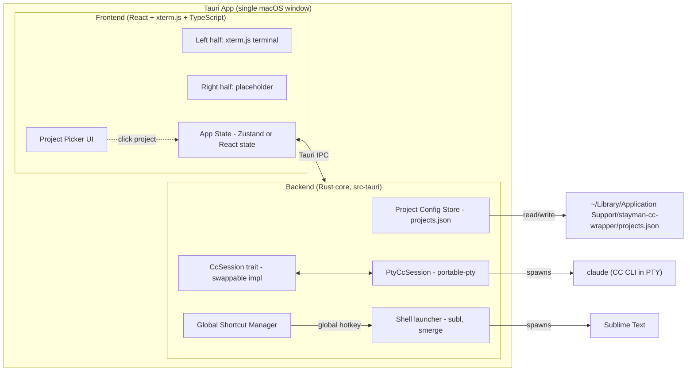

> Revision 2026-05-19: Added cross-window CC status indicator (Phase 2) — see "Phase 2 / Phase 3 forward-look" section. No Phase 1 components affected; the indicator is a Phase 2 forward-look only.

# Architecture

**Phase:** Phase 1 (Bare Shell PoC). YAGNI applied — only the components needed to satisfy Phase 1 exit criteria are designed in detail. Forward-compatibility seams for Phase 2 (stateful CC controller, file-watcher, skill registry, Recycle Session) and Phase 3 (lite editor, diff viewer, right-half panel swap) are explicitly identified as **extension points**, not built.

### Tech Stack

- **Language (backend):** Rust (stable, ≥1.77) — required by Tauri 2; owns the CC process, PTY, filesystem, global shortcuts, project config persistence. Rust is also a deliberate fit for Phase 2's stateful-controller work (process lifecycle, file watching, async I/O).
- **Language (frontend):** TypeScript + React 19 — community consensus for Tauri 2 in 2026 (matches the Terax reference project); the lite-editor work in Phase 3 (Monaco or CodeMirror 6) needs this stack regardless, so we pay the cost once.
- **Build / bundler:** Vite — fast HMR for dev; Tauri's `beforeDevCommand` / `beforeBuildCommand` hooks plug into Vite's CLI cleanly.
- **Framework:** Tauri 2 (2.9.x line) — native WebView (WKWebView on macOS); ~3MB bundle; Rust backend with IPC to a web frontend.
- **Embedded terminal:**
  - Backend: `tauri-plugin-pty` (wraps `portable-pty`) — registered in the Tauri builder; spawns `claude` in a real pty inside the Rust core. **Course-correction from roadmap.md text** (which said "node-pty via Tauri sidecar pattern"): node-pty would require shipping a Node runtime in the bundle, defeating the bundle-size advantage. portable-pty runs natively in Rust. Roadmap *milestone text* will be amended via a minor edit during WBS prep, not via a P4 back-loop (phase structure, exit criteria, and intent are unchanged).
  - Frontend: `@xterm/xterm` + `@xterm/addon-fit` + `@xterm/addon-webgl` — render the terminal, fit to container, GPU-accelerate.
  - Bridge: `tauri-pty` (JS bindings shipped with `tauri-plugin-pty`) — `spawn()` returns a handle whose `onData` / `write` / `resize` mirror node-pty's API closely enough that xterm.js wiring is straight-line.
- **Global shortcuts:** `tauri-plugin-global-shortcut` — for Sublime Text hotkey-pop. Requires macOS Accessibility permission flow; app must prompt on first launch.
- **External tools invoked via shell:** `subl` (Sublime Text), `smerge` (Sublime Merge — Phase 2). Wrapper invokes them via Tauri's `tauri-plugin-shell` `Command` API; no embedding.
- **Persistence:** flat JSON file at `~/Library/Application Support/stayman-cc-wrapper/projects.json` via `tauri-plugin-fs` + `path::app_data_dir()`. No DB; project list is a list of `{path, last_opened_at, display_name?}` records. Matches the "no per-project config burden" vision principle (no `.wrapper.json` per repo).
- **Database:** none — Phase 1 has no relational data, and the only durable state is the project list (handled above).
- **Infrastructure:** none — this is a single-user desktop app; no servers, no cloud, no telemetry.

### Dev Environment

**Host-based (opt-out — justification required).**

This is a desktop application targeting macOS. Tauri development requires direct access to the host's WKWebView, macOS code-signing chain (for later phases), and native windowing — all of which a Docker container on macOS cannot provide. The standard Tauri 2 toolchain runs natively on macOS via `rustup` + `node`. Industry practice for Tauri development is host-based; Dockerizing it would add friction without benefit.

**Toolchain:**
- Rust (stable, ≥1.77) via `rustup`
- Node 20 LTS or newer via `nvm` / `fnm` / system install
- Xcode Command Line Tools (`xcode-select --install`) — provides the C compiler, `codesign`, and macOS SDK headers
- `pnpm` (preferred) or `npm` for frontend deps
- Sublime Text and Sublime Merge installed locally; `subl` and `smerge` available on `PATH` (the wrapper invokes them but does NOT install them)
- Claude Code CLI installed and authenticated independently (`claude` on `PATH`)

**First-run bootstrap:**
```bash
# clone, then in repo root:
pnpm install            # frontend deps
cd src-tauri && cargo fetch   # backend deps
cd ..
pnpm tauri dev          # development run (Vite + Tauri together)
```

**Build commands during dev:**
- `pnpm tauri dev` — full app, live reload
- `pnpm tauri build` — production .app bundle
- `cargo test` (inside `src-tauri/`) — Rust unit tests
- `pnpm test` — frontend tests (Vitest)
- Lint: `pnpm lint` (eslint), `cargo clippy` (Rust)

### System Design



**Component responsibilities:**

| Component | Layer | Responsibility |
|-----------|-------|---------------|
| Project Picker UI | Frontend | List recents from config; "Open Folder" via Tauri dialog; emit `open_project(path)` |
| App State | Frontend | Current project, terminal connection state, panel layout (placeholder in P1) |
| Left pane terminal | Frontend | xterm.js instance; bidirectional stream with `CcSession` via IPC |
| Right pane placeholder | Frontend | Static "Coming in Phase 3" panel; reserved real-estate |
| Project Config Store | Backend | Read/write `projects.json`; debounced writes on update |
| `CcSession` trait | Backend | **Forward-compat seam.** Abstract interface: `send_input(bytes)`, `on_output(callback)`, `resize(cols, rows)`, `wait_for_exit()`, `kill()`. Phase 1 has one impl (`PtyCcSession`); Phase 2 may add `recycle()` and richer state events; future could add an `SdkCcSession` if we ever migrate to the Agent SDK. |
| `PtyCcSession` | Backend | Concrete impl using `portable-pty` to spawn `claude --dangerously-skip-permissions` with the project dir as cwd; bridges to frontend xterm.js via Tauri events. |
| Shell launcher | Backend | Spawns `subl <path>` (or `subl --project <file>` if a `.sublime-project` exists); spawns `smerge <path>` (Phase 2). Uses `tauri-plugin-shell`. |
| Global Shortcut Manager | Backend | Registers user-configured hotkeys (Phase 1: Sublime-pop) via `tauri-plugin-global-shortcut`. |

**Forward-compatibility seams (NOT built in Phase 1, only reserved):**

- `CcSession` trait is the seam for Phase 2's stateful controller (extra methods for ready-state detection, recycle, file-watcher integration) and any future Agent-SDK-backed implementation.
- A `WorkflowStateWatcher` module is *not* created in Phase 1 — it will be added in Phase 2 alongside the file-watcher.
- A `SkillRegistry` module is *not* created in Phase 1 — Phase 2 work.
- The right pane is a placeholder component; Phase 3 will replace it with a tabbed/swappable panel host. No premature panel-swap abstraction in Phase 1.
- The frontend keeps a single `AppState` slice per project; multi-project tabs in the same window are **out of scope** for all current phases (the launcher opens one project per window — if users want multiple projects simultaneously, they open multiple wrapper windows).

### Data Flow

**Phase 1 happy path — project open:**

1. User clicks a project in the picker (or selects "Open Folder").
2. Frontend invokes Tauri command `open_project(path)`.
3. Backend updates `projects.json` (`last_opened_at`, optionally adds new project).
4. Backend instantiates a `PtyCcSession` with cwd=`path`, command=`claude`, args=`["--dangerously-skip-permissions"]`.
5. Backend emits `cc-session-ready` event with a session handle ID.
6. Frontend receives the event, mounts xterm.js, subscribes to `cc-output-<sid>` events, wires xterm.js `onData` → Tauri command `cc-input(sid, bytes)`, and `xterm fit addon resize` → `cc-resize(sid, cols, rows)`.
7. CC's TUI renders inside xterm.js. User interacts as in a normal terminal.

**Phase 1 happy path — Sublime hotkey:**

1. User presses configured global hotkey (e.g., `Cmd+Shift+E`).
2. `tauri-plugin-global-shortcut` handler fires in Rust.
3. Handler reads current project's path from app state.
4. Spawns `subl <path>` (or `subl --project <file>` when a `.sublime-project` exists at the root) via `tauri-plugin-shell`.
5. macOS focuses the Sublime Text window.

**Phase 1 shutdown / window close:**

1. Frontend signals `close_project` (or window close event).
2. Backend calls `CcSession::kill()` — sends SIGTERM to the CC process, then SIGKILL after timeout.
3. Backend persists `projects.json` final state.
4. App quits.

### Key Decisions

- **Tauri over Electron.** Aligned with vision principle 1 ("lite over featureful"). Research established 25x smaller bundle, ~50% lower RAM, faster startup. The "less mature packaging ecosystem" tradeoff is acceptable for a single-user tool.
- **`tauri-plugin-pty` / `portable-pty` over node-pty + sidecar.** node-pty requires a Node runtime; portable-pty runs natively in Rust. Bundle-size and architectural cleanliness win.
- **PTY byte-injection over Agent SDK for v1.** The vision requires the familiar interactive CC TUI in the left pane. PTY byte-injection means we treat the wrapper as a legitimate terminal-front-end — typing slash commands as a human would. We avoid the "PTY scraping" anti-pattern (parsing CC's output text to infer state) by using **file watching** (Phase 2) for state detection. The `CcSession` trait is the seam that lets us swap to an Agent SDK backend later without UI changes.
- **One project per window.** No multi-project tabs. Simpler app state; multiple projects = multiple wrapper windows. Matches how the user described "3–4 active at a time" — separate windows let the OS window manager handle layout.
- **Flat JSON for project list.** No SQLite, no app-managed DB. The list is ≤100 entries with read-on-open and write-on-update; JSON is appropriate.
- **No per-project config file in the project itself.** Project list lives in `~/Library/Application Support/...`, not in `.wrapper.json` files inside each repo. Aligned with vision principle 5.
- **Host-based dev environment, not Docker.** Tauri targets host WKWebView and native windowing; Docker on macOS cannot provide them. Industry standard for Tauri.
- **`--dangerously-skip-permissions` (yolo mode) by default.** Vision explicit. A Phase 4 setting will let users opt out.
- **macOS Accessibility permission for global shortcuts.** Required by `tauri-plugin-global-shortcut` on macOS. The app must surface a permission-grant flow on first launch — added as a Phase 1 task.

### Phase 2 / Phase 3 forward-look (informational, not built)

- **Phase 2 will add:** `WorkflowStateWatcher` (notify-based file watcher for `workflow/.session.md`), `SkillRegistry` (scan `~/.claude/skills/` + `<project>/.claude/skills/`), Recycle Session orchestration (state machine in Rust: `Pausing → WaitingForSessionFile → SendingCtrlD → WaitingForExit → Respawning → Resuming`), and extend `CcSession` with `readiness` and `recycle` methods.

- **Phase 2 cross-window CC status indicator architecture:**
  - **Detection source = CC's hook channel, not the PTY.** On first launch (or via a Phase 4 setting), the wrapper installs an entry into `~/.claude/settings.json`'s `hooks` block for `UserPromptSubmit` (→ "running"), `Stop` (→ "idle"), and `Notification` (→ "running" + may include a "needs human input" sub-state if useful). The hook is a tiny script (Perl or POSIX shell, no runtime deps) that writes the event + pid + cwd + timestamp to the shared instances file. This is the same hook channel `claude-time` uses — coexistence is by side-by-side hook entries, not by sharing a single script.
  - **Cross-window state file = `~/Library/Application Support/stayman-cc-wrapper/instances.json`.** One record per running wrapper instance: `{ pid, project_path, project_display_name, cc_state: "idle"|"running"|"exited"|"unknown", last_event_at, last_heartbeat_at, window_id }`. Each wrapper process owns its own record (writes own pid+state) and reads everyone else's. Records older than ~10s with no heartbeat are treated as `stale` and dimmed/dropped. Atomic writes (write-temp-rename) prevent torn reads.
  - **Heartbeat = wrapper-side, not hook-side.** Each wrapper process refreshes its own `last_heartbeat_at` every ~3s while running, so a crashed wrapper falls out of the indicator within ~10s even if the hook never fired a Stop. The hook only writes the *state* fields; the wrapper writes the heartbeat.
  - **Render = file-watcher.** Every wrapper window's frontend gets a stream of `instances.json` updates via a Rust-side `notify`-backed watcher (debounced ~100ms). The indicator UI component is a horizontal strip of dots/badges, one per known instance, with the current window's instance highlighted. Click another instance's badge → focus that window via macOS window-server APIs (or via a tiny IPC nudge to the target wrapper process).
  - **Extends `CcSession` trait.** Add a `state_events()` stream: `Running` / `Idle` / `Exited` enum. `PtyCcSession` translates incoming hook-channel events (read off the shared file or a hook-side socket — decision in WP9b probe) into `CcSession::state_events`. Cross-window aggregation is a layer above this, reading the instances file directly.
  - **What is NOT done:** no parsing of CC's stdout/stderr to infer state; no PTY screen-buffer regex matching; no model-output sniffing. If the hook channel ever fails, the badge shows `unknown` (greyed out) rather than guessing.
- **Phase 3 will add:** Right-pane Monaco or CodeMirror 6 editor; libgit2-backed (or `git2` Rust crate) diff viewer; a second `PtyCcSession`-equivalent for the "ad-hoc terminal" mode; a panel-host component on the right that swaps between editor / diff / terminal.
- **Future hedge:** `SdkCcSession` impl of `CcSession` (using `@anthropic-ai/claude-agent-sdk`) is documented in research as a potential migration path if PTY-based control ever becomes untenable.
