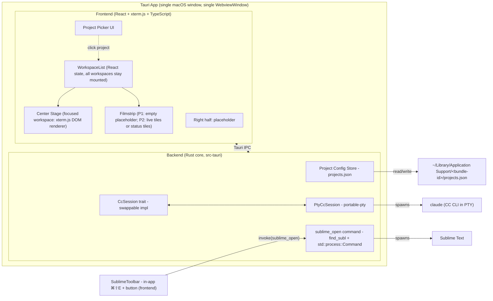

<!-- Part of the Claudesk architecture set. Index + load-bearing constraints: ../arch.md -->
# Foundations — stack, environment & system design

> The 2026-05→06 revision log is archived at [`../archive/revision-log/arch-preamble-2026-05-to-06.md`](../archive/revision-log/arch-preamble-2026-05-to-06.md) — its substance is inline below (verified claim-by-claim). ⚠️ One claim was **relocated, not archived**: the GUI-PATH fix appeared exactly once in the whole file, and is now under "Data Flow".

> **Historical framing note.** The "Phase 1 / Phase 2 / Phase 3" language below is the original
> pre-build vocabulary; nearly all of it has since shipped. Read a "Phase 2 forward-look" marker as
> *"as-built, see the linked subsystem doc"* — the per-subsystem files are the authority.

**GUI-PATH capture (as-built, M6-era; ⚠️ RELOCATED here 2026-08-03 — it previously existed **only** inside an archived revision note).** A Finder/Dock-launched macOS `.app` inherits the minimal launchd `PATH` (`/usr/bin:/bin:/usr/sbin:/sbin`), **not** the user's shell `PATH` — so user-installed CLIs (`claude` in `~/.local/bin`, Homebrew/`fnm` bins) are invisible and `cc_spawn` fails with *"No viable candidates found in PATH"*. `src-tauri/src/env_path/` fixes it app-wide: at `.setup()` (**FIRST**, before any spawn) the app captures the login-shell `PATH` (`$SHELL -l -i -c 'printf %s "$PATH"'`, fallback `/bin/zsh`) and sets it process-wide — best-effort, never blanking an existing `PATH`. ⚠️ **This bites the installed build ONLY** — `pnpm tauri:dev` inherits the terminal's full `PATH` and never reproduces it. Any new external-CLI spawn benefits automatically; do **not** re-introduce per-spawn PATH hacks.

## Tech Stack

- **Language (backend):** Rust (stable, ≥1.77) — required by Tauri 2; owns the CC process, PTY, filesystem, global shortcuts, project config persistence, **status broadcaster (Phase 2)**, **Unix-socket hook listener (Phase 2)**. Rust is also a deliberate fit for Phase 2's stateful-controller work (process lifecycle, file watching, async I/O).
- **Language (frontend):** TypeScript + React 19 — community consensus for Tauri 2 in 2026 (matches the Terax reference project); the lite-editor work in Phase 3 (Monaco or CodeMirror 6) needs this stack regardless, so we pay the cost once.
- **Build / bundler:** Vite — fast HMR for dev; Tauri's `beforeDevCommand` / `beforeBuildCommand` hooks plug into Vite's CLI cleanly.
- **Framework:** Tauri 2 (2.9.x line) — native WebView (WKWebView on macOS); ~3MB bundle; Rust backend with IPC to a web frontend. **Single `WebviewWindow`**, all workspaces are React components in one webview (research decision: no multi-webview).
- **Embedded terminal:**
  - Backend: `tauri-plugin-pty` (wraps `portable-pty`) — registered in the Tauri builder; spawns `claude` in a real pty inside the Rust core. **Course-correction from roadmap.md text** (which said "node-pty via Tauri sidecar pattern"): node-pty would require shipping a Node runtime in the bundle, defeating the bundle-size advantage. portable-pty runs natively in Rust.
  - Frontend: `@xterm/xterm` + `@xterm/addon-fit` — render the terminal, fit to container. **DOM renderer only — `@xterm/addon-webgl` is NOT used** (2026-06-15 decision; see Key Decisions below). The 2026 DOM renderer is fast enough for the foreground workspace.
  - Bridge: `tauri-pty` (JS bindings shipped with `tauri-plugin-pty`) — `spawn()` returns a handle whose `onData` / `write` / `resize` mirror node-pty's API closely enough that xterm.js wiring is straight-line.
- **Sublime-pop hotkey:** an **in-app** keybinding — a webview `keydown` handler (`⌘⇧E`) owned by the focused workspace. NOT an OS-global shortcut, so **no `tauri-plugin-global-shortcut` and no macOS Accessibility permission** are required. (As-built 2026-06-19, WP8: the OS-global approach was built then rejected at verify-human in favor of in-app — see WP8 in `../archive/phase-1-bare-shell-poc/wbs.md`.)
- **External tools invoked via shell:** `subl` (Sublime Text), `smerge` (Sublime Merge — Phase 2). Claudesk launches `subl` from the backend `sublime_open` command via **`std::process::Command`** (consistent with `cc_session` spawning `claude`; the original `tauri-plugin-shell` plan was dropped as-built — the launch is backend code, not a frontend-callable shell). No embedding.
- **Persistence:** flat JSON file at `~/Library/Application Support/<bundle-id>/projects.json` via `tauri-plugin-fs` + `path::app_data_dir()` — `<bundle-id>` is `com.claudesk.app` (prod) or `com.claudesk.app.dev` (dev), per the dev/prod-isolation note at the top of this file (NOT `Claudesk/`). No DB; project list is a list of `{path, last_opened_at, display_name?, default_drive_mode?}` records. Matches the "no per-project config burden" vision principle (no `.claudesk.json` per repo).
- **Database:** none — Phase 1 has no relational data, and the only durable state is the project list (handled above).
- **Infrastructure:** none — this is a single-user desktop app; no servers, no cloud, no telemetry.

**Phase 2 additions (forward-look, not built in Phase 1):**
- `tauri-nspanel` v2.1 — `NSPanel` wrapper for the PiP window (display-only floating panel, all-Spaces, fullscreen-aux, non-activating).
- `tauri-plugin-positioner` (with `tray-icon` feature) — positions the menu-bar popover under the tray icon.
- `notify` (via **`notify-debouncer-full` 0.7**, which re-exports `notify ^8.2`) — debounced filesystem watcher. **BUILT 2026-06-24 (QoL-WP0, commit `d893254`)** — but NOT for `.session.md` (that use was ~~DROPPED at M3~~: `.session.md` is a manual pause bookmark, not a live signal; a future milestone may watch the live workflow doc hierarchy `roadmap → wbs → wip(s) → backlog` instead — `SURFACE-2026-06-22-WP5-DROPPED-WATCH-WORKFLOW-DOC-HIERARCHY`). The watcher Claudesk actually ships is a **per-workspace** watcher in `src-tauri/src/fs_watch/`: on workspace-open (mirroring `workspace_register` in `useWorkspaceStatus.ts`) it starts a recursive debouncer over the project root and emits a debounced, heavy-dir-filtered `fs-change` Tauri event; on close it stops (drop-stops-the-debouncer). Exclusion shares `fs_index`'s rule — **as-built M6 WP6 re-base (commit `61db3d4`): heavy-dir, NOT gitignore** (`.git/` hard-excluded + heavy/generated dirs suppressed by a pure NAME-based predicate on the hot path; gitignored-but-edited files like `.env` get live external-change refresh). One contract with the tree walk. Two consumers subscribe: the **FileTree rail** auto-refreshes (re-walks `fs_tree`, preserving expand/scroll, via an `fsTreeRefreshKey` bump) and **open editor docs** live-reload (re-stat + the existing `diskConflict.diskDecision` → reload-when-clean / conflict-when-dirty, no tab activation needed). Module shape mirrors `status_broadcaster` (pure transform + DTO in `mod.rs`; managed debouncer registry + `workspace_watch_start`/`_stop` commands + `app.emit` in `commands.rs`). `FsChange` DTO is snake_case end-to-end (the IPC-casing convention, contract-tested both sides).

**Milestone 2 additions** (CM6 + git2 + search/index deps) — enumerated with pinned versions in the [right-panel surfaces](right-panel-surfaces.md) doc; not duplicated here.

## Dev Environment

**Host-based (opt-out — justification required).**

This is a desktop application targeting macOS. Tauri development requires direct access to the host's WKWebView, macOS code-signing chain (for later phases), and native windowing — all of which a Docker container on macOS cannot provide. The standard Tauri 2 toolchain runs natively on macOS via `rustup` + `node`. Industry practice for Tauri development is host-based; Dockerizing it would add friction without benefit.

**Toolchain:**
- Rust (stable, ≥1.77) via `rustup`
- Node 20 LTS or newer via `nvm` / `fnm` / system install
- Xcode Command Line Tools (`xcode-select --install`) — provides the C compiler, `codesign`, and macOS SDK headers
- `pnpm` (preferred) or `npm` for frontend deps
- Sublime Text installed locally (Sublime Merge too, for Phase 2). `subl`/`smerge` on `PATH` is **optional** — Claudesk discovers the binary via PATH → `.app` bundle (`/Applications/Sublime Text.app/.../bin/subl`) → `open -a` fallback (WP3 probe), so the maintainer's no-symlink setup works out of the box. Claudesk invokes Sublime but does NOT install it.
- Claude Code CLI installed and authenticated independently (`claude` on `PATH`)

**First-run bootstrap:**
```bash
# clone, then in repo root:
pnpm install            # frontend deps
cd src-tauri && cargo fetch   # backend deps
cd ..
pnpm tauri dev          # development run (Vite + Tauri together)
```

**Build commands during dev:**
- `pnpm tauri dev` — full app, live reload
- `pnpm tauri build` — production .app bundle
- `cargo test` (inside `src-tauri/`) — Rust unit tests
- `pnpm test` — frontend tests (Vitest)
- Lint: `pnpm lint` (eslint), `cargo clippy` (Rust)

## System Design



**Component responsibilities:**

| Component | Layer | Responsibility |
|-----------|-------|---------------|
| Project Picker UI | Frontend | List recents from config; "Open Folder" via Tauri dialog; emit `open_workspace(path)` (Phase 1: opens the single workspace; Phase 2: opens a new workspace into the list) |
| **WorkspaceList** | Frontend | Authoritative array of `Workspace { id, project_path, cc_session_id, status, xterm_ref }`. All workspaces stay mounted; switching center stage is `display: none` / `display: block`, never unmount. Phase 1: length always 1. Phase 2: length N. |
| **Center Stage** | Frontend | Renders the focused workspace at full size. Hosts the xterm.js terminal pane (left) and the right-half placeholder. |
| **Filmstrip** | Frontend | Phase 1: empty placeholder container (so Phase 2 doesn't have to introduce a new layout slot). Phase 2: one tile per non-focused workspace (live ~1 fps mirror OR static status tile, per probe outcome). |
| Right pane placeholder | Frontend | **Milestone 1:** static "Coming soon" panel; reserved real-estate inside each workspace. **Milestone 2:** grows into the per-workspace **RightPanelHost** (editor / diff / second-terminal swap) — see Milestone 2 architecture below. |
| Project Config Store | Backend | Read/write `projects.json`; debounced writes on update. |
| `CcSession` trait | Backend | **Forward-compat seam.** Abstract interface: `send_input(bytes)`, `on_output(callback)`, `resize(cols, rows)`, `wait_for_exit()`, `kill()`. Phase 1 has one impl (`PtyCcSession`); Phase 2 will add `recycle()`, `state_events()`, and per-session status fan-out. Future could add an `SdkCcSession` if we ever migrate to the Agent SDK. |
| `PtyCcSession` | Backend | Concrete impl using `portable-pty` to spawn `claude --dangerously-skip-permissions` with the project dir as cwd; bridges to frontend xterm.js via Tauri events. |
| `sublime` module / `sublime_open` + `smerge_open` commands | Backend | Resolves `subl`/`smerge` (PATH → `.app` bundle → `open -a`, per WP3) and spawns `subl <path>` / `smerge <path>` via `std::process::Command` (steal focus; never `--project`/`--new-window`). Frontend-invoked from the `RightPanelHost` tab-row icon buttons (`sublime/sublimeLaunch.ts`). **PERMANENT (revised 2026-06-20, WP8): both commands stay** — WP8 was redefined to KEEP both launchers (no removal). The Sublime-Text `⌘⇧O` hotkey was deleted (button-only now); the backend module is otherwise unchanged. |
| In-app Sublime hotkey + button | Frontend | `SublimeToolbar` in each workspace's right panel: an "Open in Sublime" button (labeled `⌘⇧E`) and a `keydown` handler bound only on the focused workspace. Both `invoke("sublime_open", {projectPath})`. No OS-global shortcut, no Accessibility permission. |

**Forward-compatibility seams (NOT built in Phase 1, only reserved):**

- `CcSession` trait is the seam for Phase 2's stateful controller (extra methods for ready-state detection, recycle, file-watcher integration) and any future Agent-SDK-backed implementation.
- **WorkspaceList holds many workspaces in Phase 2; in Phase 1 it always holds exactly one.** The data shape is the same; the only Phase 1 invariant is N=1 enforced by the picker's "open project" handler.
- The Filmstrip slot exists in Phase 1 layout but is empty — Phase 2 populates it.
- A `WorkflowStateWatcher` module is *not* created in Phase 1 — Phase 2.
- A `StatusBroadcaster` module is *not* created in Phase 1 — Phase 2.
- A `SkillRegistry` module is *not* created in Phase 1 — Phase 2.
- The right pane inside each workspace is a placeholder component; Phase 3 will replace it with a tabbed/swappable panel host. No premature panel-swap abstraction in Phase 1.

## Terminal-mirror rendering probe (the filmstrip/PiP mechanism)

A new Phase 1 work package: a synthetic harness measuring whether ~1 fps live terminal mirrors are cheap enough at N=8 workspaces. **Pass → Phase 2 ships live mirrors. Fail → Phase 2 ships status tiles in v1**, leave live mirrors as a Future Possibility.

**Harness shape:**
- 8 xterm.js instances, DOM renderer only, full-size rendering.
- Each xterm fed a representative CC output stream (canned recording of a typical Claude Code session, looped).
- Filmstrip thumbnails are `scale(0.15)` CSS-transformed tiles mirroring each background terminal, throttled to ~1 fps.
- One workspace simultaneously active (rendering normally at full speed) to simulate the center-stage workload.

> **CORRECTION (2026-06-17, from WP4 outcome).** The original text above said "live mirrors of those **off-screen** full-size xterms." That mechanism is **non-viable** and was corrected during WP4 (see `wp4-thumbnail-probe-outcome.md`): (1) a DOM node has exactly one parent, so one xterm subtree cannot appear in both an off-screen container and a filmstrip tile; (2) xterm.js's `RenderService` registers an `IntersectionObserver({threshold:0})` that **pauses the renderer for off-viewport terminals** — so an off-screen (`left:-99999px`) terminal's DOM goes stale and there is nothing live to mirror. The viable mechanism, validated by the probe, is **`@xterm/addon-serialize` `serializeAsHTML()` from the buffer** (the buffer updates via `write()` even while the renderer is paused), rendered into the tile at ~1 fps. Background workspaces are deliberately kept off-viewport so the renderer pauses for free; the serialized snapshot stays current. (`cloneNode`-per-frame of the live DOM also works but is more expensive and forces backgrounds on-viewport — rejected.)

**Measurements:**
- CPU usage at idle (all 8 workspaces "idle"; no PTY output flowing): target **<10%**.
- CPU usage during one active CC session (center-stage workspace receiving real output; 7 backgrounds idle): target **<20%**.
- RAM total: target **<300 MB**.
- Frame time on the center-stage workspace: target **<16ms** (no visible jank from background-mirror work).

Thresholds above are the proposed defaults. The probe's own implementation plan (when picked up as a Phase 1 WP) finalises them.

**Output:** a one-page report. **Decided as a sibling doc:** [`wp4-thumbnail-probe-outcome.md`](../archive/phase-1-bare-shell-poc/wp4-thumbnail-probe-outcome.md) (kept separate to avoid bloating this file).

> **OUTCOME (2026-06-17): PASS → Phase 2 ships live ~1 fps mirrors, using `serializeAsHTML()`.** On Apple M4 / macOS 26.5.1 against a real-CC-transcript-reconstructed fixture: idle webview CPU 4.5% (<10% ✅), active median 13.3% (<20% ✅; p95 ~30% on bursts — caveat + mitigations in the report), RAM 240 MB (<300 ✅), center frame time p95 18 ms with **0 dropped frames** (✅). The `serialize` arm beat `cloneNode`. Full measurements, arm comparison, caveats (frame-time measured in Chromium; CPU via `top`), and Phase 2 deltas → `wp4-thumbnail-probe-outcome.md`.

## Data Flow

**Phase 1 happy path — project open:**

1. User clicks a project in the picker (or selects "Open Folder").
2. Frontend invokes Tauri command `open_workspace(path)`.
3. Backend updates `projects.json` (`last_opened_at`, optionally adds new project).
4. Backend instantiates a `PtyCcSession` with cwd=`path`, command=`claude`, args=`["--dangerously-skip-permissions"]`.
5. Backend emits `cc-session-ready` event with a session handle ID.
6. Frontend receives the event, **adds a Workspace record to `WorkspaceList`** (Phase 1: list now has length 1), mounts xterm.js inside the center stage, subscribes to `cc-output-<sid>` events, wires xterm.js `onData` → Tauri command `cc-input(sid, bytes)`, and `xterm fit addon resize` → `cc-resize(sid, cols, rows)`.
7. CC's TUI renders inside xterm.js. User interacts as in a normal terminal.

> **As-built (M10.5 WP4 — I/O encoding, UTF-8-correct both directions):** two mojibake root causes fixed. **(Input)** `encodeBase64` (`src/cc/bridge.ts`) encodes the string's real **UTF-8 bytes** (`TextEncoder`) before base64 — the earlier `charCodeAt(i) & 0xff` truncated any code unit > 0xFF / surrogate pair, so pasted multi-byte glyphs (emoji, accented, arrows) reached CC as `�`. **(Output/locale)** the shared spawn env `color_tty_env()` (`cc_session/mod.rs`, consumed by BOTH the CC spawn and the WP9 shell spawn) now sets `LANG`+`LC_ALL=en_US.UTF-8` alongside `TERM`/`COLORTERM`. A **Finder/Dock-launched `.app` inherits the minimal launchd env where `LANG` is unset** → the spawned `claude`/shell defaults to `LC_CTYPE=C` (ASCII) and mangles UTF-8 output; the explicit UTF-8 locale forces correct decoding regardless of launch context. This output bug is **installed-`.app`-only** — `pnpm tauri:dev` inherits the login-shell's UTF-8 `LANG`, so it never reproduces in dev (the installed-build-smoke-test convention class).

**Phase 1 happy path — Sublime hotkey/button (in-app):**

1. With Claudesk focused, the user presses `⌘⇧E` (an in-app webview keybinding) OR clicks the "Open in Sublime" button in the focused workspace's right-panel toolbar.
2. The focused workspace's `SublimeToolbar` reads its own `project_path` (frontend React state) and calls `invoke("sublime_open", { projectPath })`.
3. The backend `sublime_open` command resolves `subl` (PATH → `.app` bundle → `open -a`) and spawns `subl <path>` via `std::process::Command` (`open -a "Sublime Text" <path>` on the fallback). Never `--project`/`--new-window` (WP3).
4. macOS focuses the Sublime Text window (steal-focus is intended — the user explicitly asked for Sublime).
5. `⌘⇧E` does nothing when Claudesk is not the focused app (in-app keybinding, not OS-global) — no Accessibility permission needed.

**Phase 1 shutdown / window close:**

1. Frontend signals `close_workspace` (or window close event).
2. For each workspace in `WorkspaceList`, backend calls `CcSession::kill()`. **As-built (M10.5 WP3):** a brief clean-exit attempt (`exit_command\r` — `/exit` CC / `exit` shell — polled 500ms) then a **SIGHUP-first, process-GROUP** teardown: `killpg(pgid, SIGHUP)` → ~300ms grace → `killpg(pgid, SIGKILL)` → reap. The child is a `setsid` group leader (portable-pty), so `pgid == child PID` and the group signal reaps CC/shell **and any subagent/child**. **SIGHUP (not SIGTERM)** is deliberate: it lets an interactive login shell run its on-exit history save (`~/.zsh_history`) — SIGTERM/SIGKILL lose it (verified M10.5 WP3) — so closing without typing `exit` no longer drops the terminal's command history. (Supersedes the earlier "sends SIGTERM… then SIGKILL" plan, which was neither as-built nor correct for history preservation.)
3. Backend persists `projects.json` final state.
4. App quits.

## Key Decisions

- **Tauri over Electron.** Aligned with vision principle 1 ("lite over featureful"). Research established 25x smaller bundle, ~50% lower RAM, faster startup. The "less mature packaging ecosystem" tradeoff is acceptable for a single-user tool.
- **`tauri-plugin-pty` / `portable-pty` over node-pty + sidecar.** node-pty requires a Node runtime; portable-pty runs natively in Rust. Bundle-size and architectural cleanliness win.
- **PTY byte-injection over Agent SDK for v1.** The vision requires the familiar interactive CC TUI in the foreground workspace. PTY byte-injection means we treat Claudesk as a legitimate terminal-front-end — typing slash commands as a human would. We avoid the "PTY scraping" anti-pattern (parsing CC's output text to infer state) by using **file watching** (Phase 2) for state detection. The `CcSession` trait is the seam that lets us swap to an Agent SDK backend later without UI changes.
- **Single window, many workspaces (NEW 2026-06-15).** Reversed from "one project per window." Multiple projects = workspaces inside one window, switched via filmstrip thumbnails (Phase 2). Aligned with the revised vision and the way the user actually juggles 3–4 projects.
- **xterm.js DOM renderer only — no WebGL (NEW 2026-06-15).** Research established the browser-wide WebGL-context cap of ~16/page. With a tab shell hosting many xterm instances, the WebGL renderer either hits the cap or forces a swap-on-focus complexity that gives marginal benefit on top of the modern DOM renderer. Verdict: DOM-only is simpler and good enough for the foreground workspace. If a single-workspace user one day proves the DOM renderer can't keep up, we re-add the WebGL addon for the center stage only — a one-line addon load. Decision is reversible.
- **Single `WebviewWindow`, no multi-webview (NEW 2026-06-15).** Tauri 2's multi-webview API is `unstable`-flagged and offers webview isolation we don't need (all workspaces share Claudesk's trust boundary). React-managed tabs in one webview is the stable choice.
- **Tab-shell substrate ships in Phase 1 (NEW 2026-06-15).** The WorkspaceList + Center Stage + Filmstrip slot are built in Phase 1 even though Phase 1 only ever opens one workspace. This is "design for N=1 with N>1 in mind" — Phase 2 plugs into existing structure rather than reshaping the foundation.
- **Thumbnail-rendering probe gates Phase 2's filmstrip + PiP rendering (NEW 2026-06-15).** Decision recorded in the dedicated section above. Probe pass → live ~1 fps mirrors. Probe fail → status tiles in v1.
- **Menu-bar status item ships BEFORE PiP in Phase 2 (NEW 2026-06-15) — SUPERSEDED 2026-06-22.** Reversed by the dogfood-first resequence: PiP (M5) ships **before** the menu-bar (M6) and is **unconditional** (no dogfood gate). See [status surfaces](status-channel-and-surfaces.md) §B.3 + roadmap "Revision 2026-06-22".
- **Menu-bar item is an ambient ALARM + ACTUATOR, not a status surface (NEW 2026-06-29, M7 — shrunk at spec debate).** The M7 menu-bar item was deliberately scoped DOWN from a third status surface to its one non-redundant edge over the shipped M5 PiP: **location** (the menu bar is a strip the user already watches all day, present even at zero workspaces, no summon/allocated region). It is **(a) a 2-state ambient alarm** — a template tray icon that is **lit when ANY workspace is `AwaitingInput`** ("a project is blocked on me") and **neutral otherwise** (Running + Idle both collapse to "nothing for me to do"; running-vs-idle detail is PiP's / the window's job) — reduced by a pure unit-tested fold `aggregate_alarm(states) -> {Attention|Neutral}`, swapped via the atomic `set_icon_with_as_template` setter (the as-built tauri 2.11.2 method — the specced `set_icon_and_icon_as_template_atomic` name doesn't exist; avoids the `tauri#6527` blink, and marshals to the main thread internally), `icon_as_template(true)` for light/dark; **and (b) a native menu** (left- or right-click → `TrayIconBuilder::menu(...)`) of **actuators** — Show Claudesk / Toggle PiP / Quit — reusing the 2026-06-24 `app_menu` bridge; actuators are the non-redundant complement because display-only PiP can't *act on* the app. **CUT (the rejected "status surface" half that re-implemented PiP):** the popover `WebviewWindow`, per-workspace list, navigate-on-click, the `tauri-plugin-positioner` dependency, the third Vite entry `popover.html`/`src/popover/`, and the `tauri#13633` blur-probe risk — all gone. **Why:** capability-by-capability a popover-list-dashboard was a strict subset of PiP (`On`+`minimal` already gives near-zero-pixel, all-Spaces, always-on aggregate status); two overlapping dashboards split the glance + double maintenance — the opposite of the "lite / attention is scarce" thesis. An alarm + an actuator do NOT overlap a display dashboard. Activation policy stays `Regular` (additive tray — dock icon + main window kept). See [status surfaces](status-channel-and-surfaces.md) §B.2 + design-prior [[new-surface-must-earn-its-place-against-existing-ones]].
- **CC hook channel via Unix socket, not shared file (NEW 2026-06-15).** Resolves the previously deferred WP9b probe. With three concurrent status-surface consumers (filmstrip / menu-bar / PiP), Unix-socket multi-consumer concurrency wins decisively over shared-file locking and debounce-write juggling.
- **Flat JSON for the project list. SQLite is the scoped exception for time-analytics (M9).** The **project list** (`projects.json`) stays flat JSON — no DB — because it is ≤100 entries with read-on-open / write-on-update semantics where JSON is appropriate. This rule governs the *project list specifically*, NOT the whole app. **M9 introduced one deliberate, scoped exception: a feature-local SQLite DB** (`<app-data>/time-analytics.sqlite`, per-identity — see [time analytics](time-analytics.md)) for the time-tracking event store. SQLite is the right tool *there* and not a contradiction of the flat-JSON rule: the analytics store is high-volume append-mostly event data (thousands of hook events/day) with time-range/session/project **query** needs and concurrent multi-writer access (multiple CC sessions' hooks) — exactly what a flat JSON file is wrong for and what `claude-time` already proved SQLite fits. The exception is *contained*: it is one feature's private store, opened lazily and gated OFF by default (`time_tracking_enabled`), and it does not migrate the project list or any other app state to a DB.
- **No per-project config file in the project itself.** Project list lives in `~/Library/Application Support/...`, not in `.claudesk.json` files inside each repo. Aligned with vision principle 5.
- **Host-based dev environment, not Docker.** Tauri targets host WKWebView and native windowing; Docker on macOS cannot provide them. Industry standard for Tauri.
- **`--dangerously-skip-permissions` (yolo mode) by default.** Vision explicit. A Phase 4 setting will let users opt out.
- **Sublime hotkey is in-app, not OS-global (revised 2026-06-19, WP8).** The original design used `tauri-plugin-global-shortcut` (which needs a macOS Accessibility grant + first-launch onboarding flow). That was built then rejected at verify-human — the operator clarified the hotkey should fire only while Claudesk is focused, not system-wide. As-built: a right-panel "Open in Sublime" affordance backed by `sublime_open`. (The `⌘⇧E`→`⌘⇧O` Sublime-Text `keydown` hotkey that originally accompanied the button was **deleted at WP8, 2026-06-20** — the button is now the only Sublime-Text affordance.) No `tauri-plugin-global-shortcut`, no Accessibility permission, no onboarding dialog. **Both Sublime launchers (Text + Merge) are now PERMANENT icon buttons** in the RightPanelHost tab row — WP8 was redefined to keep them (the earlier "removed at Milestone 2 once parity is proven" plan is superseded; see the Revision 2026-06-20 note at the top of this file).
- **CodeMirror 6 over Monaco for the in-app editor (Milestone 2, decided 2026-06-19 from `research.md`).** For an editor *embedded* as one panel among several in a ~3 MB Tauri app, CM6 wins decisively: ~1.26 MB gzipped vs Monaco's ~5 MB, no web-worker configuration (fiddly in WKWebView), composes as a component, native-webview/serializable pedigree fits Tauri IPC. Monaco's advantage (VS-Code-grade IntelliSense / language servers) doesn't apply — Claude Code is the intelligence layer, the editor is a Sublime-feature-parity *lite* editor. React binding: `@uiw/react-codemirror` (not legacy `react-codemirror2`). Reversible if a hard CM6 limitation surfaces, but the bundle/worker wins are structural.
- **The editor edits a document; the project is app-layer (Milestone 2).** Cmd+P fuzzy file finder and project-wide find/replace are Rust+React subsystems, not editor config — true for Monaco too (neither manages a project tree). The WBS budgets them as their own work, not sub-tasks of "wire up the editor." The diff viewer is `git2` (file list + base blobs) + `@codemirror/merge` (rendering), not `git2` computing the rendered diff.

