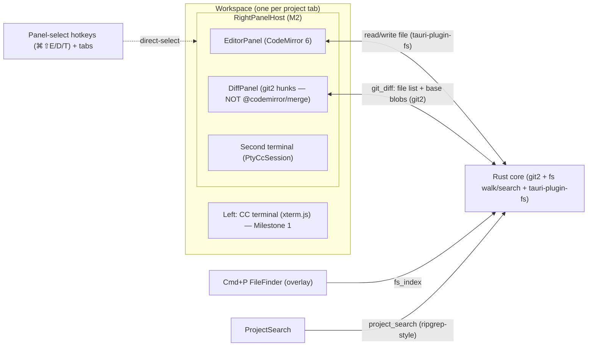

<!-- Part of the Claudesk architecture set. Index + load-bearing constraints: ../arch.md -->
# Right-panel surfaces

The per-workspace right half: **Editor · Diff · Terminal · Docs (gated)**.

## Editor, Diff & Terminal (as-built)

> **Status: SHIPPED + cycle closed 2026-06-22.** All M2 WPs (1, 2, 3a/b/c, 4, 5, 6, 7, 8, 9, 10, 11, 12, 13) landed; the M2 WBS is archived at `../archive/milestone-2-lite-editor-diff-viewer/wbs.md`. The section below now reads as as-built architecture (with a few inline as-built corrections), not a forward plan. Two design deltas from the original sketch were confirmed in code: the **DiffPanel renders styled git2-hunk lines, NOT `@codemirror/merge`** (lighter, exact Sublime-Merge look), and **both Sublime launchers were KEPT** (WP8 redefinition). A multi-file editor tab strip (WP12) + ⌘W close-tab (WP13) + file-tree navigator (WP10) + tree/editor density & git indicators (WP11) were added beyond the original component sketch.
>
> **Scope (Milestone 2, roadmap):** the right half stopped being a placeholder and became a real per-workspace editing surface that is the *primary* routine-editing surface (Sublime Text kept as a permanent escape hatch — WP8). Grounded in `research.md` (2026-06-19). YAGNI held — this designed M2 only; Milestones 3–9 (stateful CC controller, multi-workspace, status surfaces, polish) stay forward-look.

### Component shape

The Milestone 1 "right-half placeholder" inside each workspace becomes a **`RightPanelHost`** — a per-workspace React component that owns the right half and swaps between panels: **Editor** (CodeMirror 6, with a multi-file tab strip + split panes + a left file-tree rail), **Diff** (backend `git2` hunks rendered as styled +/- lines — NOT `@codemirror/merge`, as-built WP4), and **Terminal** — *N* login-shell `PtyCcSession`s per workspace via `term_spawn` (M6 WP11 made it multiple; reuses the WP7/`CcSession` seam). One host instance per workspace; each workspace keeps its own panel state (which panel is active, open files, scroll), mirroring the "all workspaces stay mounted" rule from Milestone 1.

> **⚠️ Updated at the M11 close (2026-08-03): the panel set is FOUR, and it is no longer a static list.** Milestone 11 added a **Docs** panel (read-only `workflow-system/` markdown viewer), and because that surface is gated behind M10.9's `workflow_features_enabled`, the registry became **gate-derived**: `availablePanels(enabled)` / `defaultPanel(enabled)` / `selectPanel(current, target, enabled)` / `reconcilePanel(current, enabled)` in `panelHost.ts`, with the static `AVAILABLE_PANELS` retained as the literal **OFF-state** value the OFF-invariant guard checks against. With the gate **off** the three-panel description above is exact and Editor is still first/default; with it **on**, Docs is prepended and becomes the default. See "The Docs panel" below.

| Component | Layer | Responsibility |
|-----------|-------|---------------|
| **RightPanelHost** | Frontend | Per-workspace owner of the right half. Holds the active-panel state (editor \| diff \| terminal \| **docs**, the last gate-derived — M11); **per-panel direct-select hotkeys** (⌘⇧E Editor / ⌘⇧D Diff / ⌘⇧T Terminal / **⌘⇧K Docs, gated** — NOT a cycle) + clickable tabs select panels. The tab row also carries **both permanent Sublime launcher icon buttons** (`sublime_open` Text + `smerge_open` Merge, right-aligned past a divider, via `sublime/sublimeLaunch.ts` — WP8; no Sublime hotkey, `⌘⇧O` freed). Replaces the M1 placeholder. *(As-built WP5: direct-select chords, not the originally-sketched cycle.)* |
| **EditorPanel** | Frontend | CodeMirror 6 via `@uiw/react-codemirror`. Multi-cursor (core), `@codemirror/search` find/replace, language modes (per-file), optional minimap (⚠️ **known-broken**: goes stale on file update — `SURFACE-2026-07-31-EDITOR-MINIMAP-STALE-ON-FILE-UPDATE`, reproduced + root-caused to upstream canvas math at M11.5 WP2, then deliberately deferred as feature-sized), dark theme. Reads/writes files via `tauri-plugin-fs`. |
| **DiffPanel** | Frontend | **As-built: styled `git2`-hunk lines, NOT `@codemirror/merge`** (the backend computes the hunks; the panel renders +/- lines for the exact Sublime-Merge look). One scrolling column: a collapsible Commits section on top (**collapsed by default — QoL-WP8**) + the changed-files area (working-dir or a selected commit's diff), each file a collapsible section. Sticky chrome (commits section / commit banner / per-file headers) **stacks** via cumulative `top:` offsets from measured CSS vars (`--diff-commits-h` / `--diff-commit-banner-h`, kept current by a ResizeObserver — QoL-WP8) so the current file's header stays pinned while its diff scrolls. Per-file "Edit" badge opens the live working-tree file into the EditorPanel (`onOpenInEditor`); collapse/expand-all control over all sections. |
| **FileFinder** (Cmd+P) | Frontend + Backend | **App-layer, not an editor feature.** A React fuzzy-picker overlay over a backend-provided file index of the workspace's project dir; selecting opens the file into the EditorPanel. |
| **ProjectSearch** | Frontend + Backend | **App-layer.** Backend ripgrep-style search over the project dir → results list; opening a result loads the file + highlights the match in CM6 (`@codemirror/search` does the in-document highlight). |
| **`git_diff` command(s)** | Backend | `git2`-backed: list changed files (unstaged vs staged) + return base-content blobs (HEAD blob for working-tree diffs, index blob for staged). Pure-fn core + thin Tauri command wrappers (the WP6/WP7 shape). Does NOT compute the rendered diff — supplies inputs to DiffPanel. |
| **`fs_index` / `project_search` command(s)** | Backend | Walk the workspace project dir for the FileFinder index; ripgrep-style content search for ProjectSearch. **Exclusion is heavy-dir, NOT gitignore (M6 WP6 re-base, commit `61db3d4`):** a manual DFS `read_dir` (`walk_project`, replacing `ignore::WalkBuilder`) excludes only `.git/` + heavy/generated dirs (by name or a detected >500-immediate-child count, listed-but-not-descended), so gitignored-but-edited files (`.env`, `.session.md`, `.claude/*`) are shown/searchable/openable. One shared walk backs tree + Cmd+P + search so they never disagree. |
| **`editor_fs` command(s)** | Backend | Root-confined file IO + mutation behind a **two-layer** guard (backlog-paydown WP7 2026-07-20 — now a fully-enforced invariant, not an accepted gap). **Layer 1 — `root` is authenticated, not trusted:** every command takes an injected `AppHandle` and calls `validate_root(known_roots, requested_root)` before honoring `root` — the known-project list is resolved server-side (`config_store::read_projects(app_data_dir())`), and a `root` that is neither a known project nor a descendant of one is rejected (both sides canonicalized; component-wise `starts_with`). Mirrors `config_store`'s server-side-derivation posture; `AppHandle` is Tauri-injected so the FE `invoke` shape (`{root, path[, contents]}`) is unchanged. **Layer 2 — the file path is confined to `root`** via `resolve_within` (canonicalizes the parent AND, when the target exists, the *full* resolved path — so a **leaf** symlink escaping root is rejected, not just a directory-component symlink; a not-yet-existing new-file leaf is safe by construction) / `resolve_within_lexical` (parent-tolerant, create paths). `read_file`/`write_file`/`stat_file` (M2) + **QoL-WP5/WP5b: `delete_file`** (rejects a dir → `IsDirectory`, hard `fs::remove_file`), **`trash_path`** (recursive folder delete via the macOS Trash — recoverable, `trash` crate), **`create_dir`** (parent-tolerant via the lexical guard). Create-a-file = `write_file("")` (no new command); the FileTree rail's ＋/⊞/✕ affordances + ⌘N drive these. Tab teardown on delete is exact-match (file) or prefix-match (folder) across all panes. |
| **Second-terminal panel** | Frontend + Backend | A second `PtyCcSession`-equivalent for an ad-hoc shell in the right half (reuses the `CcSession` trait + `cc_*` command pattern; not `claude` — a plain shell). |

### Data flow (Milestone 2)

### Key M2 design constraints

- **The editor engine edits a *document*; the *project* is ours.** This is the load-bearing finding (`research.md`): Cmd+P fuzzy file finder and project-wide find/replace are **app-layer subsystems** (Rust file-index + ripgrep-style search + React overlays), not CM6 (or Monaco) configuration. The WBS must budget them as their own work, distinct from "wire up CodeMirror." Roughly 2 of the 6 Sublime-parity "editor" features are actually backend features.
- **Diff = `git2` (data) + styled-line hunk render (as-built WP4 — supersedes the `@codemirror/merge` plan).** `git2` supplies the changed-file list, structured hunks, and commit log; the frontend renders +/- lines with Sublime-Merge styling directly (no `@codemirror/merge`, no CM6 MergeView). This was lighter and gave an exacter Sublime-Merge look in the narrow half-width panel. Interactive staging / rebase / blame / conflict-resolution are explicitly out of M2 scope (they live in Sublime Merge, launched via `smerge_open`).
- **Panel-switch hotkey must coexist with CM6's keymap.** When focus is inside a CM6 editor, CM6 can swallow app-level chords. The right-half panel-switch hotkey (and Cmd+P / the command palette) must be registered so they fire *even while editing* — as CM6 keybindings that bubble, or with app key handling scoped to let the chord through. This is the same class of issue WP8 hit with `⌘⇧E`; design it deliberately, do not rely on a naive document-level listener.
- **N mounted editors.** Per the tab model (the multi-workspace milestone — Milestone 4 after the 2026-06-22 reorder, was M6), N workspaces each may hold a CM6 EditorPanel (plus a DiffPanel — as-built styled git2-hunk lines, NOT extra CM6 MergeView instances), all mounted (`display:none` when backgrounded). CM6 is far lighter than Monaco, but the WP4-style "cost at N" concern applies to editors too — the WP4 probe covered terminals only. A cheap sanity check that N mounted editors stay within the RAM/CPU envelope is warranted at the multi-workspace milestone (tracked as `SURFACE-2026-06-21-WP9-N-EDITORS-COST-AT-MULTIWORKSPACE`).
- **Both Sublime launchers KEPT permanently as tab-row icon buttons (revised 2026-06-20, WP8 — supersedes the "Sublime Text pop removed at parity" plan).** WP8 was redefined: the Sublime **Text** pop is **NOT removed**. Both launchers (`sublime_open` Text + `smerge_open` Merge) are permanent **icon buttons** in the `RightPanelHost` `right-panel-toggle` tab row (right-aligned past a divider), each calling its unchanged backend command via `sublime/sublimeLaunch.ts`. The only thing deleted at WP8 was the redundant Sublime-**Text** `⌘⇧O` `keydown` hotkey (`chord.ts` + `SublimeToolbar.tsx` removed); `⌘⇧O` is now freed/unbound. **There is no parity gate** — WP8 is no longer gated on WP9 (no removal → no parity proof needed), and it is no longer the "last M2 build step." The in-app editor is the *primary* routine-editing surface, but Sublime Text remains a permanent escape hatch alongside Sublime Merge (the inline DiffPanel covers *viewing*; staging / blame / history / blob-at-rev stay in Sublime Merge). *(Earlier 2026-06-19/2026-06-20 wording said the Text pop was removed at parity — fully superseded by the WP8 redefinition; see the top-of-file Revision 2026-06-20 note.)*
- **Dark-mode only.** CM6 theme is a single dark theme extension; no light variant (project convention).

### M2 forward-compat / seam reuse

- **`CcSession` trait reused** for the second-terminal panel (a plain shell, not `claude`) — no new process-spawning abstraction. As-built (WP9): a generic `spawn_argv` core that both `cc_spawn` (claude) and `term_spawn` (login shell) delegate to; shared `cc_input`/`cc_resize`/`cc_kill` commands + `cc-output-<sid>`/`cc-exit-<sid>` events; the frontend `XtermPane` is parameterized by `spawnCommand`, with a thin `TerminalPane` wrapper for the shell.
- **PTY prompt-flush invariant (load-bearing — incident-terminal-blank-cursor, 2026-06-22).** A one-shot-emitting PTY process (a login shell prints its prompt exactly once at startup; `claude` does not — it streams continuously) needs BOTH halves of the prompt-race fix: (1) the backend **buffers output until `cc_ready`** then flushes (`PtyCcSession::mark_ready`, `OutputBacklog` Some→None) — *necessary*; AND (2) the frontend `cc-output-<sid>` listener must **survive for the session's lifetime** — it must NOT be torn down by a transient React re-render. The buffer-and-flush alone is *not sufficient*: if the listener is unlistened when the flush emits, the one-shot prompt is lost and the pane stays blank-but-cursor (the deferred-spawn terminal path hit this when `XtermPane`'s spawn effect keyed on `bridge.phase` and re-ran on `spawning→live`). The contract is encoded in `src/cc/spawnTrigger.ts` (the spawn effect's re-run trigger set must exclude the bridge phase) and locked by `spawnTrigger.test.ts`. Future terminal/PTY work that touches the spawn-effect lifecycle must preserve this: re-spawn only on a genuine signal (relaunch nonce / `active` / `projectPath` / `spawnCommand`), never on a phase transition.
- **`tauri-plugin-fs` reused** for file read/write — already a dependency from Milestone 1's config store.
- **Backend command shape reused** — `git_diff` / `fs_index` / `project_search` follow the `command → pure-fn (injected paths, TempDir-testable) → typed error → String` pattern from `config_store` (WP6) and `cc_session` (WP7).

## The Docs panel (gated)

> **As-built.** The *pre-build* arch back-loop is archived at [`../archive/milestone-11-workflow-docs-viewer/arch-revision-2026-08-01-prebuild.md`](../archive/milestone-11-workflow-docs-viewer/arch-revision-2026-08-01-prebuild.md); **nothing it decided was reversed**, and this section wins wherever they differ. ⚠️ Two things exist *only* in that archived revision and are preserved here: the **measured evidence** for deferring the registration-site guard gap (**13/13** non-test keydown sites delegate to a predicate module, **ZERO** inline chord matches — the only two inline `e.key ===` comparisons are `"Escape"` dismissals; the [workflow gate](workflow-gate.md) cites this measurement **by name**, so it must stay findable), and **the shape of the eventual fix** — a guard that pins the convention itself, **not a sixth arm** on the OFF-invariant guard. ⚠️ **Open actionable carried from that revision:** `App.tsx`'s comment claims the guard selects `*chord*.ts` modules **by filename**. That has been **false since M11.5 WP4** changed selection to by-exported-identifier. Fix the comment.

**Scope.** A 4th `RightPanelHost` panel that renders the project's own `workflow-system/` strategic markdown **read-only**, with curated auto-discovery, auto-select-on-open, in-doc link navigation, and scroll-preserving live reload on `fs-change`. It is an **attention/re-orientation** surface, not a documentation reader — the whole point is a glance that tells you where the work is. Gated behind M10.9's `workflow_features_enabled`, and it is that gate's **first consumer** (the seam shipped with zero, by design).

### The gate-derived panel registry

`panelHost.ts` no longer exports a single static list. Four gate-taking functions, all pure:

| Export | Shape | Note |
|---|---|---|
| `AVAILABLE_PANELS` | `readonly ["editor","diff","terminal"]` | **Retained deliberately** as the literal OFF-state value, so the OFF-invariant guard has a concrete thing to assert against. |
| `AVAILABLE_PANELS_WITH_WORKFLOW` | private, `["docs", ...AVAILABLE_PANELS]` | Docs is **prepended** — see the ordering decision below. |
| `availablePanels(enabled)` | → one of the two above | |
| `defaultPanel(enabled)` | `enabled ? "docs" : "editor"` | |
| `selectPanel(current, target, enabled = false)` | gained a third param | Still the single enforcement point all 10 `setPanel` paths route through. |
| `reconcilePanel(current, enabled)` | evicts to `defaultPanel(enabled)` | The back-loop's predicted hazard fix. |

**⚠️ The hazard fix is a render-time derivation, not an effect** (`RightPanelHost.tsx:444-447`): `reconcilePanel(storedPanel ?? defaultPanel(gate), gate)` is computed **during render**, specifically so a panel that just became unavailable is never rendered for even one frame. An effect-based sync would flash it. And it evicts to `defaultPanel(gate)` — **not** to a hardcoded `"editor"` as the back-loop sketched.

Panel state is `useState<RightPanel | null>(null)` (`:404`) — `null` means *"the user has not chosen"*, which is what lets the default follow the **async** gate seed rather than freezing at mount.

**⚠️ Docs is the FIRST tab and the default panel when the gate is ON** (operator decision, WP3 verify-human 2026-08-02). Rationale: a re-orientation surface a workflow user must click past on every workspace open is a surface that does not get used. The ordering applies **only** with the gate on — with it off `AVAILABLE_PANELS` is untouched and Editor stays first, which is exactly what preserves M10.9's byte-identical-when-off contract.

**Gate consumption:** `RightPanelHost.tsx:410` is the sole `useWorkflowFeaturesEnabled()` call site. A `workflowFeaturesEnabledRef` (`:416-419`) exists because the capture-phase keydown listener registers once on `[visible]` and would otherwise stale-close over the registration-time gate value — without the ref, toggling the gate would not affect `⌘⇧K` until the next re-register. Chord is `⌘⇧K` (`panelForChord`: `case "k": return enabled ? "docs" : null`).

**The OFF-invariant guard was EXTENDED, never narrowed** — now 14/14 (`offInvariantGuard.test.ts`). Its panel arm imports `availablePanels` and asserts the **computed** `availablePanels(false)` (`:177`) instead of the static array, with an anti-vacuity companion diffing `availablePanels(false)` against `availablePanels(true)` (`:193-194`). ⚠️ Because the chord arm **strips comments before matching** (measured: a comment-only mention does *not* satisfy it), `panelHost.ts` carries its seam reference in **executable source** — `type WorkflowGateValue = ReturnType<typeof useWorkflowFeaturesEnabled>`. M11 landed a gated surface without weakening the guard, which is the property M11.5 WP4 was paid to protect.

### Backend: `src-tauri/src/docs/` — two read-only commands, no new trust surface

`docs_list(app, root) -> Vec<DocEntry>` (`commands.rs:56`) and `docs_read(app, root, path) -> String` (`:67`), registered at `lib.rs:468-469`. Both reuse `editor_fs`'s two-layer trust seam: **Layer 1** `validate_root` against `config_store::read_projects` (`:47`); **Layer 2** `read_file_core` (`:69`).

**⚠️ `read_file_core` is the reuse surface, not `resolve_within`** — the latter is private (`editor_fs/mod.rs:96`) and unreachable from a sibling module. (The parked WBS named `resolve_within`; corrected at activation.) The doc set is a strict subset of the already-trusted project tree, so M11 adds **no** new trust surface.

**Discovery is curated, not a glob** — `docs/mod.rs:98-115`: `PRODUCT_DOCS` (7 named files under `workflow-system/product`) + `STATE_DOCS` (3 under `workflow-system/state`, including the gitignored-but-present `.session.md`), plus `*wbs*.md` and `wip/*.md` as globs via `glob_dir` (`:163`). An unbounded list dilutes exactly the glance the panel exists to serve.

**⚠️ `archive/**` and `CHANGELOG.md` are excluded by MECHANISM, not by rule** — `glob_dir` is non-recursive and every other lookup is an exact path join. Making it recursive would **silently re-admit `archive/**`**; the test `excludes_archive_and_changelog` is the only thing standing between that change and the regression.

**⚠️ Legacy pre-migration layout support was BUILT then REMOVED** by operator decision (WP2 Phase 1 verify-human, 2026-08-01) — carrying `docs/product/` + `workflow/` roots forever to serve a shrinking set of unmigrated projects wasn't worth the permanent complexity. An unmigrated project shows **no docs**, not a partial list, asserted by `ignores_the_legacy_pre_migration_layout` so a future re-add is deliberate. *(This reverses the parked WBS's "tolerate the legacy layout too" — recorded because the WBS text says otherwise.)*

**`DocEntry` crosses IPC in snake_case** (`mod.rs:59-87`) — Tauri does not camelCase return values, so `docsOrder.ts`'s mirror type must stay snake_case (pinned by `doc_entry_serde_shape_is_snake_case`). It carries `mtime_ms: f64`, so `Eq` is deliberately **not** derived (`:55`). **Modification time, not creation time**, because this workflow `git mv`s WIP files to `archive/` and creates new ones — birthtime tracks phase *starts* rather than where work actually is (measured on a live WIP: birth 08:48 vs mtime 09:28).

### Frontend: renderer choice, and why `DocMarkdown` is a separate file

**Dependency (the milestone's one net-new):** `react-markdown@^10.1.0` + `remark-gfm@^4.0.1` + `rehype-sanitize@^6.0.0` (`package.json:41-43`). Chosen at WP1 over `marked` + `DOMPurify` on **security posture under `csp: null`** — fidelity was a dead heat. Cost accepted: ~89 KB min / ~25 KB gzip and ~100 net-new transitive packages, bought to remove a standing three-part-plus-hook sanitizer configuration obligation whose omission failure mode is **silent**. `react-dom/server`'s `renderToStaticMarkup` (tests only) already ships with the existing `react-dom`, so render output is assertable as a **value** with no component-render harness.

**⚠️ `DocMarkdown.tsx` is deliberately separate from `DocsPanel.tsx`, and the separation is load-bearing** — it is a pure function of `source` (no hooks, no IPC, no state), which is precisely what makes the above assertion strategy possible. Folding it back into `DocsPanel` would couple every render assertion to the panel's async lifecycle. (`SURFACE-2026-07-31-NO-REACT-COMPONENT-RENDER-HARNESS` stays deferred *because* of this shape.)

**`DocsPanel` is its own lazy chunk** — `RightPanelHost.tsx:69-71` `lazy(() => import("./docs/DocsPanel"))` behind `<Suspense fallback={null}>` (`:1265`), alongside the existing `DiffPanel`/`ProjectSearch` lazy imports. Measured at WP5 exit: **171 kB** lazy chunk, `main` **440 kB**.

**Frontmatter is pre-stripped** by `stripFrontmatter` (`frontmatter.ts:61`) and rendered as a `<pre class="doc-frontmatter">` block (`DocMarkdown.tsx:104-106`) rather than parsed into fields. ⚠️ The pattern's **`(?![\r\n])` non-blank-first-line guard is mutation-proven load-bearing**: without it, `---\n\nProse.\n\n---\n` (a leading thematic break) matches and **deletes a real paragraph** from the body. `remark-frontmatter` was rejected — it correctly consumes the fence but **renders nothing**, leaving the panel without the YAML it exists to show.

**Link handling** is one delegated container click handler with a four-class classifier — `classifyHref.ts:48` (**order matters**: `#` → any `scheme:` → `//` → relative), `resolveDocLink.ts:68`, `makeDocLinkClickHandler` (`handleDocLinkClick.ts:72`). ⚠️ **The external test must not be `startsWith("http")`**: protocol-relative `//evil.example.com` is external but carries no scheme, and a naive check misroutes it into the local-file path. External opens use `openUrl` from `@tauri-apps/plugin-opener` — **M11 wrote the app's first call sites** (`handleDocLinkClick.ts:23,75`); the plugin was already registered (`lib.rs:152`, `opener:default` in both capability files) with zero callers. `[[slug]]` links render as literal text emitting **no `<a>`**, so the handler structurally cannot see them — accepted as inert, not a classifier gap.

**The panel owns its scroll container** — `.docs-content` (`src/App.css:1305`) is the single stable element whose `scrollTop` is captured/restored; `.docs-panel` at `:1244`. Neither renderer emits inline `style` or a wrapper root (both produce a flat sibling list), which is what makes one stable container possible.

### Selection precedence: a FOUR-tier ladder

`selectedDoc(chosen, docs, jumpedTo, settled)` (`pickInitialDoc.ts:125-137`):

**`chosen`** (explicit user pick — sacred) > **`jumpedTo`** (machine jump — overridable) > **`settled`** (latched auto-resolution) > live **`pickInitialDoc(docs)`**.

**⚠️ `jumpedTo` MUST stay separate from `chosen`.** WP4's first version latched the jump's answer into `chosen`; since `shouldJump` requires `chosen === null`, the first jump then **permanently disabled every later one** — a shipped CRITICAL, fixed in `966dca5`.

**`settled` was added at WP5**, which was planned verification-only — a deliberate scope extension against a live reproduction. It fixes a defect where editing a **sibling** wip file moved the auto-selection out from under a reader (measured: reading `older-feature.md` at `scrollTop` 600 → landed at `scrollTop` 0 of `newer-feature.md`). Operator chose *"pin once resolved"* over *"treat it as a jump"*. Latched in the `docs_list` response handler; released at exactly **two** sites (the jump arm, `chooseDoc`) and **re-latched** at the `refallback` arm. That re-latch is not cosmetic: an earlier version cleared the latch and wrote nothing, dropping the panel onto the live-compute tier **permanently** and reproducing the original defect on the very next sibling edit.

**⚠️ The post-`settled` behavior is NOT live-verified** — an informed operator decision, recorded here so nothing reads as verified. The live run predates the fix and exercised the broken version; the shipped behavior rests on **1734 tests + 7 mutants**. Failure mode is visible-but-harmless (the selection moves; nothing is lost), and operator dogfooding exercises the trigger on every `/session-restore`.

### Live reload (WP4) — classify by DIFFING the doc set

**⚠️ Never classify on `FsChange.kind`** — the backend folds a mixed 200 ms batch to `Other`. Classification diffs the **re-listed** doc set. Three arms (`docsReloadDecision.ts:44-115`): content change → re-render in place, selection untouched; a doc **appears** → re-run `pickInitialDoc` and jump; a doc **disappears** → `"refallback"`, which **clears `chosen` to `null`** rather than re-pointing it (re-pointing forges a fake user choice and suppresses the next legitimate jump).

**The disappear arm is not an edge case** — `/session-restore` deletes `.session.md` at its step 7, on **every** restore.

**Four pure modules** exist so tests drive the real code rather than a replica: `docsReloadDecision.ts`, `docsScrollRestore.ts`, `pendingRestore.ts`, `fetchLatch.ts` (all `src/components/workspace/docs/`). ⚠️ **jsdom reports `clientHeight === 0` for *visible* elements too**, so scroll geometry is an injected **value**, never read off an element.

**`fetchLatch.ts` exists because three inline lines deadlocked under StrictMode and rendered a permanently blank panel.** The load-bearing transition is `in-flight` + `cancel` → **`idle`**, not `settled`: StrictMode's mount→unmount→remount always cancels the first fetch, so settling on cancel makes the remount refuse to fetch and **no data ever commits**. Conversely `settled` + `cancel` → `settled`, so switching center stage away and back does not refetch (the "all workspaces stay mounted" contract). **Invisible to every gate** — `tsc`, lint, 1538 tests and a clean production build all passed while the panel was blank; caught at verify-human.

### Two retracted evidence claims — the browser supplies the answer unaided

**⚠️ Recorded because the WBS, CHANGELOG, and archived WP4 WIP all said otherwise before WP5 corrected them.** Neither WP4's deferred scroll restore nor its doc-shrink clamp was ever proven live, because **WebKit volunteers both behaviors**: it retains `scrollTop` across a content swap on a `display:none`-but-never-unmounted node (proven in a standalone `WKWebView` fixture containing **zero** restore code — hide → swap → reveal returns to exactly 1200), and it **clamps** out-of-range `scrollTop` writes itself (`999999` lands at `scrollHeight − clientHeight`; `-300` lands at 0).

**No code defect** — both pure modules stay mutation-proven and remain the only protection where the browser does *not* volunteer the answer (genuine unmount/remount, a different hiding strategy, a non-WebKit engine). Relatedly, `pendingRestore`'s `"deferred"` arm has **never run**: `DocsPanel.tsx:436` skips the reload entirely while the panel is not front, so the catch-up path at `:462` always takes the `"applied"` arm. The arm is reachable only by a race (reload starts while front → panel switch during the `docs_list`→`docs_read` round trip).

**The durable rule this milestone paid for twice: an observation is only decisive when a broken implementation would give a DIFFERENT answer.** Ask what the platform does *unaided* before spending a live run. Third instance in the same WP: a rAF sampler through the MCP bridge captured **zero frames** yet still reported `everHitZero: false` — a vacuous pass caught only because the sample count was checked.

### Read-only is a property of the PANEL, not of the webview

Rust registers exactly `docs_list` + `docs_read`, both reads; the panel has 0 `textarea`, 0 `[contenteditable]`, 0 non-checkbox `input`. **But under `csp: null` the webview still reaches `editor_fs::write_file` and friends** — do not let the M11 exit verdict's "read-only PASS" be read as a webview-level guarantee. That gap is `SURFACE-2026-08-02-SET-A-CSP-AS-SECOND-LINE-OF-DEFENSE` (medium, app-wide, open).
