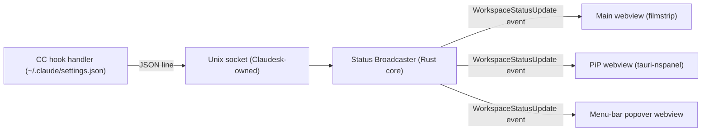

<!-- Part of the Claudesk architecture set. Index + load-bearing constraints: ../arch.md -->
# Status channel & surfaces

> **⚠️ This section was titled "Phase 2 forward-look (informational, not built)" until 2026-08-03 and that label was WRONG** — §A/§B describe M3/M4/M5/M7 architecture that **shipped**, and their own bodies carry as-built markers. A reader trusted the heading and skipped real, load-bearing architecture (this is the single most-consequential mislabel the 2026-08-03 prune found). §C (auto-resume) and §D (drive mode) *were* genuinely unbuilt and have been cut — they are M12, specced in `roadmap.md` and decomposed in `wbs.md`.

The Phase 2 forward-look is reorganised around four architectural deltas: (a) **status broadcaster** as the central nervous system, (b) **three status surfaces** that subscribe to it, (c) **smart auto-resume on workspace open**, (d) **drive-mode selector**. The prior 2026-05-19 "cross-window CC status indicator" sub-section is fully replaced by (a) + (b). The 2026-05-22 "smart auto-resume" and "drive-mode selector" sub-sections are preserved in spirit but updated for the workspace-not-window model.

## A. Status broadcaster + Unix-socket hook channel

- **CC hook registration.** *(As-built M3 WP2/WP3, 2026-06-22; event set + Notification gating extended QoL-WP2, 2026-06-25; event set extended 4→10 by M9 WP2, 2026-07-07.)* On launch, Claudesk installs entries in `~/.claude/settings.json`'s `hooks` block for **ten** events (`hook_install::CLAUDESK_EVENTS: [&str; 10]` is the single source of truth), split into two roles:
  - **Four *status* events** (mapped to a state by `status_broadcaster::event_to_state`): `UserPromptSubmit` (→ "running"), `Stop` (→ "idle"), `PostToolUse` (→ "running"), `Notification` (→ "awaiting-input", **gated** — see below). `PostToolUse` is the **answer-resume signal**: when a user answers an `AskUserQuestion`/permission prompt mid-turn CC fires `PostToolUse` (live-captured) but NO `UserPromptSubmit`, so without it the indicator stayed stuck at AwaitingInput until the next `Stop`.
  - **Six *time-analytics-only* events** (status-neutral — dropped by `event_to_state`, consumed only by the M9 `time_store` writer): `PreToolUse`, `PostToolUseFailure`, `SubagentStart`, `SubagentStop`, `SessionStart`, `SessionEnd`. These give the reclassifier tool-execution intervals (`PreToolUse`/`PostToolUse[Failure]` paired by `tool_use_id`), subagent intervals (`SubagentStart`/`SubagentStop` by `agent_type`), and session boundaries. `PreToolUse` — deliberately UNregistered pre-M9 (the status machine never needed it; `UserPromptSubmit`→Running covered a turn's pre-tool state) — is now registered but status-neutral because the time writer needs the tool-start timestamp. The full 4→10 delta (incl. the live-capture that confirmed `PostToolUseFailure` is a distinct CC-emitted event) is documented in `docs/product/wp1-time-analytics-probe-outcome.md` §(d).

  The hook is a tiny **Perl** script (`resources/claudesk-hook.pl`, `/usr/bin/perl` — measured ~15 ms/call, exits 0 unconditionally so it never blocks CC; the WP1 probe chose Perl over POSIX sh) that reads the event JSON on stdin and writes one JSON line — `{ hook_event_name, session_id, cwd, timestamp, source, prompt_length_chars?, message?, notification_type?, tool_name?, tool_use_id?, agent_type?, reason? }` — to Claudesk's Unix socket at the stable path `<app-data>/hook.sock` (on macOS `~/Library/Application Support/com.claudesk.app/hook.sock` — the bundle identifier, **not** `Claudesk/`; `hook_socket::commands::hook_socket_path` is the single source of truth for this path). Each extra is present only on the event(s) that carry it: `prompt_length_chars` on `UserPromptSubmit` (a **length**, never the prompt text — the privacy substitute), `notification_type` on `Notification` (QoL-WP2), the `tool_*`/`agent_type`/`reason` extras (M9 WP2) on the tool/subagent/session events, and `source` on `SessionStart` (CC's startup/resume tag — distinct from the `time_store` DB `source` *column*, which discriminates hook-vs-native event origin; see the M9 section below). Registration is additive / idempotent / reversible and **preserves any co-resident subscriber** (`notify-telegram.sh`, and — historically — a user's own standalone `claude-time-hook.pl`; see the deprecation note below) — matcher-groups are keyed on the `claudesk-hook.pl` basename so Claudesk only ever touches its own group.
- **Notification gating** *(QoL-WP2, 2026-06-25).* `Notification` → AwaitingInput is gated on `notification_type`: a genuine input-needed type (`permission_prompt`, `elicitation_dialog`) — OR an **unknown/absent** type (the honest conservative fallback, mirroring `Unknown`) — maps to AwaitingInput; a recognized informational type (`idle_prompt`, `auth_success`, `elicitation_complete`, `elicitation_response`) is a **no-op** (the event is dropped, so the prior state is preserved and an idle nudge doesn't flip a busy dot blue). The gate lives backend-side in `status_broadcaster::event_to_state`; the frontend renders only the derived `state`.
- **⚠️ The hook channel is BIDIRECTIONAL as of M12 WP4b (2026-08-07) — it was read-only telemetry for its first four milestones.** *(New architectural capability. The next person to touch `claudesk-hook.pl` must find this here rather than rediscover it.)* Everything above describes the CC→Claudesk direction: the script reads event JSON on stdin and writes a line to the socket. It now **also writes to stdout on exactly one event** — `UserPromptSubmit` — returning CC's `additionalContext` so Claudesk can tell the session a fact it would otherwise have to be asked for. The first consumer is the workflow **drive mode**: the operator picks it on the picker row, and `/session-restore` therefore stops re-asking a question that was already answered at workspace-open.
  - **Shape (⚠️ runtime-enforced, and the obvious form is REJECTED):** `additionalContext` **must** nest under `hookSpecificOutput` alongside `hookEventName`. A top-level `additionalContext` is rejected at runtime — this was established by live capture, not from docs, per `[[cc-hook-capture-beats-docs]]`.
  - **Gated by ABSENCE, which is what keeps every other user byte-identical.** Emission is conditioned on the `CLAUDESK_DRIVE_MODE` env var, set only on the CC spawn (`cc_spawn_env`) and only while `workflow_features_enabled` is on. Unset ⇒ the script emits **nothing** — so a plain-terminal `claude`, a gate-off Claudesk, and a pre-M12 build all behave identically. **Inertness is the same mechanism that already protects every plain-CLI user**, not a second code path. ⚠️ The var is the **only** possible Claudesk marker: `cwd`-based correlation cannot distinguish a Claudesk-spawned `claude` from a terminal-spawned one in the same tree.
  - **⚠️ The never-block-CC invariant survives unchanged, and must keep surviving.** The script still `exit 0`s **unconditionally** on every degraded path (no socket, malformed JSON, empty stdin), and stays **silent on the other 9 of the 10 events** it is registered for — so a down Claudesk still cannot block CC. That contract is the reason the script is registered on all ten events for both identities, and it is what a stdout-writing hook most easily breaks. Pinned by `never_blocks_cc_on_degraded_inputs` (6 abuse arms, driving the **real** shipped script as a subprocess and capturing exit status *and* stdout).
  - **The vocabulary is pinned across two languages.** The four mode strings live in Rust per-variant serde renames (`stepping`/`orchestrated`/`autopilot`/`fsd`) **and** a Perl exact-match allowlist. A test reads the allowlist **out of the shipped script** rather than restating it, so it cannot become a third copy of the same list — until M12 nothing tied the two sides together, and a rename on either would have left both suites green while the signal silently stopped arriving.
  - **⚠️ Known and undecided:** the env var **inherits to all descendants**, so a nested `claude` launched inside a workspace fires the hook carrying the *parent workspace's* mode (confirmed empirically). Recorded as a MAJOR review finding, **not** classified as a defect. ⚠️ **Long-context durability of per-turn re-injection is ASSUMED, not proven** — both live proofs were short, cold contexts; validated by dogfooding (a synthetic filler probe was declined as expensive *and* weak evidence).
  - **M13 reuse is NOT pre-committed** (operator, 2026-08-06). Recycle Session ends in `/session-restore` and is the natural second caller, but *"I'll need to open the spec and re-evaluate if it's reusable when we get there."* This section records what exists; it deliberately does **not** define a generalized injection abstraction for an unspecced caller.
- **Unix socket vs shared file.** Decided: socket. Claudesk's Rust core opens the socket on app launch and accepts a stream of JSON lines from any CC instance whose `cwd` matches a known workspace's project path. No file lock contention, no debounce-write juggling, no torn reads. The hook script is small enough to write the socket synchronously in <1ms; CC does not block waiting for the hook.
- **Status broadcaster.** Normalizes incoming hook events into `WorkspaceStatusUpdate { workspace_id, state: Idle|Running|AwaitingInput, last_event_at, last_output_snippet?, notification_type? }` and emits via Tauri's event channel (`app_handle.emit("workspace-status", ...)`). *(`notification_type` added QoL-WP2 — diagnostic only; the gating decision is made in `event_to_state`, not by the frontend.)* All three webviews subscribe; they re-render their local UI on each event. *(Implemented M3 WP4, commit `8bc2d68` — `src-tauri/src/status_broadcaster/`. The state enum also carries `Unknown` as the honest no-data default a surface shows before any event arrives; the broadcaster never emits it. cwd→workspace resolution canonicalizes both sides (M2 WP11 path-keying lesson); an unmatched cwd is dropped, not an error. **As-built correction (M6 WP2, commit `bafee80`):** `resolve_cwd` matches a cwd that is the workspace root **OR any descendant of it** — longest-registered-ancestor wins (a `Stop` from `<root>/src-tauri` resolves to the `<root>` workspace; nested workspaces → longest prefix). The original exact-canonical-hashmap lookup silently dropped turn-end `Stop`s whose cwd had descended into a subdir (`cd src-tauri`), latching the dot on `Running` — the intermittent stuck-dot bug, root-caused via the WP1 prod file-telemetry and fixed here.)*
- **IPC DTO casing convention (snake_case end-to-end).** All Claudesk IPC DTOs serialize with snake_case field names verbatim — no `#[serde(rename_all)]`, no camelCase. The frontend TS type mirrors the Rust serde field names exactly, so there is no casing translation layer to drift. `WorkspaceStatusUpdate` is the canonical example, pinned by a `serde_json::to_value` key-shape contract test (`status_broadcaster::tests::dto_serde_shape_is_snake_case`). This convention closes the class of bug logged as `SURFACE-2026-06-21-IPC-DTO-FIELD-CASE-TESTS-MISS-SERDE-SHAPE` (multi-word DTO fields drifting between the Rust struct and the TS type). New IPC DTOs follow it and add a parallel key-shape test.
- **Standalone `claude-time` deprecation (M9 WP7, 2026-07-16).** The standalone `claude-time` tool (`_ref/claude-customization/tools/claude-time/` — hook → `sqlite3` subprocess → `reclassify.py` → Gantt JSX dashboard) has been **absorbed into Claudesk** and is **deprecated** as of M9. Claudesk now owns the entire capability natively (see the "M9 time-analytics subsystem" section below) and has **zero runtime dependency** on the standalone tool: Claudesk installs its **own** `claudesk-hook.pl` and writes its own `time-analytics.sqlite`; it never reads `claude-time`'s DB, never invokes `claude-time-hook.pl`, and never registers it. The only in-tree `claude-time` references are (a) port-lineage doc-comments in `time_store`/`reclassify`/`query` and (b) a hook-install **test fixture** (`hook_install::mod.rs` `settings_with_claude_time()` + the `merge_is_additive_and_preserves_existing_hooks` test) — that test is the *proof of the decoupling posture*: it asserts a pre-existing `claude-time-hook.pl` entry **survives** Claudesk's registration on every event. **Decoupling posture: stop depending, do not delete.** Claudesk must NOT delete a hook it didn't install — a user who still has `claude-time-hook.pl` registered in `~/.claude/settings.json` keeps it (harmless: it just writes its own separate DB), and **removing it is the user's manual action** (edit `~/.claude/settings.json`, drop the `claude-time-hook.pl` matcher-groups). Once removed, Claudesk's tab is the sole time-tracker.

  **UPDATE 2026-07-29 — the upstream tool is now RETIRED, not merely deprecated.** The forward-looking note that once closed this bullet ("retirement of the standalone tool's own README/source lives in the `my-claude-code-customization` repo") is a completed fact: that repo **deleted `tools/claude-time/` entirely** (32 files) and removed the `claude-time` linking from its `install.sh`. So the source path named at the top of this bullet — `_ref/claude-customization/tools/claude-time/` — **no longer exists**; it is retained above as the historical lineage reference, reachable only via that repo's git history. Trigger: Claudesk's M10.9 WP3.5a install wizard would otherwise have *newly installed* the deprecated tool for every user who opted into the workflow layer — the gap being that this bullet's "stop depending, do not delete" posture governed *not removing what was already there* and never covered `install.sh` continuing to add it. Cross-repo ask + reply: `../my-claude-code-customization/HANDOFF-from-claudesk-2026-07-29.md` and its `HANDOFF-REPLY-to-claudesk-2026-07-29.md`.

  **What did NOT change — the posture above still stands, verbatim.** Claudesk still must not delete a hook it didn't install; `settings_with_claude_time()` + `merge_is_additive_and_preserves_existing_hooks` remain the proof and must **not** be removed as dead fixtures — a user machine can still carry a `claude-time-hook.pl` registration from a pre-retirement install, and upstream's `uninstall.sh` deliberately keeps removing those two legacy symlinks **unconditionally** for exactly that reason (its original `[ -d tools/claude-time ]` guard would have gone permanently false once the directory was deleted, silently stranding the installs the cleanup exists to rescue).
- **Failure mode.** If the socket is missing or the hook script can't connect, the workspace status defaults to `Unknown`. Claudesk does not infer state from PTY output; an unknown badge is honest, a guessed badge is not.
- **Frontend close-the-loop (as-built M3 WP6, commit `b377a97`).** The main React webview `listen("workspace-status")`s and renders an honest dot+label indicator (Idle / Running / AwaitingInput / Unknown) in the workspace chrome header; the TS wire type mirrors the Rust serde field names verbatim (snake_case, no translation layer). Workspace open→`workspace_register` / close→`workspace_deregister` populate the cwd→workspace registry by list-diffing (N≤1 in M3, generalizes to M4 multi-workspace). Palette is deliberately distinct so two states never read alike: Running = Claude-brand orange `#d97757`, AwaitingInput = cool blue `#539bf5` (operator-chosen at verify-human). This was M3's live verify surface — a real CC state transition observed in the UI purely from the hook channel, confirmed with terminal output scrolled away. The full multi-surface fan-out (M4 filmstrip / M5 PiP / M6 menu-bar) subscribes to this same event in later milestones. *(One backlogged MAJOR: the `last_output_snippet`→tooltip path is wired but unfed — `SURFACE-2026-06-22-QUALITY-WP6-SNIPPET-TOOLTIP-DEAD-PATH`; pick up via `/feature-refactor`.)*

## B. Three status surfaces (subscribers)

**B.1 — Filmstrip + Center Stage (in-window).**
- Lives in the main React webview. Subscribes to `workspace-status` events from the broadcaster.
- Center Stage renders the focused workspace's xterm.js at full size, DOM renderer.
- Filmstrip renders one tile per non-focused workspace. Tile content per the **WP4 probe outcome (PASS, 2026-06-17 — live mirrors):**
  - Each background workspace's xterm.js is mounted **off-viewport** (`left:-99999px`) so xterm pauses its renderer (the buffer still updates via `write()`). The filmstrip tile is built from **`@xterm/addon-serialize` `serializeAsHTML()`** read off that buffer, rendered into a `scale(0.15)` tile, throttled to ~1 fps. (NOT a live mirror of off-screen DOM — that mechanism is non-viable; see the probe outcome doc and the §"Phase 1 thumbnail-rendering probe" correction.)
  - Active-CPU p95 caveat (~30% on output bursts) → mitigations available (sub-1fps background rate, coalesced serialize, mirror only visible tiles) if dogfooding shows it matters.
  - (Status-tile-only fallback was the probe-fail branch; not taken.)
- Clicking a tile swaps which workspace is the center stage (CSS `display: none` / `display: block`; no remount). Workspace state and PTY connection persist.
- **Filmstrip collapse:** A chrome button toggles between "full filmstrip" (tiles with thumbnails or status) and "collapsed strip" (one-line row of project-name + status-dot pills). Collapsed workspaces use `display: none` on their off-screen xterm to suppress the render loop; PTY output still buffers in xterm's scrollback.

**B.2 — Menu-bar status item — DESIGNED-FOR-BUILD (Milestone 7) — SHRUNK to AMBIENT ALARM + ACTUATOR.** *Promoted from sketch + shrunk at the M7 spec debate (2026-06-29). Tauri-2.11.x API facts verified against current docs/source. The build target is deliberately minimal: the menu bar's only non-redundant edge over the shipped M5 PiP is **location** (a strip the user already watches), so M7 exploits ONLY that — a single ambient alarm + an actuator menu. The richer "status surface" design (popover list + navigate) was rejected as a PiP subset; it's preserved struck-through at the end for the record. New module `src-tauri/src/tray/` (mirrors `pip/` shape). NO new dependency, NO new webview.*

Like the M4 filmstrip and the M5 PiP, the tray icon subscribes to the **same M3 `status_broadcaster` `workspace-status` Tauri event** — but it is **not a status surface**, it is an **alarm** (one bit: "is a project waiting on me?") + an **actuator** (right-click acts on the app). No broadcaster change.

- **Tray icon — native, 2-state ambient alarm, template image.** `tauri::tray::TrayIconBuilder` (confirmed current at 2.11.x). The icon is a **template image** (`icon_as_template(true)`) so macOS auto-adapts it to the light/dark menu bar. It shows **one bit**:
  - **Lit (attention)** = ANY open workspace is `AwaitingInput` — "stop what you're doing, a project is blocked on you."
  - **Neutral (template/dim)** = nothing awaiting (Running and Idle both collapse to "nothing for you to do"; running-vs-idle detail lives in PiP / the window — not in the menu bar).
  - The reduction is a **pure fold** over the registry's per-workspace states (`aggregate_alarm(states) -> AlarmState { Attention | Neutral }`), unit-testable without a live app (the `pip::should_arm_summon` testability precedent). Recomputed on every `workspace-status` event and on workspace register/deregister; the icon is swapped via **`set_icon_with_as_template(icon, true)`** — the atomic setter (the as-built tauri 2.11.2 method; the originally-specced name `set_icon_and_icon_as_template_atomic` does NOT exist on this version, corrected at M7 WP1 build), NOT `set_icon` then `set_icon_as_template` (the two-call path resets the template flag and blinks; `tauri#6527`). **Note (as built):** `set_icon_with_as_template` marshals its AppKit op to the main thread *internally* (tauri's `run_item_main_thread!`), so the swap is main-thread-safe regardless of the `workspace-status` listener's thread — no manual `run_on_main_thread` hop needed for the swap (the M5 abort class doesn't apply here). **Two pre-rendered template icon variants** ship in `src-tauri/icons/tray/` (lit + neutral; a faithful monochrome app-icon portrait — window + 4 filmstrip tiles + main CC box — with a lower-right corner badge on attention), embedded via **`include_bytes!` + `Image::from_bytes`** (no `trayIcon` config block — a config-declared tray is static and would create a SECOND icon redundant with the dynamic `TrayIconBuilder`-in-`.setup()` the runtime swap requires; no install-path file IO either). At **zero workspaces** the alarm is Neutral (nothing to wait on).
- **Left-click → the same native menu (NO popover).** There is **no popover window** — building one would re-implement the PiP dashboard (the rejected redundancy). Left-click simply shows the native menu (the default `TrayIconBuilder::menu(...)` behavior; we do NOT call `show_menu_on_left_click(false)`). "Which project is waiting / jump to it" is a *detail* interaction → that's PiP's job or the main window's, not the menu bar's.
- **Right-click (and left-click) → native context menu (actuators — mirrors existing actions only).** `TrayIconBuilder::menu(...)` shows a `tauri::menu::Menu`. Items: **Show Claudesk Window** / **Toggle PiP** / **Quit** — all already-existing app actions, reusing the 2026-06-24 `app_menu` `on_menu_event`/`emit` bridge + managed-handle pattern (mirrors features, adds none). These are **actuators** (they act on the app), which display-only PiP genuinely cannot offer — the non-redundant counterpart to the alarm. "Toggle PiP" reuses the existing `pip-mode` path; "Show Claudesk Window" brings the main window forward (a thin command, also reachable from the existing app menu); "Quit" is a `PredefinedMenuItem`.
- **macOS activation policy unchanged (`Regular`).** The tray item is **additive** — Claudesk keeps its dock icon and main window. We do NOT switch to `ActivationPolicy::Accessory` (that's for tray-only apps).
- **Window/icon-op main-thread rule applies.** Updating the tray icon is an AppKit op; any background-thread caller MUST marshal via `app.run_on_main_thread(...)` (the M5 PiP rule — off-main-thread AppKit ops abort the process with no Rust panic). Tauri `#[command]` fns + `on_tray_icon_event` + the `workspace-status` listener wiring already run on / can be marshaled to the main thread.
- **Agent verify-self.** The pure `aggregate_alarm` fold + DTO are **unit-tested** (the bulk of the logic). The icon-swap path is exercised via the MCP bridge by driving a status transition on a scratch workspace and confirming the app stays alive (no abort) — but the **native menu-bar glyph itself (lit vs neutral) and the native menu are NOT in any webview**, so "the menu bar actually shows the alarm" + "the menu appears + items fire" are **operator-carry / DEFERRED-TO-RELEASE** (the M5/M6 native-surface pattern). There is no popover webview to bridge-drive (cut).
- **No `tauri-plugin-positioner`, no `popover.html`, no `src/popover/`.** All cut with the popover — the dependency, the third Vite entry, the separate webview, and the `tauri#13633` blur-to-hide probe risk all disappear with the dashboard half.

> **Rejected richer version (recorded for the record — DO NOT build):** ~~the menu-bar item as a full third *status surface*: `show_menu_on_left_click(false)` to free left-click for a decoration-less popover `WebviewWindow` (3rd Vite entry `popover.html` + `src/popover/`, own React root subscribing to `workspace-status`), rendering one row per open workspace (status dot + project name), with **navigate-on-click** (bring-forward + switch-center-stage), positioned via `tauri-plugin-positioner` 2.3 (`tray-icon` feature) `Position::TrayBottomCenter`, and a 3-state aggregate dot (green/blue/amber, AwaitingInput > Running > Idle), dismissed on blur with a `tauri#13633` click-outside fallback.~~ **Cut at the M7 spec debate (2026-06-29):** capability-by-capability this is a strict subset of the shipped M5 PiP (which already does live mirrors + layouts + attention weighting, all-Spaces, near-zero-pixel in `minimal`+`On`). Two overlapping dashboards split the glance and double the maintenance. See design-prior [[new-surface-must-earn-its-place-against-existing-ones]].

**B.3 — PiP NSPanel — AS-BUILT (M5 COMPLETE 2026-06-27; unconditional).** *Resynced at M5 finalize — the pre-build notes below carried several assumptions the WP1 probe falsified; this is the as-built record. `src-tauri/src/pip/` (module) + `src/pip/` (frontend route `pip.html` + `main.tsx`, Vite multi-entry).*
- **Crate (git-pinned, NOT crates.io):** `tauri-nspanel = { git = "https://github.com/ahkohd/tauri-nspanel", branch = "v2.1" }` (pkg 2.1.0, commit `a3122e8`); compiles against Tauri 2.11.2. Requires the `tauri` feature `macos-private-api` + `"app": { "macOSPrivateApi": true }` in `tauri.conf.json`. Plugin init `.plugin(tauri_nspanel::init())`.
- **Panel class + builder (corrected vs. the original plan):** define a panel class via `tauri_panel! { panel!(... { can_become_key_window:false, can_become_main_window:false, is_floating_panel:true, hides_on_deactivate:false }) }`, then `PanelBuilder::<_, P>::new(...).with_window(|wb| wb.decorations(false).transparent(true).skip_taskbar(true)).style_mask(StyleMask::new().borderless().nonactivating_panel()).level(PanelLevel::Floating).collection_behavior(CollectionBehavior::new().can_join_all_spaces().full_screen_auxiliary().stationary())`. Non-activation (no focus-steal on click) comes from the **`NonactivatingPanel` style mask**, NOT `no_activate(true)` — **`no_activate(true)` is destructive** (it flips `NSApplicationActivationPolicy` to Prohibited during `build()` and HID the entire main window) and was rejected by the probe. The window MUST be born `decorations(false)` + `transparent(true)` BEFORE the borderless+nonactivating mask is applied (a Titled→borderless transition crashes with `NSRangeException`). Builder method is `collection_behavior` (American spelling), not `set_collection_behaviour`.
- **Show without activating:** `panel.order_front_regardless()`; hide: `panel.hide()`. **Teardown:** via `panel.to_window()` → `window.close()` ONLY (closing the live panel object is a use-after-free that aborts the process); torn down on the main window's `CloseRequested` so an all-Spaces panel doesn't orphan on screen. No close (X) button on the borderless panel — dismiss via the mode control.
- **Confirmed behaviors (WP1):** visible on every Space; does NOT steal focus / activate on click; survives Claudesk losing focus / minimize; no crash on toggle; safe teardown. (Over-fullscreen draw was DROPPED as a requirement — the `full_screen_auxiliary` flag is kept but harmless.) **Entitlement/signing:** none for unsigned local dev. Installed-`.app` parity + the `tauri-apps/tauri#5566` release-vs-dev caveat are operator-verified at the `/release` gate (`SURFACE-2026-06-27-M5-INSTALLED-BUILD-VERIFY-DEFERRED-TO-RELEASE`).
- **Four layouts + persisted switcher + content-driven resize (WP4):** horizontal mirror (default) / vertical mirror / compact (name+dot, no mirror) / minimal (dots only). On-panel own-row switcher cycles them; layout persists per bundle-identity (`config_store/settings.rs`, `pip_layout`). Panel auto-resizes **content-driven** (`computePanelSize(layout, count, screen)` — fixed tile unit × N along the flow axis, 90%-screen-capped then wrapped; applied via `pip_resize`), NOT a static size table. Compact/minimal stop the serialize cost (no mirrors). **Minimal-layout attention weighting:** `orderForAttention` sorts awaiting-input first; awaiting dots POP (blink + halo) while all-busy reads quiet — the "is anyone waiting on me?" glance.
- **Roster divergence (intentional):** the PiP mirrors **ALL N workspaces INCLUDING the center-staged one** (`derivePipFrame` drops nothing) — unlike the filmstrip's static center tile — because PiP is watched when the center stage is NOT visible. Do NOT "fix" this to match the filmstrip.
- **Rendering:** reuses the M4 shared `useMirrorTicker` serialize (one loop feeds filmstrip + PiP via a `pip-mirror` emit; NO second serialize loop), gated on a backend `pip-visibility` broadcast so a hidden panel costs nothing.
- **Visibility lifecycle = tri-state `PipMode` (WP5):** **Off** (hidden) / **On** (shown + pinned) / **Auto** (default — hidden while focused, auto-summons on ~3s sustained main-window blur, auto-dismisses on refocus). Selectable via the right-panel PiP icon (cycles Off→On→Auto) + a View-menu radio (the menu `CheckMenuItem`s re-check exclusively on the `pip-mode` broadcast). Mode persists per bundle-identity (`pip_mode`). The explicit tri-state replaced an earlier inferred-regime design that had an unreachable-state dead-end (design-prior `explicit-selectable-mode-over-inferred-mode`).
- **Display-only:** clicking a PiP tile does NOT bring the workspace forward (vision anti-goal); click-to-focus is a Future Possibility.
- **⚠️ PiP/NSPanel window ops MUST run on the main thread.** Any background-thread caller (the auto-summon debounce timer, future async paths) MUST marshal the window op via `app.run_on_main_thread(...)` — off-main-thread AppKit ops abort the process with a native exception and NO Rust panic (invisible to `cargo test`; presents as clean-launch-then-silently-die). Tauri `#[command]` fns + `on_window_event` already run on the main thread. (See CLAUDE.md for the full rule.)
- **Bus-factor risk:** `tauri-nspanel` is single-maintainer, pinned to a branch (not a tag). Mitigation: monitor `tauri-apps/tauri#13034` for first-party NSPanel support and migrate when it lands.
- **Agent verify-self via the MCP bridge (WP2 ADOPT):** the dev-only `tauri-plugin-mcp-bridge` (`#[cfg(debug_assertions)]`, 127.0.0.1:9223; MCP server in `.mcp.json`) reaches BOTH the `main` and `pip` webviews (`webview_*{windowId:'pip'}`), so PiP status surfaces are agent-verifiable (not carried to verify-human). Boundaries: raw xterm typing is low-fidelity (trigger status transitions via IPC/click); installed-`.app` + `pgrep`-class outcomes stay operator-only. Compiled OUT of release builds.

