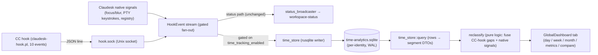

# Milestone 9 architecture — Time-analytics panel (as-built)

Moved out of `arch.md` 2026-08-03 (size guard). This dir **already held** two arch-grade companion docs (`wp1-time-analytics-probe-outcome.md`, `wp2.5-native-signal-schema.md`), so the detailed as-built lives here by established precedent — `arch.md` holding a third copy was the anomaly.

⚠️ The four ⚠️-class rules it contained were NOT archived — they are stubbed in `arch.md` per the never-move-a-warning rule.

---

M9 absorbed the standalone `claude-time` time-tracker into Claudesk as a native, **default-OFF** right-panel analytics tab — the retrospective counterpart to the real-time status surfaces (M4 filmstrip / M5 PiP / M7 menu-bar). It answers "where did this week's session time actually go, per project?" and — the key M9 scope insight — **measures** the human states (present/away, typing, per-project attribution) that `claude-time` could only *infer* from hook-stream gaps, because inside Claudesk the richer native signals exist (window focus/blur, real PTY keystrokes, exact workspace-registry attribution). The standalone tool is deprecated (see the "Standalone `claude-time` deprecation" Key Decision above).

**As-built modules & data path:**

- **Write side — `src-tauri/src/time_store/`.** A **second, gated drain** of the same `HookEvent` stream the status broadcaster already consumes. The status path is byte-unchanged; `time_store` fans out alongside it, gated on `time_tracking_enabled` (below), so tracking-OFF is zero storage/IO. Writes go through **rusqlite** (parameter-bound INSERTs — safe by construction, unlike `claude-time`'s hand-quoted `sqlite3`-subprocess SQL). The schema mirrors `claude-time`'s `events` table PLUS a **`source` discriminator column** so a second event source (the native signals) can share the store. Connection pragmas: `journal_mode=WAL` + `busy_timeout=2000` (mirrors claude-time's WAL + 2s timeout — multi-writer safety, since every CC session's hook writes concurrently).
- **The feature-local SQLite DB.** `<app-data>/time-analytics.sqlite` — resolved via `time_store::commands::time_store_path` from `app_data_dir()` (the bundle **identifier** dir, so it inherits dev/prod isolation: `com.claudesk.app/time-analytics.sqlite` vs `com.claudesk.app.dev/…`), sibling to `hook.sock`. This is the **scoped exception** to the flat-JSON/no-DB rule (see that Key Decision) — one feature's private, query-shaped, multi-writer store, not a migration of app state to a DB.
- **Native-signal source (WP2.5) — the "measure, don't guess" lever.** Claudesk captures its own **window focus/blur**, **real PTY keystrokes**, **active-surface** marks, external-launch marks, and **workspace-registry attribution** into the same store as a second `source`. This makes real the signals `claude-time` guessed at (a hardcoded CPS typing debit + magic gap thresholds). Privacy-by-construction: keystrokes are recorded as timing/count signals via a closed enum, not content.
- **Reclassifier — `src-tauri/src/reclassify/` (a REDESIGN, not a port).** Pure logic (no app, hand-built fixtures) that turns raw events into classified human/AI segments. WP3 was a spec-first **redesign** of the metric definitions, not a 1:1 port of `reclassify.py`: it **fuses** the CC-hook gaps + the native signals, *measuring* where a signal exists (present/away from focus/blur, typing spans from real keystrokes, per-project from the registry) and *inferring* only where none does (reading-vs-thinking within focused-idle collapses to a single honest `reviewing` kind). Kind model moved from claude-time's 5-kind enum to a **6-kind** model with an **AI-family / human-family** split (`ai-doing`/`ai-reasoning`/`subagent` vs `typing`/`reviewing`, + `away`). `reclassify.py`'s `test_reclassify.py` assertions were the *starting reference* (how it currently measures), adapted-not-copied — the reading/thinking bucket tests were deliberately NOT ported (superseded by `reviewing`).
- **Session-termination model (WP6.5) — measure session END, don't infer it.** A session's `end` was originally just the timestamp of its last hook event, so a closed/crashed/power-lost session was indistinguishable from a long idle pause — its row stretched to the day-window edge and read as "running all day," corrupting every duration/away number. The fix **fuses four signals**: (1) explicit end-marker on workspace close (`NativeSignal::WorkspaceClose` from `cc_kill`/`kill_all`); (2) a **max-idle cap** (`SESSION_IDLE_CAP_MS` = 30 min, idle-gap keyed) so a dangling session doesn't stretch to the edge; (3) CC's **`SessionEnd`** hook honored as the authoritative clean-close signal (empirically confirmed via live hook-stream capture to fire on `/exit` / `cc_kill` / SIGTERM with a `reason`, but NOT on bare SIGKILL/crash); (4) **startup reconciliation** (`reconcile_dangling` at `.setup()`) that closes out sessions left dangling by a prior crash/outage. Precedence when they disagree: explicit-marker > `SessionEnd` > max-idle-cap > live. Read-time capping self-fixes historical rows (no destructive backfill). A force-quit that writes no marker (SIGKILL) is an accepted limitation — signals 2 + 4 cover it (`SURFACE-2026-07-08-M9-WP6.5-CLOSE-MARKER-MISSES-FORCE-QUIT`).
- **Query layer — `src-tauri/src/time_store/query.rs`.** The synchronous data path: SQLite rows → segment/day/week/month/metrics/comparison DTOs the dashboard consumes, oracle'd structurally against `claude-time`'s `viz_data.py`. Adds a direct **`chrono` 0.4** dependency (`default-features=false`, features `clock`+`std`) for the local-timezone day-boundary math (minutes-from-local-midnight coordinate + local-calendar day bucketing per the WP1-frozen contract) — `chrono` was already lockfile-transitive; the M9 query layer promotes it to a direct dep (`time` 0.3's local-offset path is soundness-guarded/finicky, so `chrono` was the cleaner choice). **Duration totals are summed at ms precision BEFORE the minute-coordinate is applied** — the `SegPayload.start/end` stay integer minutes-from-midnight (the frozen WP1 contract, for render positioning) but per-kind duration accumulates on a `dur_ms` field, so sub-minute AI tool-execution (a Pre→Post ~1s apart) still contributes its real duration instead of flooring to zero (the minute-quantization bug, `SURFACE-2026-07-13-M9-WP4-MINUTE-QUANTIZATION-ZEROES-SUBMINUTE-AI-DOING`, fixed). `build_metrics` / `build_comparison_data` (the aggregate-metric producers) were re-derived under the 6-kind model, not ported — the old `human_blocking_agent = reading+thinking` identity is wrong once `thinking→ai-reasoning` joins the AI family.
- **Dashboard tab — `src/components/workspace/dashboard/`.** A dark-themed (dark-only, like the rest of Claudesk), lazy-loaded React surface with day / week / month views + metrics + A/B compare. The day view is a continuous video-editor-style flexible timeline (interactive viewport + minimap + drag-pan/zoom). AI-vs-human segments are colored by family via a `familyOf`/`colorForKind` seam. Lazy-loaded to keep it off the startup bundle (folds in `SURFACE-2026-06-19-CM6-BUNDLE-SIZE-LAZY-LOAD`).
- **The dashboard is a GLOBAL surface — mount-scope must match data-scope.** The analytics DB is machine-global (any tracking-ON Claudesk logs ALL CC sessions on the machine, across all projects), so the dashboard is a **global full-window view mounted once** (a `PickerOverlay`-pattern surface reachable from both the picker scene and an open workspace via ⌘⇧A / a filmstrip button), NOT a per-workspace panel. An earlier WP6a build mounted it per-workspace and had to be reworked (F23 back-loop) — the principle codified from it: **a surface's mount-scope must match its data-scope** (`SURFACE-2026-07-08...GLOBAL`). Because capture is machine-global + gated by a live tracking-ON instance, the dashboard legitimately shows sessions from *other* Claudesk apps on the same machine — expected behavior, not a bug.
- **Universal feature-flag pattern — `time_tracking_enabled` (WP5).** A single app-global boolean in `config_store` settings (`time_tracking_enabled: Option<bool>`, default **`false`** = OFF), read via `read_time_tracking_enabled` / written via `time_set_tracking_enabled`, that **gates BOTH write paths** (the CC-hook drain + the native-signal source) at `lib.rs` via `time_store::commands::tracking_enabled`. OFF ⇒ zero storage, zero extra IO, status dots wholly unaffected (the status path is a different, always-on drain). This is the reusable "universal-vs-workflow-coupled flag, default-OFF" pattern for any future capture feature. Toggled from the dashboard/settings; takes effect on the next event.

